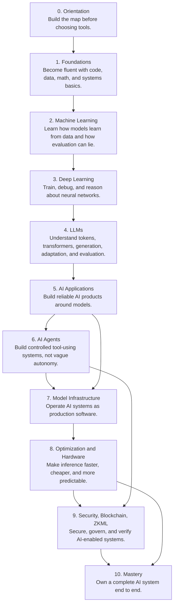

# Roadmap Map

## Main Path

## Stage Structure

| Stage | Part count | Parts |
|---|---:|---|
| [Stage 0: Orientation](<stages/0. Orientation/index.md>) | 5 | AI Engineering Mental Model, Tooling and Learning Environment, Use Case Judgment, Learning Operating System, First Portfolio Skeleton |
| [Stage 1: Foundations](<stages/1. Foundations/index.md>) | 6 | Python Software Craft, Math for AI Engineers, Data Handling, Databases and Storage, Web and API Basics, Systems Thinking Basics |
| [Stage 2: Machine Learning](<stages/2. Machine Learning/index.md>) | 5 | Problem Framing, Splits and Leakage, Supervised Models, Metrics and Error Analysis, Unsupervised Representations |
| [Stage 3: Deep Learning](<stages/3. Deep Learning/index.md>) | 6 | Neural Network Core, Training Loop Engineering, Optimization Dynamics, Architectures and Modalities, Debugging Neural Systems, Hardware Aware Training Preview |
| [Stage 4: Large Language Models](<stages/4. LLMs/index.md>) | 7 | Token and Context Mechanics, Transformer Mental Model, Generation Controls, Model Landscape, Prompting and In-Context Learning, Fine-Tuning and Dataset Engineering, LLM Evaluation Methodology |
| [Stage 5: AI Applications](<stages/5. AI Applications/index.md>) | 7 | AI Product Interface, Prompt System Engineering, RAG Ingestion, Retrieval and Reranking, Grounded Generation, Application Evaluation and Feedback, Guardrails and Release Architecture |
| [Stage 6: AI Agents](<stages/6. AI Agents/index.md>) | 8 | Agent Loop Fundamentals, Reasoning and Planning Patterns, Tool Design, MCP and Tool Ecosystems, Memory and Agentic RAG, Multi-Agent Systems, Agent Evaluation and Observability, Agent Security and Safety |
| [Stage 7: Model Infrastructure](<stages/7. Model Infrastructure/index.md>) | 6 | Data Pipeline Architecture, RAG and Feature Infrastructure, Training and Adaptation Pipelines, Serving and Deployment, Observability and Quality Operations, Reliability and Cost Control |
| [Stage 8: Optimization and Hardware Acceleration](<stages/8. Optimization and Hardware/index.md>) | 7 | Inference Performance Model, Transformer Inference Internals, Model Optimization, Serving Engines, Distributed Inference, GPU and Kernel Basics, Edge and Accelerator Co-Design |
| [Stage 9: AI Security, Blockchain, and ZKML](<stages/9. Security, Blockchain, ZKML/index.md>) | 6 | LLM and Agent Security, Secure AI Application Architecture, Governance and Responsible AI, Blockchain Fundamentals, Smart Contract Security, ZK and Verifiable AI |
| [Stage 10: Mastery](<stages/10. Mastery/index.md>) | 5 | Capstone Problem and Architecture, Capstone Build Execution, Portfolio Communication, Interview and Collaboration Readiness, Specialization and Research Frontiers |
