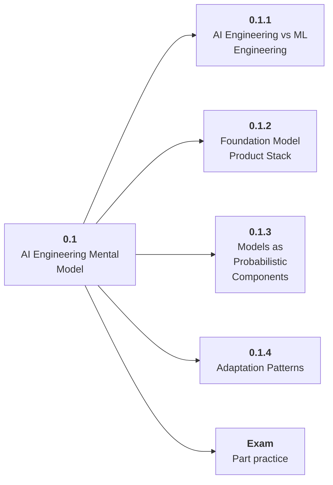

# 0.1 AI Engineering Mental Model

## Role at Stage 0: Orientation

Build a mental model of AI products as systems around foundation models, not as isolated prompts. This part is one capability inside the stage. It should leave behind an artifact, measurements, and a short explanation of failure modes.

## Explanation

This part has 4 sub-parts because the topic needs that many learning units to feel natural. Some stages have more parts and some have fewer; the structure follows the topic, not a fixed template.

## Part Diagram

## Sub-Parts

| Sub-part folder | What it explains |
|---|---|
| [0.1.1 AI Engineering vs ML Engineering](<0.1.1 AI Engineering vs ML Engineering/index.md>) | AI Engineering vs ML Engineering is the working skill inside AI Engineering Mental Model that helps you build the stage artifact, A learning log, environment checklist, use-case decision memo, and first roadmap plan, while collecting enough evidence to trust the result. |
| [0.1.2 Foundation Model Product Stack](<0.1.2 Foundation Model Product Stack/index.md>) | Foundation Model Product Stack is the working skill inside AI Engineering Mental Model that helps you build the stage artifact, A learning log, environment checklist, use-case decision memo, and first roadmap plan, while collecting enough evidence to trust the result. |
| [0.1.3 Models as Probabilistic Components](<0.1.3 Models as Probabilistic Components/index.md>) | Models as Probabilistic Components is the working skill inside AI Engineering Mental Model that helps you build the stage artifact, A learning log, environment checklist, use-case decision memo, and first roadmap plan, while collecting enough evidence to trust the result. |
| [0.1.4 Adaptation Patterns](<0.1.4 Adaptation Patterns/index.md>) | Adaptation Patterns is the working skill inside AI Engineering Mental Model that helps you build the stage artifact, A learning log, environment checklist, use-case decision memo, and first roadmap plan, while collecting enough evidence to trust the result. |

## What a Person Who Masters This Part Can Do

- Explain how AI Engineering Mental Model supports a learning log, environment checklist, use-case decision memo, and first roadmap plan..
- Build and inspect this artifact: Draw an AI application stack for a simple assistant.
- Measure progress with: Check owners, inputs, outputs, failure modes, and evaluation points.
- Debug at least one failure mode before moving to the next part.

## Build and Measure

**Build:** Draw an AI application stack for a simple assistant.

**Measure:** Check owners, inputs, outputs, failure modes, and evaluation points.

## Tests

Take one 30-question exam after studying this part. It opens in a new browser tab so the study page stays available.

  <a href="test/exam.html" target="_blank" rel="noopener">Open Part Exam</a>

## Back to Stage

Return to [Stage 0: Orientation](<../index.md>).
