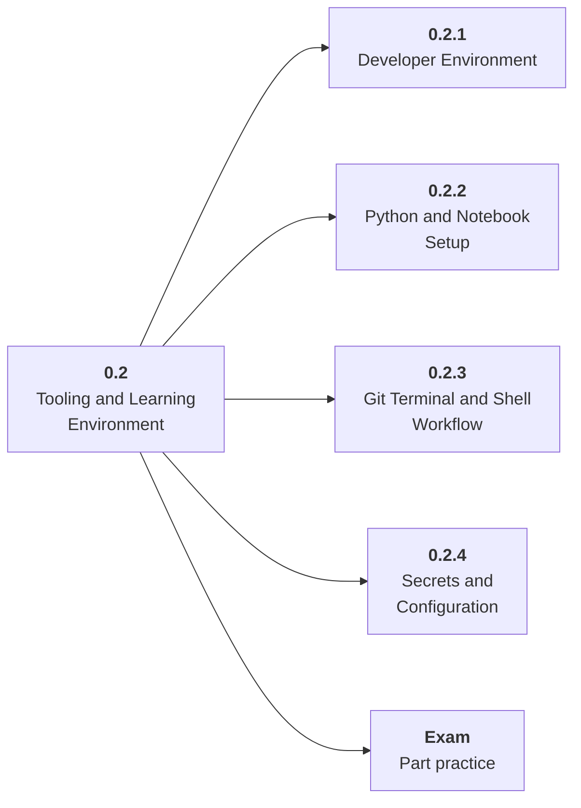

# 0.2 Tooling and Learning Environment

## Role at Stage 0: Orientation

Create a reliable local workspace so every later project can be reproduced, debugged, and shared. This part is one capability inside the stage. It should leave behind an artifact, measurements, and a short explanation of failure modes.

## Explanation

This part has 4 sub-parts because the topic needs that many learning units to feel natural. Some stages have more parts and some have fewer; the structure follows the topic, not a fixed template.

## Part Diagram

## Sub-Parts

| Sub-part folder | What it explains |
|---|---|
| [0.2.1 Developer Environment](<0.2.1 Developer Environment/index.md>) | Developer Environment is the working skill inside Tooling and Learning Environment that helps you build the stage artifact, A learning log, environment checklist, use-case decision memo, and first roadmap plan, while collecting enough evidence to trust the result. |
| [0.2.2 Python and Notebook Setup](<0.2.2 Python and Notebook Setup/index.md>) | Python and Notebook Setup is the working skill inside Tooling and Learning Environment that helps you build the stage artifact, A learning log, environment checklist, use-case decision memo, and first roadmap plan, while collecting enough evidence to trust the result. |
| [0.2.3 Git Terminal and Shell Workflow](<0.2.3 Git Terminal and Shell Workflow/index.md>) | Git Terminal and Shell Workflow is the working skill inside Tooling and Learning Environment that helps you build the stage artifact, A learning log, environment checklist, use-case decision memo, and first roadmap plan, while collecting enough evidence to trust the result. |
| [0.2.4 Secrets and Configuration](<0.2.4 Secrets and Configuration/index.md>) | Secrets and Configuration is the working skill inside Tooling and Learning Environment that helps you build the stage artifact, A learning log, environment checklist, use-case decision memo, and first roadmap plan, while collecting enough evidence to trust the result. |

## What a Person Who Masters This Part Can Do

- Explain how Tooling and Learning Environment supports a learning log, environment checklist, use-case decision memo, and first roadmap plan..
- Build and inspect this artifact: Create the roadmap workspace with notes, projects, environment files, and a decision journal.
- Measure progress with: Run one script, one test, and one documented setup command from a clean shell.
- Debug at least one failure mode before moving to the next part.

## Build and Measure

**Build:** Create the roadmap workspace with notes, projects, environment files, and a decision journal.

**Measure:** Run one script, one test, and one documented setup command from a clean shell.

## Tests

Take one 30-question exam after studying this part. It opens in a new browser tab so the study page stays available.

  <a href="test/exam.html" target="_blank" rel="noopener">Open Part Exam</a>

## Back to Stage

Return to [Stage 0: Orientation](<../index.md>).
