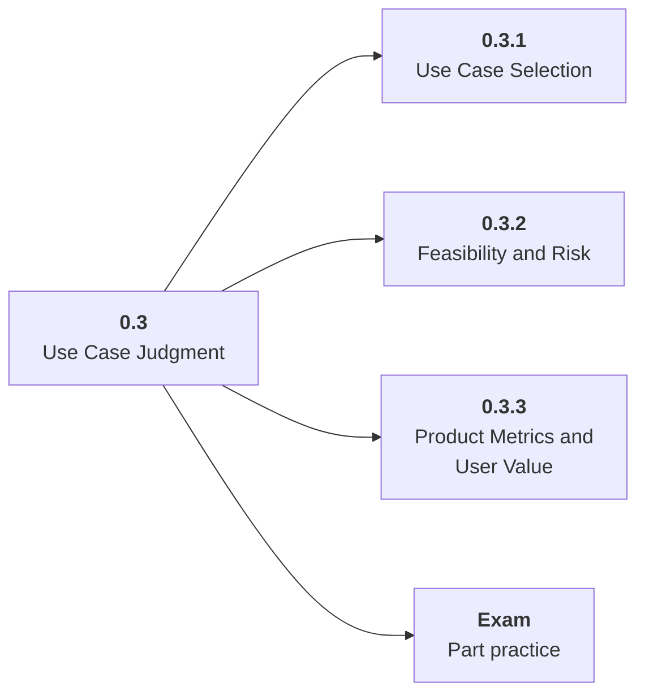

# 0.3 Use Case Judgment

## Role at Stage 0: Orientation

Choose AI projects that have clear users, data, success criteria, and acceptable risk. This part is one capability inside the stage. It should leave behind an artifact, measurements, and a short explanation of failure modes.

## Explanation

This part has 3 sub-parts because the topic needs that many learning units to feel natural. Some stages have more parts and some have fewer; the structure follows the topic, not a fixed template.

## Part Diagram

## Sub-Parts

| Sub-part folder | What it explains |
|---|---|
| [0.3.1 Use Case Selection](<0.3.1 Use Case Selection/index.md>) | Use Case Selection is the working skill inside Use Case Judgment that helps you build the stage artifact, A learning log, environment checklist, use-case decision memo, and first roadmap plan, while collecting enough evidence to trust the result. |
| [0.3.2 Feasibility and Risk](<0.3.2 Feasibility and Risk/index.md>) | Feasibility and Risk is the working skill inside Use Case Judgment that helps you build the stage artifact, A learning log, environment checklist, use-case decision memo, and first roadmap plan, while collecting enough evidence to trust the result. |
| [0.3.3 Product Metrics and User Value](<0.3.3 Product Metrics and User Value/index.md>) | Product Metrics and User Value is the working skill inside Use Case Judgment that helps you build the stage artifact, A learning log, environment checklist, use-case decision memo, and first roadmap plan, while collecting enough evidence to trust the result. |

## What a Person Who Masters This Part Can Do

- Explain how Use Case Judgment supports a learning log, environment checklist, use-case decision memo, and first roadmap plan..
- Build and inspect this artifact: Write a use-case brief for the first AI application you want to build.
- Measure progress with: Score user value, data availability, evaluation difficulty, latency, privacy, cost, and risk.
- Debug at least one failure mode before moving to the next part.

## Build and Measure

**Build:** Write a use-case brief for the first AI application you want to build.

**Measure:** Score user value, data availability, evaluation difficulty, latency, privacy, cost, and risk.

## Tests

Take one 30-question exam after studying this part. It opens in a new browser tab so the study page stays available.

  <a href="test/exam.html" target="_blank" rel="noopener">Open Part Exam</a>

## Back to Stage

Return to [Stage 0: Orientation](<../index.md>).
