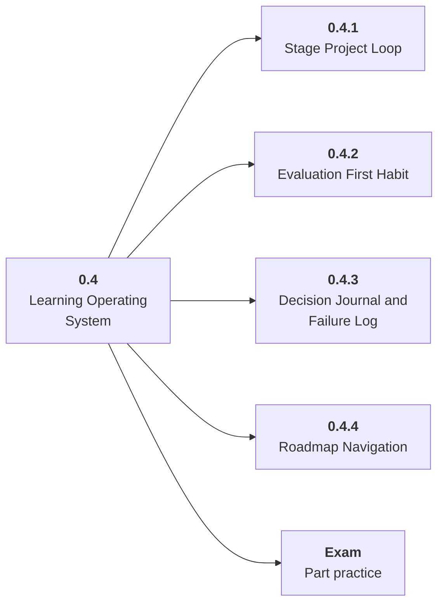

# 0.4 Learning Operating System

## Role at Stage 0: Orientation

Turn the roadmap into a repeatable loop of learning, building, measuring, and reflection. This part is one capability inside the stage. It should leave behind an artifact, measurements, and a short explanation of failure modes.

## Explanation

This part has 4 sub-parts because the topic needs that many learning units to feel natural. Some stages have more parts and some have fewer; the structure follows the topic, not a fixed template.

## Part Diagram

## Sub-Parts

| Sub-part folder | What it explains |
|---|---|
| [0.4.1 Stage Project Loop](<0.4.1 Stage Project Loop/index.md>) | Stage Project Loop is the working skill inside Learning Operating System that helps you build the stage artifact, A learning log, environment checklist, use-case decision memo, and first roadmap plan, while collecting enough evidence to trust the result. |
| [0.4.2 Evaluation First Habit](<0.4.2 Evaluation First Habit/index.md>) | Evaluation First Habit is the working skill inside Learning Operating System that helps you build the stage artifact, A learning log, environment checklist, use-case decision memo, and first roadmap plan, while collecting enough evidence to trust the result. |
| [0.4.3 Decision Journal and Failure Log](<0.4.3 Decision Journal and Failure Log/index.md>) | Decision Journal and Failure Log is the working skill inside Learning Operating System that helps you build the stage artifact, A learning log, environment checklist, use-case decision memo, and first roadmap plan, while collecting enough evidence to trust the result. |
| [0.4.4 Roadmap Navigation](<0.4.4 Roadmap Navigation/index.md>) | Roadmap Navigation is the working skill inside Learning Operating System that helps you build the stage artifact, A learning log, environment checklist, use-case decision memo, and first roadmap plan, while collecting enough evidence to trust the result. |

## What a Person Who Masters This Part Can Do

- Explain how Learning Operating System supports a learning log, environment checklist, use-case decision memo, and first roadmap plan..
- Build and inspect this artifact: Create a 30-day plan with weekly artifacts.
- Measure progress with: Review scope, hours, measurements, weak spots, and exit criteria.
- Debug at least one failure mode before moving to the next part.

## Build and Measure

**Build:** Create a 30-day plan with weekly artifacts.

**Measure:** Review scope, hours, measurements, weak spots, and exit criteria.

## Tests

Take one 30-question exam after studying this part. It opens in a new browser tab so the study page stays available.

  <a href="test/exam.html" target="_blank" rel="noopener">Open Part Exam</a>

## Back to Stage

Return to [Stage 0: Orientation](<../index.md>).
