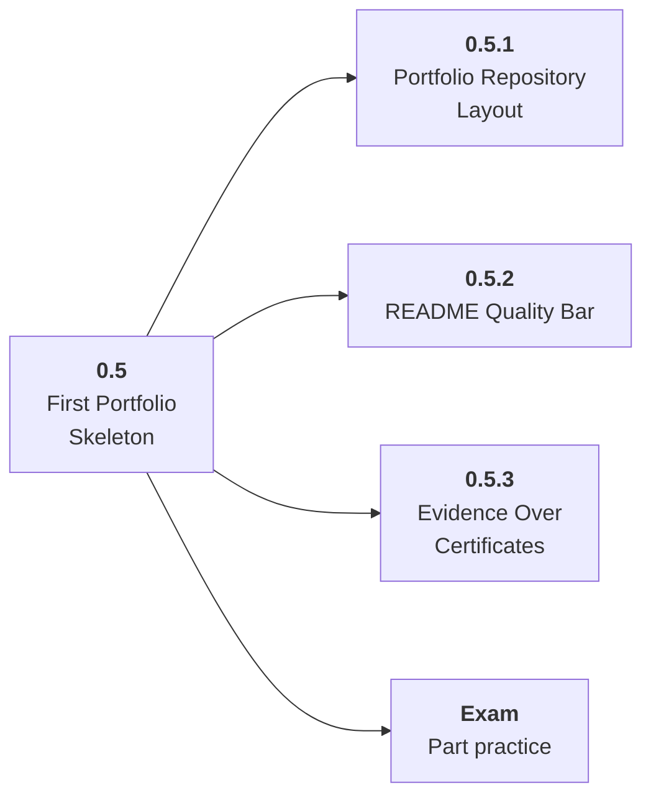

# 0.5 First Portfolio Skeleton

## Role at Stage 0: Orientation

Start documenting work from day one so every stage leaves behind usable evidence. This part is one capability inside the stage. It should leave behind an artifact, measurements, and a short explanation of failure modes.

## Explanation

This part has 3 sub-parts because the topic needs that many learning units to feel natural. Some stages have more parts and some have fewer; the structure follows the topic, not a fixed template.

## Part Diagram

## Sub-Parts

| Sub-part folder | What it explains |
|---|---|
| [0.5.1 Portfolio Repository Layout](<0.5.1 Portfolio Repository Layout/index.md>) | Portfolio Repository Layout is the working skill inside First Portfolio Skeleton that helps you build the stage artifact, A learning log, environment checklist, use-case decision memo, and first roadmap plan, while collecting enough evidence to trust the result. |
| [0.5.2 README Quality Bar](<0.5.2 README Quality Bar/index.md>) | README Quality Bar is the working skill inside First Portfolio Skeleton that helps you build the stage artifact, A learning log, environment checklist, use-case decision memo, and first roadmap plan, while collecting enough evidence to trust the result. |
| [0.5.3 Evidence Over Certificates](<0.5.3 Evidence Over Certificates/index.md>) | Evidence Over Certificates is the working skill inside First Portfolio Skeleton that helps you build the stage artifact, A learning log, environment checklist, use-case decision memo, and first roadmap plan, while collecting enough evidence to trust the result. |

## What a Person Who Masters This Part Can Do

- Explain how First Portfolio Skeleton supports a learning log, environment checklist, use-case decision memo, and first roadmap plan..
- Build and inspect this artifact: Create a public or private portfolio skeleton.
- Measure progress with: Check that every project has a problem, approach, run instructions, measurements, and next steps.
- Debug at least one failure mode before moving to the next part.

## Build and Measure

**Build:** Create a public or private portfolio skeleton.

**Measure:** Check that every project has a problem, approach, run instructions, measurements, and next steps.

## Tests

Take one 30-question exam after studying this part. It opens in a new browser tab so the study page stays available.

  <a href="test/exam.html" target="_blank" rel="noopener">Open Part Exam</a>

## Back to Stage

Return to [Stage 0: Orientation](<../index.md>).
