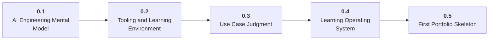

# Stage 0: Orientation

0 Build the map before choosing tools.

## Goal

Understand modern AI engineering as a discipline: product judgment, model behavior, system design, evaluation, and responsible deployment.

## Roadmap to Master This Stage

1. Read the stage goal and diagram before opening the parts.
2. Move through the parts in order unless you can already pass the exit criteria.
3. Study each sub-part folder: overview, deep dive, and examples/practice.
4. Build the stage artifact in small slices and measure the listed metrics.
5. Use the part exam after each part, or open the global Exam tab to test across the roadmap.

## Stage Structure Diagram

## Parts

| Part | Simple explanation | Build focus |
|---|---|---|
| [0.1 AI Engineering Mental Model](<0.1 AI Engineering Mental Model/index.md>) | Build a mental model of AI products as systems around foundation models, not as isolated prompts. | Draw an AI application stack for a simple assistant. |
| [0.2 Tooling and Learning Environment](<0.2 Tooling and Learning Environment/index.md>) | Create a reliable local workspace so every later project can be reproduced, debugged, and shared. | Create the roadmap workspace with notes, projects, environment files, and a decision journal. |
| [0.3 Use Case Judgment](<0.3 Use Case Judgment/index.md>) | Choose AI projects that have clear users, data, success criteria, and acceptable risk. | Write a use-case brief for the first AI application you want to build. |
| [0.4 Learning Operating System](<0.4 Learning Operating System/index.md>) | Turn the roadmap into a repeatable loop of learning, building, measuring, and reflection. | Create a 30-day plan with weekly artifacts. |
| [0.5 First Portfolio Skeleton](<0.5 First Portfolio Skeleton/index.md>) | Start documenting work from day one so every stage leaves behind usable evidence. | Create a public or private portfolio skeleton. |

## Sub-Part Map

| Part | Sub-part | Why it matters |
|---|---|---|
| 0.1 | [0.1.1 AI Engineering vs ML Engineering](<0.1 AI Engineering Mental Model/0.1.1 AI Engineering vs ML Engineering/index.md>) | AI Engineering vs ML Engineering is the working skill inside AI Engineering Mental Model that helps you build the stage artifact, A learning log, environment checklist, use-case decision memo, and first roadmap plan, while collecting enough evidence to trust the result. |
| 0.1 | [0.1.2 Foundation Model Product Stack](<0.1 AI Engineering Mental Model/0.1.2 Foundation Model Product Stack/index.md>) | Foundation Model Product Stack is the working skill inside AI Engineering Mental Model that helps you build the stage artifact, A learning log, environment checklist, use-case decision memo, and first roadmap plan, while collecting enough evidence to trust the result. |
| 0.1 | [0.1.3 Models as Probabilistic Components](<0.1 AI Engineering Mental Model/0.1.3 Models as Probabilistic Components/index.md>) | Models as Probabilistic Components is the working skill inside AI Engineering Mental Model that helps you build the stage artifact, A learning log, environment checklist, use-case decision memo, and first roadmap plan, while collecting enough evidence to trust the result. |
| 0.1 | [0.1.4 Adaptation Patterns](<0.1 AI Engineering Mental Model/0.1.4 Adaptation Patterns/index.md>) | Adaptation Patterns is the working skill inside AI Engineering Mental Model that helps you build the stage artifact, A learning log, environment checklist, use-case decision memo, and first roadmap plan, while collecting enough evidence to trust the result. |
| 0.2 | [0.2.1 Developer Environment](<0.2 Tooling and Learning Environment/0.2.1 Developer Environment/index.md>) | Developer Environment is the working skill inside Tooling and Learning Environment that helps you build the stage artifact, A learning log, environment checklist, use-case decision memo, and first roadmap plan, while collecting enough evidence to trust the result. |
| 0.2 | [0.2.2 Python and Notebook Setup](<0.2 Tooling and Learning Environment/0.2.2 Python and Notebook Setup/index.md>) | Python and Notebook Setup is the working skill inside Tooling and Learning Environment that helps you build the stage artifact, A learning log, environment checklist, use-case decision memo, and first roadmap plan, while collecting enough evidence to trust the result. |
| 0.2 | [0.2.3 Git Terminal and Shell Workflow](<0.2 Tooling and Learning Environment/0.2.3 Git Terminal and Shell Workflow/index.md>) | Git Terminal and Shell Workflow is the working skill inside Tooling and Learning Environment that helps you build the stage artifact, A learning log, environment checklist, use-case decision memo, and first roadmap plan, while collecting enough evidence to trust the result. |
| 0.2 | [0.2.4 Secrets and Configuration](<0.2 Tooling and Learning Environment/0.2.4 Secrets and Configuration/index.md>) | Secrets and Configuration is the working skill inside Tooling and Learning Environment that helps you build the stage artifact, A learning log, environment checklist, use-case decision memo, and first roadmap plan, while collecting enough evidence to trust the result. |
| 0.3 | [0.3.1 Use Case Selection](<0.3 Use Case Judgment/0.3.1 Use Case Selection/index.md>) | Use Case Selection is the working skill inside Use Case Judgment that helps you build the stage artifact, A learning log, environment checklist, use-case decision memo, and first roadmap plan, while collecting enough evidence to trust the result. |
| 0.3 | [0.3.2 Feasibility and Risk](<0.3 Use Case Judgment/0.3.2 Feasibility and Risk/index.md>) | Feasibility and Risk is the working skill inside Use Case Judgment that helps you build the stage artifact, A learning log, environment checklist, use-case decision memo, and first roadmap plan, while collecting enough evidence to trust the result. |
| 0.3 | [0.3.3 Product Metrics and User Value](<0.3 Use Case Judgment/0.3.3 Product Metrics and User Value/index.md>) | Product Metrics and User Value is the working skill inside Use Case Judgment that helps you build the stage artifact, A learning log, environment checklist, use-case decision memo, and first roadmap plan, while collecting enough evidence to trust the result. |
| 0.4 | [0.4.1 Stage Project Loop](<0.4 Learning Operating System/0.4.1 Stage Project Loop/index.md>) | Stage Project Loop is the working skill inside Learning Operating System that helps you build the stage artifact, A learning log, environment checklist, use-case decision memo, and first roadmap plan, while collecting enough evidence to trust the result. |
| 0.4 | [0.4.2 Evaluation First Habit](<0.4 Learning Operating System/0.4.2 Evaluation First Habit/index.md>) | Evaluation First Habit is the working skill inside Learning Operating System that helps you build the stage artifact, A learning log, environment checklist, use-case decision memo, and first roadmap plan, while collecting enough evidence to trust the result. |
| 0.4 | [0.4.3 Decision Journal and Failure Log](<0.4 Learning Operating System/0.4.3 Decision Journal and Failure Log/index.md>) | Decision Journal and Failure Log is the working skill inside Learning Operating System that helps you build the stage artifact, A learning log, environment checklist, use-case decision memo, and first roadmap plan, while collecting enough evidence to trust the result. |
| 0.4 | [0.4.4 Roadmap Navigation](<0.4 Learning Operating System/0.4.4 Roadmap Navigation/index.md>) | Roadmap Navigation is the working skill inside Learning Operating System that helps you build the stage artifact, A learning log, environment checklist, use-case decision memo, and first roadmap plan, while collecting enough evidence to trust the result. |
| 0.5 | [0.5.1 Portfolio Repository Layout](<0.5 First Portfolio Skeleton/0.5.1 Portfolio Repository Layout/index.md>) | Portfolio Repository Layout is the working skill inside First Portfolio Skeleton that helps you build the stage artifact, A learning log, environment checklist, use-case decision memo, and first roadmap plan, while collecting enough evidence to trust the result. |
| 0.5 | [0.5.2 README Quality Bar](<0.5 First Portfolio Skeleton/0.5.2 README Quality Bar/index.md>) | README Quality Bar is the working skill inside First Portfolio Skeleton that helps you build the stage artifact, A learning log, environment checklist, use-case decision memo, and first roadmap plan, while collecting enough evidence to trust the result. |
| 0.5 | [0.5.3 Evidence Over Certificates](<0.5 First Portfolio Skeleton/0.5.3 Evidence Over Certificates/index.md>) | Evidence Over Certificates is the working skill inside First Portfolio Skeleton that helps you build the stage artifact, A learning log, environment checklist, use-case decision memo, and first roadmap plan, while collecting enough evidence to trust the result. |

## Stage Artifact

A learning log, environment checklist, use-case decision memo, and first roadmap plan.

## What to Measure

- weekly learning cadence
- one documented use-case decision
- tooling installed and tested
- first project skeleton

## Exit Criteria

- explain AI engineering versus ML engineering
- describe prompting, RAG, agents, fine-tuning, and serving
- choose a narrow first project
- maintain a decision log

## Navigation

Next: [Stage 1: Foundations](<../1. Foundations/index.md>)
