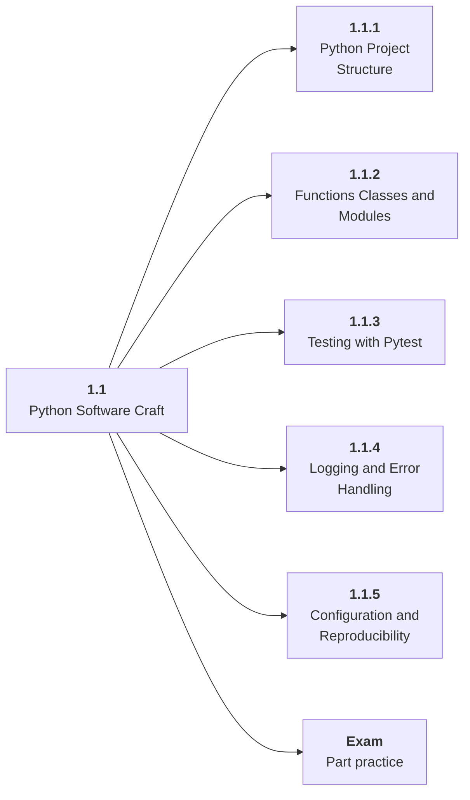

# 1.1 Python Software Craft

## Role at Stage 1: Foundations

Write Python that can grow from notebooks into maintainable AI project code. This part is one capability inside the stage. It should leave behind an artifact, measurements, and a short explanation of failure modes.

## Explanation

This part has 5 sub-parts because the topic needs that many learning units to feel natural. Some stages have more parts and some have fewer; the structure follows the topic, not a fixed template.

## Part Diagram

## Sub-Parts

| Sub-part folder | What it explains |
|---|---|
| [1.1.1 Python Project Structure](<1.1.1 Python Project Structure/index.md>) | Python Project Structure is the working skill inside Python Software Craft that helps you build the stage artifact, A tested Python data application with a CLI or API, setup notes, and a short data report, while collecting enough evidence to trust the result. |
| [1.1.2 Functions Classes and Modules](<1.1.2 Functions Classes and Modules/index.md>) | Functions Classes and Modules is the working skill inside Python Software Craft that helps you build the stage artifact, A tested Python data application with a CLI or API, setup notes, and a short data report, while collecting enough evidence to trust the result. |
| [1.1.3 Testing with Pytest](<1.1.3 Testing with Pytest/index.md>) | Testing with Pytest is the working skill inside Python Software Craft that helps you build the stage artifact, A tested Python data application with a CLI or API, setup notes, and a short data report, while collecting enough evidence to trust the result. |
| [1.1.4 Logging and Error Handling](<1.1.4 Logging and Error Handling/index.md>) | Logging and Error Handling is the working skill inside Python Software Craft that helps you build the stage artifact, A tested Python data application with a CLI or API, setup notes, and a short data report, while collecting enough evidence to trust the result. |
| [1.1.5 Configuration and Reproducibility](<1.1.5 Configuration and Reproducibility/index.md>) | Configuration and Reproducibility is the working skill inside Python Software Craft that helps you build the stage artifact, A tested Python data application with a CLI or API, setup notes, and a short data report, while collecting enough evidence to trust the result. |

## What a Person Who Masters This Part Can Do

- Explain how Python Software Craft supports a tested python data application with a cli or api, setup notes, and a short data report..
- Build and inspect this artifact: Refactor a notebook-style script into a small package with tests and a CLI.
- Measure progress with: Track test count, runtime, config options, and reproducibility.
- Debug at least one failure mode before moving to the next part.

## Build and Measure

**Build:** Refactor a notebook-style script into a small package with tests and a CLI.

**Measure:** Track test count, runtime, config options, and reproducibility.

## Tests

Take one 30-question exam after studying this part. It opens in a new browser tab so the study page stays available.

  <a href="test/exam.html" target="_blank" rel="noopener">Open Part Exam</a>

## Back to Stage

Return to [Stage 1: Foundations](<../index.md>).
