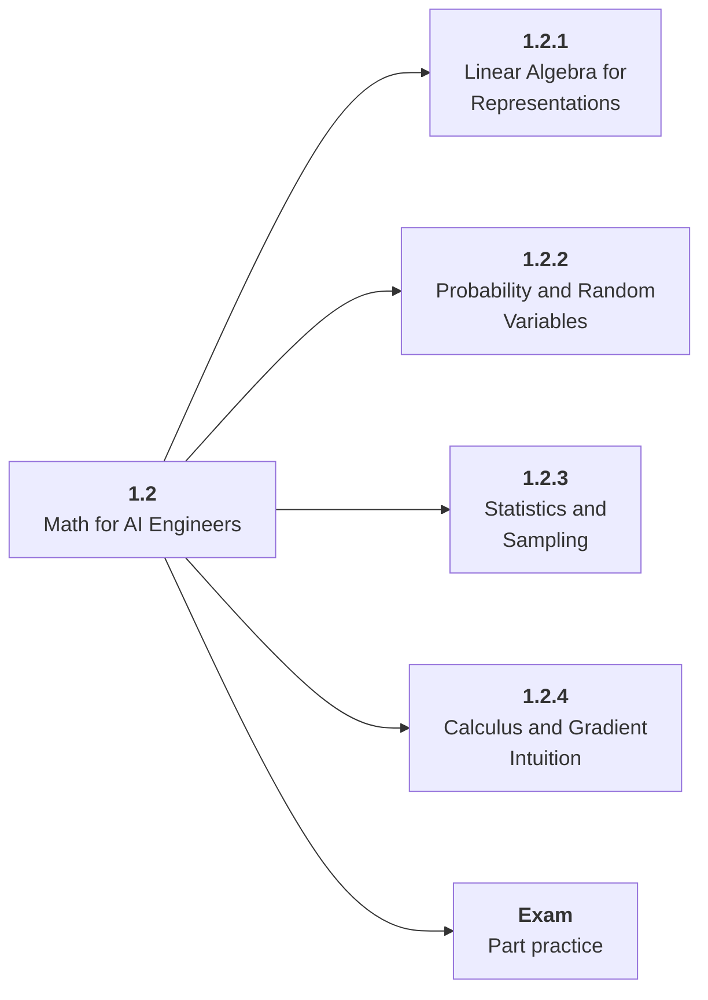

# 1.2 Math for AI Engineers

## Role at Stage 1: Foundations

Learn the practical math that explains representations, uncertainty, optimization, and metrics. This part is one capability inside the stage. It should leave behind an artifact, measurements, and a short explanation of failure modes.

## Explanation

This part has 4 sub-parts because the topic needs that many learning units to feel natural. Some stages have more parts and some have fewer; the structure follows the topic, not a fixed template.

## Part Diagram

## Sub-Parts

| Sub-part folder | What it explains |
|---|---|
| [1.2.1 Linear Algebra for Representations](<1.2.1 Linear Algebra for Representations/index.md>) | Linear Algebra for Representations is the working skill inside Math for AI Engineers that helps you build the stage artifact, A tested Python data application with a CLI or API, setup notes, and a short data report, while collecting enough evidence to trust the result. |
| [1.2.2 Probability and Random Variables](<1.2.2 Probability and Random Variables/index.md>) | Probability and Random Variables is the working skill inside Math for AI Engineers that helps you build the stage artifact, A tested Python data application with a CLI or API, setup notes, and a short data report, while collecting enough evidence to trust the result. |
| [1.2.3 Statistics and Sampling](<1.2.3 Statistics and Sampling/index.md>) | Statistics and Sampling is the working skill inside Math for AI Engineers that helps you build the stage artifact, A tested Python data application with a CLI or API, setup notes, and a short data report, while collecting enough evidence to trust the result. |
| [1.2.4 Calculus and Gradient Intuition](<1.2.4 Calculus and Gradient Intuition/index.md>) | Calculus and Gradient Intuition is the working skill inside Math for AI Engineers that helps you build the stage artifact, A tested Python data application with a CLI or API, setup notes, and a short data report, while collecting enough evidence to trust the result. |

## What a Person Who Masters This Part Can Do

- Explain how Math for AI Engineers supports a tested python data application with a cli or api, setup notes, and a short data report..
- Build and inspect this artifact: Build notebooks for vector similarity, probability simulation, and gradient descent.
- Measure progress with: Validate at least one calculation by hand and one by code.
- Debug at least one failure mode before moving to the next part.

## Build and Measure

**Build:** Build notebooks for vector similarity, probability simulation, and gradient descent.

**Measure:** Validate at least one calculation by hand and one by code.

## Tests

Take one 30-question exam after studying this part. It opens in a new browser tab so the study page stays available.

  <a href="test/exam.html" target="_blank" rel="noopener">Open Part Exam</a>

## Back to Stage

Return to [Stage 1: Foundations](<../index.md>).
