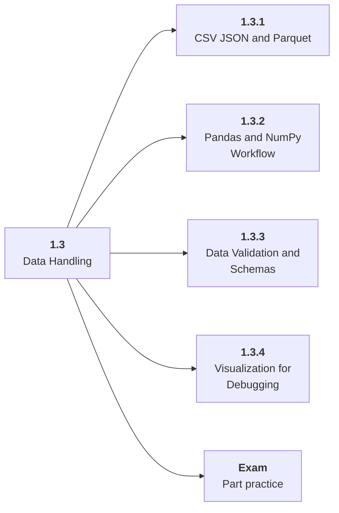

# 1.3 Data Handling

## Role at Stage 1: Foundations

Turn messy raw data into inspected, documented, and validated inputs. This part is one capability inside the stage. It should leave behind an artifact, measurements, and a short explanation of failure modes.

## Explanation

This part has 4 sub-parts because the topic needs that many learning units to feel natural. Some stages have more parts and some have fewer; the structure follows the topic, not a fixed template.

## Part Diagram

## Sub-Parts

| Sub-part folder | What it explains |
|---|---|
| [1.3.1 CSV JSON and Parquet](<1.3.1 CSV JSON and Parquet/index.md>) | CSV JSON and Parquet is the working skill inside Data Handling that helps you build the stage artifact, A tested Python data application with a CLI or API, setup notes, and a short data report, while collecting enough evidence to trust the result. |
| [1.3.2 Pandas and NumPy Workflow](<1.3.2 Pandas and NumPy Workflow/index.md>) | Pandas and NumPy Workflow is the working skill inside Data Handling that helps you build the stage artifact, A tested Python data application with a CLI or API, setup notes, and a short data report, while collecting enough evidence to trust the result. |
| [1.3.3 Data Validation and Schemas](<1.3.3 Data Validation and Schemas/index.md>) | Data Validation and Schemas is the working skill inside Data Handling that helps you build the stage artifact, A tested Python data application with a CLI or API, setup notes, and a short data report, while collecting enough evidence to trust the result. |
| [1.3.4 Visualization for Debugging](<1.3.4 Visualization for Debugging/index.md>) | Visualization for Debugging is the working skill inside Data Handling that helps you build the stage artifact, A tested Python data application with a CLI or API, setup notes, and a short data report, while collecting enough evidence to trust the result. |

## What a Person Who Masters This Part Can Do

- Explain how Data Handling supports a tested python data application with a cli or api, setup notes, and a short data report..
- Build and inspect this artifact: Profile, clean, and export a real dataset.
- Measure progress with: Track missingness, duplicates, schema drift, outliers, and cleaning decisions.
- Debug at least one failure mode before moving to the next part.

## Build and Measure

**Build:** Profile, clean, and export a real dataset.

**Measure:** Track missingness, duplicates, schema drift, outliers, and cleaning decisions.

## Tests

Take one 30-question exam after studying this part. It opens in a new browser tab so the study page stays available.

  <a href="test/exam.html" target="_blank" rel="noopener">Open Part Exam</a>

## Back to Stage

Return to [Stage 1: Foundations](<../index.md>).
