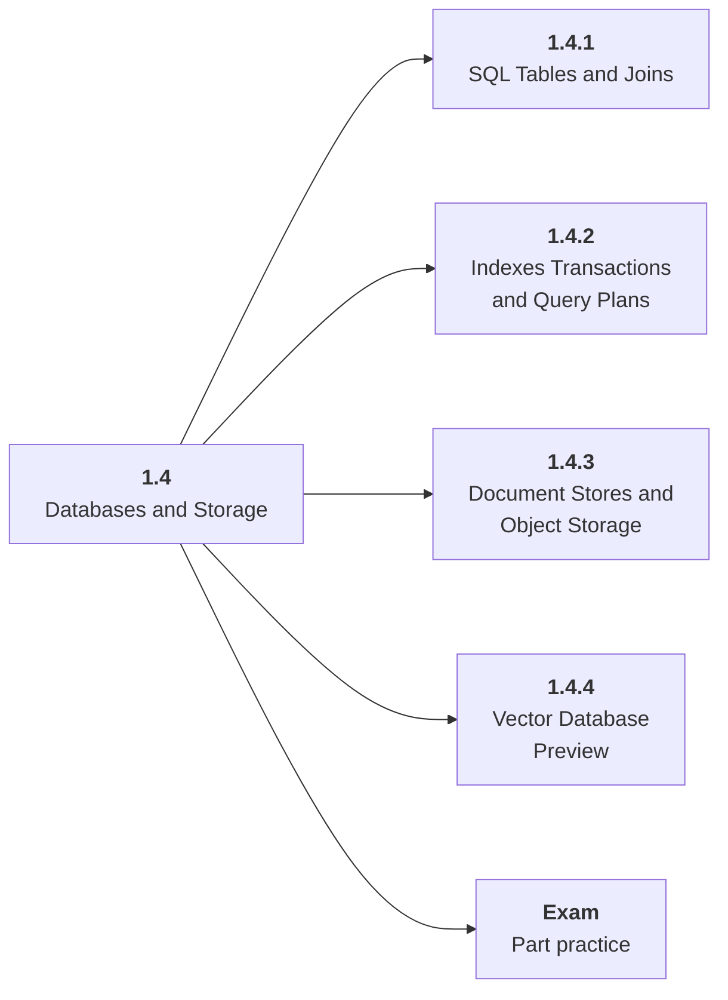

# 1.4 Databases and Storage

## Role at Stage 1: Foundations

Understand where application, training, retrieval, and observability data live. This part is one capability inside the stage. It should leave behind an artifact, measurements, and a short explanation of failure modes.

## Explanation

This part has 4 sub-parts because the topic needs that many learning units to feel natural. Some stages have more parts and some have fewer; the structure follows the topic, not a fixed template.

## Part Diagram

## Sub-Parts

| Sub-part folder | What it explains |
|---|---|
| [1.4.1 SQL Tables and Joins](<1.4.1 SQL Tables and Joins/index.md>) | SQL Tables and Joins is the working skill inside Databases and Storage that helps you build the stage artifact, A tested Python data application with a CLI or API, setup notes, and a short data report, while collecting enough evidence to trust the result. |
| [1.4.2 Indexes Transactions and Query Plans](<1.4.2 Indexes Transactions and Query Plans/index.md>) | Indexes Transactions and Query Plans is the working skill inside Databases and Storage that helps you build the stage artifact, A tested Python data application with a CLI or API, setup notes, and a short data report, while collecting enough evidence to trust the result. |
| [1.4.3 Document Stores and Object Storage](<1.4.3 Document Stores and Object Storage/index.md>) | Document Stores and Object Storage is the working skill inside Databases and Storage that helps you build the stage artifact, A tested Python data application with a CLI or API, setup notes, and a short data report, while collecting enough evidence to trust the result. |
| [1.4.4 Vector Database Preview](<1.4.4 Vector Database Preview/index.md>) | Vector Database Preview is the working skill inside Databases and Storage that helps you build the stage artifact, A tested Python data application with a CLI or API, setup notes, and a short data report, while collecting enough evidence to trust the result. |

## What a Person Who Masters This Part Can Do

- Explain how Databases and Storage supports a tested python data application with a cli or api, setup notes, and a short data report..
- Build and inspect this artifact: Load a cleaned dataset into SQLite and query it.
- Measure progress with: Track query correctness, indexes, joins, and storage format decisions.
- Debug at least one failure mode before moving to the next part.

## Build and Measure

**Build:** Load a cleaned dataset into SQLite and query it.

**Measure:** Track query correctness, indexes, joins, and storage format decisions.

## Tests

Take one 30-question exam after studying this part. It opens in a new browser tab so the study page stays available.

  <a href="test/exam.html" target="_blank" rel="noopener">Open Part Exam</a>

## Back to Stage

Return to [Stage 1: Foundations](<../index.md>).
