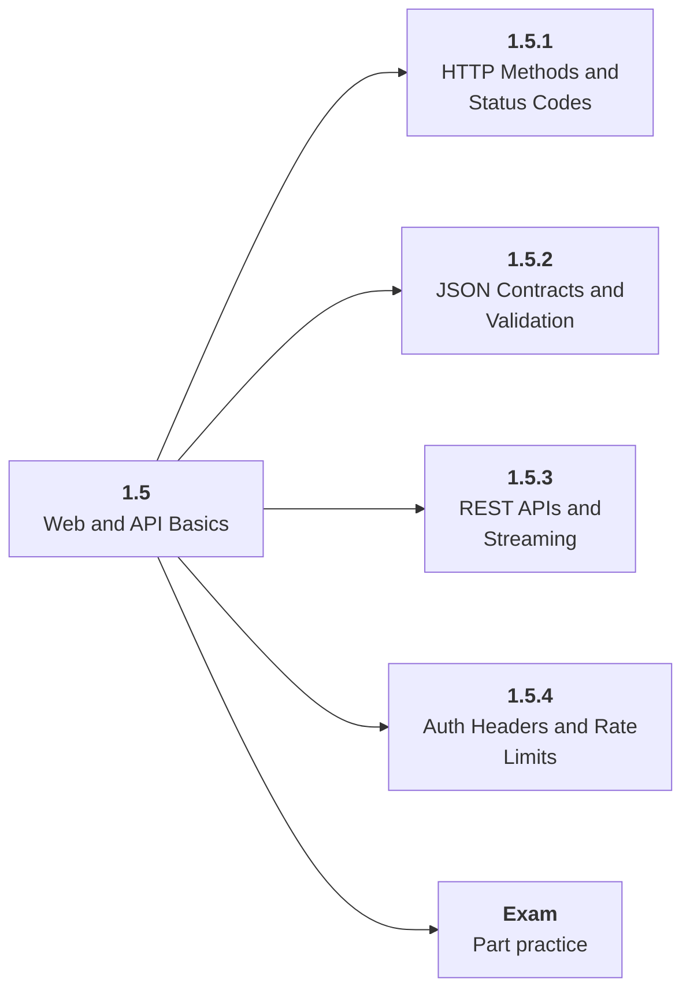

# 1.5 Web and API Basics

## Role at Stage 1: Foundations

Learn the service contracts used by LLM APIs, agent tools, dashboards, and deployed products. This part is one capability inside the stage. It should leave behind an artifact, measurements, and a short explanation of failure modes.

## Explanation

This part has 4 sub-parts because the topic needs that many learning units to feel natural. Some stages have more parts and some have fewer; the structure follows the topic, not a fixed template.

## Part Diagram

## Sub-Parts

| Sub-part folder | What it explains |
|---|---|
| [1.5.1 HTTP Methods and Status Codes](<1.5.1 HTTP Methods and Status Codes/index.md>) | HTTP Methods and Status Codes is the working skill inside Web and API Basics that helps you build the stage artifact, A tested Python data application with a CLI or API, setup notes, and a short data report, while collecting enough evidence to trust the result. |
| [1.5.2 JSON Contracts and Validation](<1.5.2 JSON Contracts and Validation/index.md>) | JSON Contracts and Validation is the working skill inside Web and API Basics that helps you build the stage artifact, A tested Python data application with a CLI or API, setup notes, and a short data report, while collecting enough evidence to trust the result. |
| [1.5.3 REST APIs and Streaming](<1.5.3 REST APIs and Streaming/index.md>) | REST APIs and Streaming is the working skill inside Web and API Basics that helps you build the stage artifact, A tested Python data application with a CLI or API, setup notes, and a short data report, while collecting enough evidence to trust the result. |
| [1.5.4 Auth Headers and Rate Limits](<1.5.4 Auth Headers and Rate Limits/index.md>) | Auth Headers and Rate Limits is the working skill inside Web and API Basics that helps you build the stage artifact, A tested Python data application with a CLI or API, setup notes, and a short data report, while collecting enough evidence to trust the result. |

## What a Person Who Masters This Part Can Do

- Explain how Web and API Basics supports a tested python data application with a cli or api, setup notes, and a short data report..
- Build and inspect this artifact: Build a small JSON API or command-line API client.
- Measure progress with: Measure request latency, error handling, input limits, and response schema validity.
- Debug at least one failure mode before moving to the next part.

## Build and Measure

**Build:** Build a small JSON API or command-line API client.

**Measure:** Measure request latency, error handling, input limits, and response schema validity.

## Tests

Take one 30-question exam after studying this part. It opens in a new browser tab so the study page stays available.

  <a href="test/exam.html" target="_blank" rel="noopener">Open Part Exam</a>

## Back to Stage

Return to [Stage 1: Foundations](<../index.md>).
