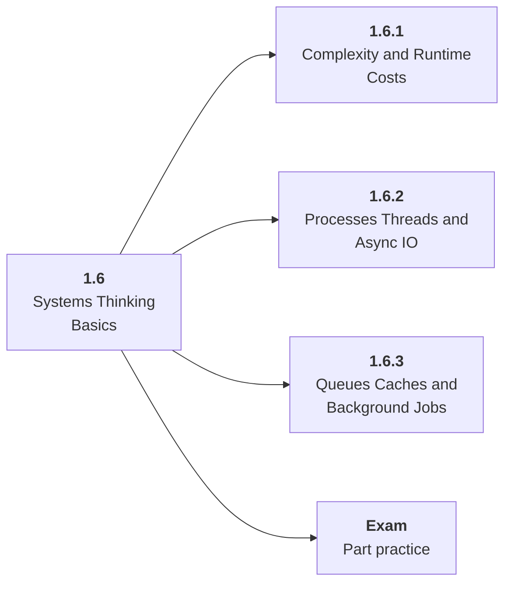

# 1.6 Systems Thinking Basics

## Role at Stage 1: Foundations

Build enough runtime intuition to reason about memory, concurrency, queues, containers, and deployment. This part is one capability inside the stage. It should leave behind an artifact, measurements, and a short explanation of failure modes.

## Explanation

This part has 3 sub-parts because the topic needs that many learning units to feel natural. Some stages have more parts and some have fewer; the structure follows the topic, not a fixed template.

## Part Diagram

## Sub-Parts

| Sub-part folder | What it explains |
|---|---|
| [1.6.1 Complexity and Runtime Costs](<1.6.1 Complexity and Runtime Costs/index.md>) | Complexity and Runtime Costs is the working skill inside Systems Thinking Basics that helps you build the stage artifact, A tested Python data application with a CLI or API, setup notes, and a short data report, while collecting enough evidence to trust the result. |
| [1.6.2 Processes Threads and Async IO](<1.6.2 Processes Threads and Async IO/index.md>) | Processes Threads and Async IO is the working skill inside Systems Thinking Basics that helps you build the stage artifact, A tested Python data application with a CLI or API, setup notes, and a short data report, while collecting enough evidence to trust the result. |
| [1.6.3 Queues Caches and Background Jobs](<1.6.3 Queues Caches and Background Jobs/index.md>) | Queues Caches and Background Jobs is the working skill inside Systems Thinking Basics that helps you build the stage artifact, A tested Python data application with a CLI or API, setup notes, and a short data report, while collecting enough evidence to trust the result. |

## What a Person Who Masters This Part Can Do

- Explain how Systems Thinking Basics supports a tested python data application with a cli or api, setup notes, and a short data report..
- Build and inspect this artifact: Wrap a slow data task as a small service or background job.
- Measure progress with: Measure runtime, memory, backpressure behavior, and failure recovery.
- Debug at least one failure mode before moving to the next part.

## Build and Measure

**Build:** Wrap a slow data task as a small service or background job.

**Measure:** Measure runtime, memory, backpressure behavior, and failure recovery.

## Tests

Take one 30-question exam after studying this part. It opens in a new browser tab so the study page stays available.

  <a href="test/exam.html" target="_blank" rel="noopener">Open Part Exam</a>

## Back to Stage

Return to [Stage 1: Foundations](<../index.md>).
