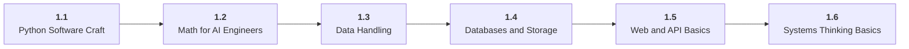

# Stage 1: Foundations

1 Become fluent with code, data, math, and systems basics.

## Goal

Build the programming, data, math, and software habits needed to learn AI without fighting basic tooling.

## Roadmap to Master This Stage

1. Read the stage goal and diagram before opening the parts.
2. Move through the parts in order unless you can already pass the exit criteria.
3. Study each sub-part folder: overview, deep dive, and examples/practice.
4. Build the stage artifact in small slices and measure the listed metrics.
5. Use the part exam after each part, or open the global Exam tab to test across the roadmap.

## Stage Structure Diagram

## Parts

| Part | Simple explanation | Build focus |
|---|---|---|
| [1.1 Python Software Craft](<1.1 Python Software Craft/index.md>) | Write Python that can grow from notebooks into maintainable AI project code. | Refactor a notebook-style script into a small package with tests and a CLI. |
| [1.2 Math for AI Engineers](<1.2 Math for AI Engineers/index.md>) | Learn the practical math that explains representations, uncertainty, optimization, and metrics. | Build notebooks for vector similarity, probability simulation, and gradient descent. |
| [1.3 Data Handling](<1.3 Data Handling/index.md>) | Turn messy raw data into inspected, documented, and validated inputs. | Profile, clean, and export a real dataset. |
| [1.4 Databases and Storage](<1.4 Databases and Storage/index.md>) | Understand where application, training, retrieval, and observability data live. | Load a cleaned dataset into SQLite and query it. |
| [1.5 Web and API Basics](<1.5 Web and API Basics/index.md>) | Learn the service contracts used by LLM APIs, agent tools, dashboards, and deployed products. | Build a small JSON API or command-line API client. |
| [1.6 Systems Thinking Basics](<1.6 Systems Thinking Basics/index.md>) | Build enough runtime intuition to reason about memory, concurrency, queues, containers, and deployment. | Wrap a slow data task as a small service or background job. |

## Sub-Part Map

| Part | Sub-part | Why it matters |
|---|---|---|
| 1.1 | [1.1.1 Python Project Structure](<1.1 Python Software Craft/1.1.1 Python Project Structure/index.md>) | Python Project Structure is the working skill inside Python Software Craft that helps you build the stage artifact, A tested Python data application with a CLI or API, setup notes, and a short data report, while collecting enough evidence to trust the result. |
| 1.1 | [1.1.2 Functions Classes and Modules](<1.1 Python Software Craft/1.1.2 Functions Classes and Modules/index.md>) | Functions Classes and Modules is the working skill inside Python Software Craft that helps you build the stage artifact, A tested Python data application with a CLI or API, setup notes, and a short data report, while collecting enough evidence to trust the result. |
| 1.1 | [1.1.3 Testing with Pytest](<1.1 Python Software Craft/1.1.3 Testing with Pytest/index.md>) | Testing with Pytest is the working skill inside Python Software Craft that helps you build the stage artifact, A tested Python data application with a CLI or API, setup notes, and a short data report, while collecting enough evidence to trust the result. |
| 1.1 | [1.1.4 Logging and Error Handling](<1.1 Python Software Craft/1.1.4 Logging and Error Handling/index.md>) | Logging and Error Handling is the working skill inside Python Software Craft that helps you build the stage artifact, A tested Python data application with a CLI or API, setup notes, and a short data report, while collecting enough evidence to trust the result. |
| 1.1 | [1.1.5 Configuration and Reproducibility](<1.1 Python Software Craft/1.1.5 Configuration and Reproducibility/index.md>) | Configuration and Reproducibility is the working skill inside Python Software Craft that helps you build the stage artifact, A tested Python data application with a CLI or API, setup notes, and a short data report, while collecting enough evidence to trust the result. |
| 1.2 | [1.2.1 Linear Algebra for Representations](<1.2 Math for AI Engineers/1.2.1 Linear Algebra for Representations/index.md>) | Linear Algebra for Representations is the working skill inside Math for AI Engineers that helps you build the stage artifact, A tested Python data application with a CLI or API, setup notes, and a short data report, while collecting enough evidence to trust the result. |
| 1.2 | [1.2.2 Probability and Random Variables](<1.2 Math for AI Engineers/1.2.2 Probability and Random Variables/index.md>) | Probability and Random Variables is the working skill inside Math for AI Engineers that helps you build the stage artifact, A tested Python data application with a CLI or API, setup notes, and a short data report, while collecting enough evidence to trust the result. |
| 1.2 | [1.2.3 Statistics and Sampling](<1.2 Math for AI Engineers/1.2.3 Statistics and Sampling/index.md>) | Statistics and Sampling is the working skill inside Math for AI Engineers that helps you build the stage artifact, A tested Python data application with a CLI or API, setup notes, and a short data report, while collecting enough evidence to trust the result. |
| 1.2 | [1.2.4 Calculus and Gradient Intuition](<1.2 Math for AI Engineers/1.2.4 Calculus and Gradient Intuition/index.md>) | Calculus and Gradient Intuition is the working skill inside Math for AI Engineers that helps you build the stage artifact, A tested Python data application with a CLI or API, setup notes, and a short data report, while collecting enough evidence to trust the result. |
| 1.3 | [1.3.1 CSV JSON and Parquet](<1.3 Data Handling/1.3.1 CSV JSON and Parquet/index.md>) | CSV JSON and Parquet is the working skill inside Data Handling that helps you build the stage artifact, A tested Python data application with a CLI or API, setup notes, and a short data report, while collecting enough evidence to trust the result. |
| 1.3 | [1.3.2 Pandas and NumPy Workflow](<1.3 Data Handling/1.3.2 Pandas and NumPy Workflow/index.md>) | Pandas and NumPy Workflow is the working skill inside Data Handling that helps you build the stage artifact, A tested Python data application with a CLI or API, setup notes, and a short data report, while collecting enough evidence to trust the result. |
| 1.3 | [1.3.3 Data Validation and Schemas](<1.3 Data Handling/1.3.3 Data Validation and Schemas/index.md>) | Data Validation and Schemas is the working skill inside Data Handling that helps you build the stage artifact, A tested Python data application with a CLI or API, setup notes, and a short data report, while collecting enough evidence to trust the result. |
| 1.3 | [1.3.4 Visualization for Debugging](<1.3 Data Handling/1.3.4 Visualization for Debugging/index.md>) | Visualization for Debugging is the working skill inside Data Handling that helps you build the stage artifact, A tested Python data application with a CLI or API, setup notes, and a short data report, while collecting enough evidence to trust the result. |
| 1.4 | [1.4.1 SQL Tables and Joins](<1.4 Databases and Storage/1.4.1 SQL Tables and Joins/index.md>) | SQL Tables and Joins is the working skill inside Databases and Storage that helps you build the stage artifact, A tested Python data application with a CLI or API, setup notes, and a short data report, while collecting enough evidence to trust the result. |
| 1.4 | [1.4.2 Indexes Transactions and Query Plans](<1.4 Databases and Storage/1.4.2 Indexes Transactions and Query Plans/index.md>) | Indexes Transactions and Query Plans is the working skill inside Databases and Storage that helps you build the stage artifact, A tested Python data application with a CLI or API, setup notes, and a short data report, while collecting enough evidence to trust the result. |
| 1.4 | [1.4.3 Document Stores and Object Storage](<1.4 Databases and Storage/1.4.3 Document Stores and Object Storage/index.md>) | Document Stores and Object Storage is the working skill inside Databases and Storage that helps you build the stage artifact, A tested Python data application with a CLI or API, setup notes, and a short data report, while collecting enough evidence to trust the result. |
| 1.4 | [1.4.4 Vector Database Preview](<1.4 Databases and Storage/1.4.4 Vector Database Preview/index.md>) | Vector Database Preview is the working skill inside Databases and Storage that helps you build the stage artifact, A tested Python data application with a CLI or API, setup notes, and a short data report, while collecting enough evidence to trust the result. |
| 1.5 | [1.5.1 HTTP Methods and Status Codes](<1.5 Web and API Basics/1.5.1 HTTP Methods and Status Codes/index.md>) | HTTP Methods and Status Codes is the working skill inside Web and API Basics that helps you build the stage artifact, A tested Python data application with a CLI or API, setup notes, and a short data report, while collecting enough evidence to trust the result. |
| 1.5 | [1.5.2 JSON Contracts and Validation](<1.5 Web and API Basics/1.5.2 JSON Contracts and Validation/index.md>) | JSON Contracts and Validation is the working skill inside Web and API Basics that helps you build the stage artifact, A tested Python data application with a CLI or API, setup notes, and a short data report, while collecting enough evidence to trust the result. |
| 1.5 | [1.5.3 REST APIs and Streaming](<1.5 Web and API Basics/1.5.3 REST APIs and Streaming/index.md>) | REST APIs and Streaming is the working skill inside Web and API Basics that helps you build the stage artifact, A tested Python data application with a CLI or API, setup notes, and a short data report, while collecting enough evidence to trust the result. |
| 1.5 | [1.5.4 Auth Headers and Rate Limits](<1.5 Web and API Basics/1.5.4 Auth Headers and Rate Limits/index.md>) | Auth Headers and Rate Limits is the working skill inside Web and API Basics that helps you build the stage artifact, A tested Python data application with a CLI or API, setup notes, and a short data report, while collecting enough evidence to trust the result. |
| 1.6 | [1.6.1 Complexity and Runtime Costs](<1.6 Systems Thinking Basics/1.6.1 Complexity and Runtime Costs/index.md>) | Complexity and Runtime Costs is the working skill inside Systems Thinking Basics that helps you build the stage artifact, A tested Python data application with a CLI or API, setup notes, and a short data report, while collecting enough evidence to trust the result. |
| 1.6 | [1.6.2 Processes Threads and Async IO](<1.6 Systems Thinking Basics/1.6.2 Processes Threads and Async IO/index.md>) | Processes Threads and Async IO is the working skill inside Systems Thinking Basics that helps you build the stage artifact, A tested Python data application with a CLI or API, setup notes, and a short data report, while collecting enough evidence to trust the result. |
| 1.6 | [1.6.3 Queues Caches and Background Jobs](<1.6 Systems Thinking Basics/1.6.3 Queues Caches and Background Jobs/index.md>) | Queues Caches and Background Jobs is the working skill inside Systems Thinking Basics that helps you build the stage artifact, A tested Python data application with a CLI or API, setup notes, and a short data report, while collecting enough evidence to trust the result. |

## Stage Artifact

A tested Python data application with a CLI or API, setup notes, and a short data report.

## What to Measure

- tests pass from clean checkout
- data quality report
- runtime measured
- CLI or API path documented

## Exit Criteria

- use Python environments, packages, tests, and type hints
- clean and inspect a real dataset
- explain vectors, probability, gradients, and splits
- debug HTTP, JSON, SQL, Git, and shell workflows

## Navigation

Previous: [Stage 0: Orientation](<../0. Orientation/index.md>) | Next: [Stage 2: Machine Learning](<../2. Machine Learning/index.md>)
