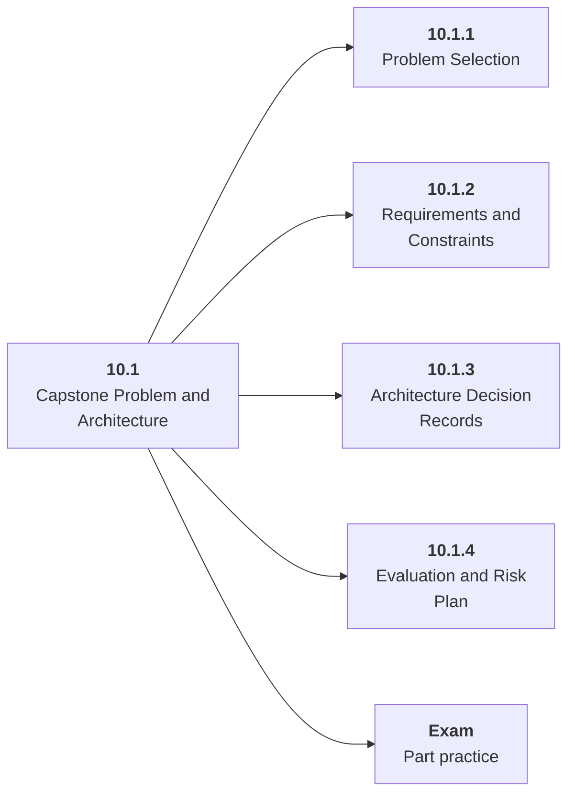

# 10.1 Capstone Problem and Architecture

## Role at Stage 10: Mastery

Choose a narrow but real system and design it before coding. This part is one capability inside the stage. It should leave behind an artifact, measurements, and a short explanation of failure modes.

## Explanation

This part has 4 sub-parts because the topic needs that many learning units to feel natural. Some stages have more parts and some have fewer; the structure follows the topic, not a fixed template.

## Part Diagram

## Sub-Parts

| Sub-part folder | What it explains |
|---|---|
| [10.1.1 Problem Selection](<10.1.1 Problem Selection/index.md>) | Problem Selection is the working skill inside Capstone Problem and Architecture that helps you build the stage artifact, A capstone AI system with architecture, implementation, evaluation, deployment, observability, cost, security review, and portfolio narrative, while collecting enough evidence to trust the result. |
| [10.1.2 Requirements and Constraints](<10.1.2 Requirements and Constraints/index.md>) | Requirements and Constraints is the working skill inside Capstone Problem and Architecture that helps you build the stage artifact, A capstone AI system with architecture, implementation, evaluation, deployment, observability, cost, security review, and portfolio narrative, while collecting enough evidence to trust the result. |
| [10.1.3 Architecture Decision Records](<10.1.3 Architecture Decision Records/index.md>) | Architecture Decision Records is the working skill inside Capstone Problem and Architecture that helps you build the stage artifact, A capstone AI system with architecture, implementation, evaluation, deployment, observability, cost, security review, and portfolio narrative, while collecting enough evidence to trust the result. |
| [10.1.4 Evaluation and Risk Plan](<10.1.4 Evaluation and Risk Plan/index.md>) | Evaluation and Risk Plan is the working skill inside Capstone Problem and Architecture that helps you build the stage artifact, A capstone AI system with architecture, implementation, evaluation, deployment, observability, cost, security review, and portfolio narrative, while collecting enough evidence to trust the result. |

## What a Person Who Masters This Part Can Do

- Explain how Capstone Problem and Architecture supports a capstone ai system with architecture, implementation, evaluation, deployment, observability, cost, security review, and portfolio narrative..
- Build and inspect this artifact: Write a capstone architecture document.
- Measure progress with: Review requirements, alternatives, risks, eval plan, and operations.
- Debug at least one failure mode before moving to the next part.

## Build and Measure

**Build:** Write a capstone architecture document.

**Measure:** Review requirements, alternatives, risks, eval plan, and operations.

## Tests

Take one 30-question exam after studying this part. It opens in a new browser tab so the study page stays available.

  <a href="test/exam.html" target="_blank" rel="noopener">Open Part Exam</a>

## Back to Stage

Return to [Stage 10: Mastery](<../index.md>).
