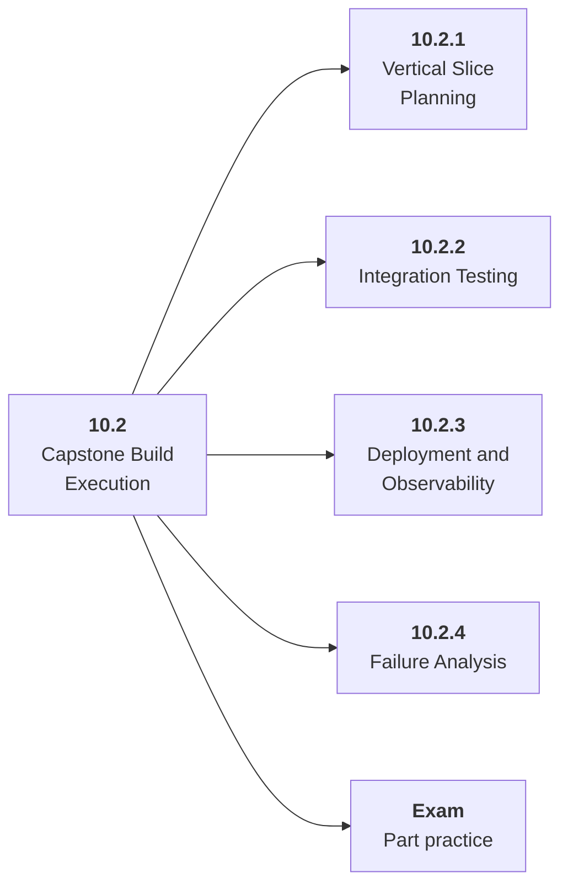

# 10.2 Capstone Build Execution

## Role at Stage 10: Mastery

Build the capstone in vertical slices that integrate product, model, data, and deployment early. This part is one capability inside the stage. It should leave behind an artifact, measurements, and a short explanation of failure modes.

## Explanation

This part has 4 sub-parts because the topic needs that many learning units to feel natural. Some stages have more parts and some have fewer; the structure follows the topic, not a fixed template.

## Part Diagram

## Sub-Parts

| Sub-part folder | What it explains |
|---|---|
| [10.2.1 Vertical Slice Planning](<10.2.1 Vertical Slice Planning/index.md>) | Vertical Slice Planning is the working skill inside Capstone Build Execution that helps you build the stage artifact, A capstone AI system with architecture, implementation, evaluation, deployment, observability, cost, security review, and portfolio narrative, while collecting enough evidence to trust the result. |
| [10.2.2 Integration Testing](<10.2.2 Integration Testing/index.md>) | Integration Testing is the working skill inside Capstone Build Execution that helps you build the stage artifact, A capstone AI system with architecture, implementation, evaluation, deployment, observability, cost, security review, and portfolio narrative, while collecting enough evidence to trust the result. |
| [10.2.3 Deployment and Observability](<10.2.3 Deployment and Observability/index.md>) | Deployment and Observability is the working skill inside Capstone Build Execution that helps you build the stage artifact, A capstone AI system with architecture, implementation, evaluation, deployment, observability, cost, security review, and portfolio narrative, while collecting enough evidence to trust the result. |
| [10.2.4 Failure Analysis](<10.2.4 Failure Analysis/index.md>) | Failure Analysis is the working skill inside Capstone Build Execution that helps you build the stage artifact, A capstone AI system with architecture, implementation, evaluation, deployment, observability, cost, security review, and portfolio narrative, while collecting enough evidence to trust the result. |

## What a Person Who Masters This Part Can Do

- Explain how Capstone Build Execution supports a capstone ai system with architecture, implementation, evaluation, deployment, observability, cost, security review, and portfolio narrative..
- Build and inspect this artifact: Implement milestone slices.
- Measure progress with: Track milestones, eval trend, latency, cost, bugs, and reliability.
- Debug at least one failure mode before moving to the next part.

## Build and Measure

**Build:** Implement milestone slices.

**Measure:** Track milestones, eval trend, latency, cost, bugs, and reliability.

## Tests

Take one 30-question exam after studying this part. It opens in a new browser tab so the study page stays available.

  <a href="test/exam.html" target="_blank" rel="noopener">Open Part Exam</a>

## Back to Stage

Return to [Stage 10: Mastery](<../index.md>).
