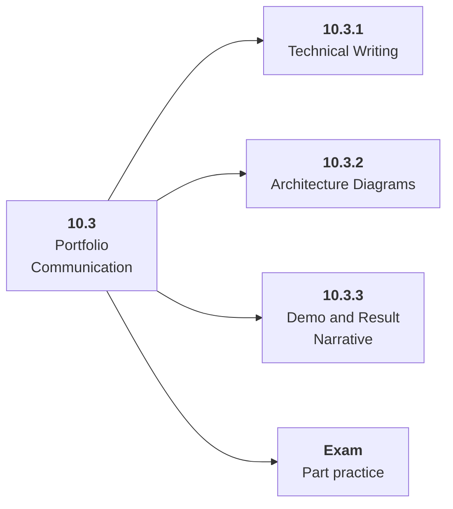

# 10.3 Portfolio Communication

## Role at Stage 10: Mastery

Explain your work through READMEs, diagrams, eval reports, demos, and failure analysis. This part is one capability inside the stage. It should leave behind an artifact, measurements, and a short explanation of failure modes.

## Explanation

This part has 3 sub-parts because the topic needs that many learning units to feel natural. Some stages have more parts and some have fewer; the structure follows the topic, not a fixed template.

## Part Diagram

## Sub-Parts

| Sub-part folder | What it explains |
|---|---|
| [10.3.1 Technical Writing](<10.3.1 Technical Writing/index.md>) | Technical Writing is the working skill inside Portfolio Communication that helps you build the stage artifact, A capstone AI system with architecture, implementation, evaluation, deployment, observability, cost, security review, and portfolio narrative, while collecting enough evidence to trust the result. |
| [10.3.2 Architecture Diagrams](<10.3.2 Architecture Diagrams/index.md>) | Architecture Diagrams is the working skill inside Portfolio Communication that helps you build the stage artifact, A capstone AI system with architecture, implementation, evaluation, deployment, observability, cost, security review, and portfolio narrative, while collecting enough evidence to trust the result. |
| [10.3.3 Demo and Result Narrative](<10.3.3 Demo and Result Narrative/index.md>) | Demo and Result Narrative is the working skill inside Portfolio Communication that helps you build the stage artifact, A capstone AI system with architecture, implementation, evaluation, deployment, observability, cost, security review, and portfolio narrative, while collecting enough evidence to trust the result. |

## What a Person Who Masters This Part Can Do

- Explain how Portfolio Communication supports a capstone ai system with architecture, implementation, evaluation, deployment, observability, cost, security review, and portfolio narrative..
- Build and inspect this artifact: Create README, demo script, diagram, and results report.
- Measure progress with: Check whether a reader can run or understand it in 15 minutes.
- Debug at least one failure mode before moving to the next part.

## Build and Measure

**Build:** Create README, demo script, diagram, and results report.

**Measure:** Check whether a reader can run or understand it in 15 minutes.

## Tests

Take one 30-question exam after studying this part. It opens in a new browser tab so the study page stays available.

  <a href="test/exam.html" target="_blank" rel="noopener">Open Part Exam</a>

## Back to Stage

Return to [Stage 10: Mastery](<../index.md>).
