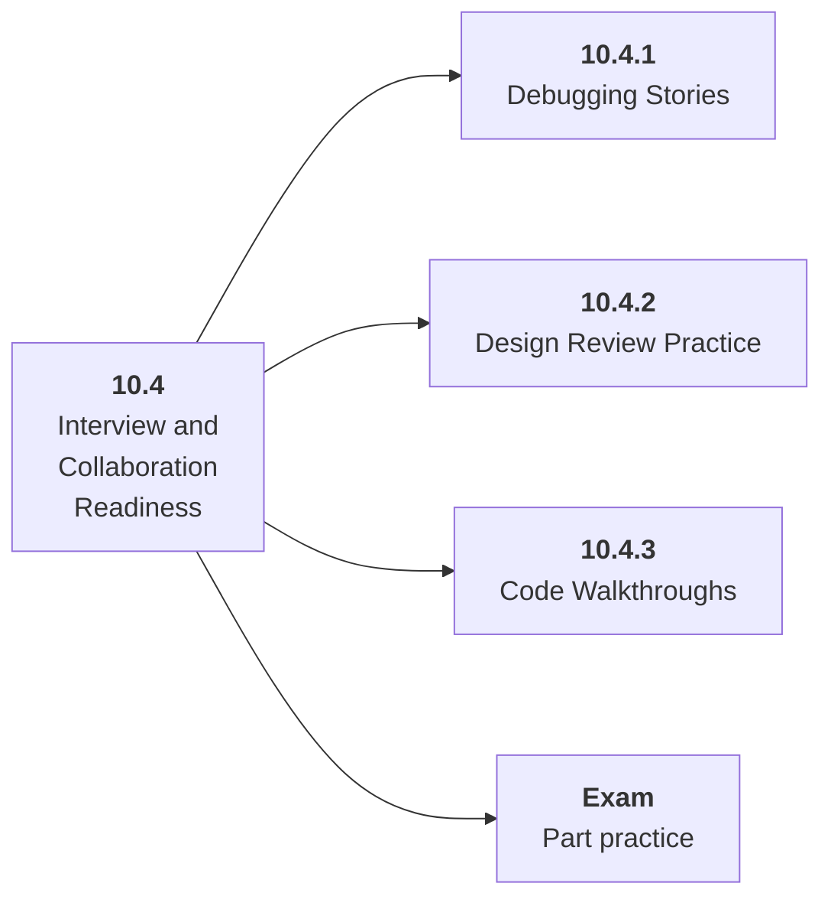

# 10.4 Interview and Collaboration Readiness

## Role at Stage 10: Mastery

Turn project experience into clear debugging stories, design reviews, and collaboration habits. This part is one capability inside the stage. It should leave behind an artifact, measurements, and a short explanation of failure modes.

## Explanation

This part has 3 sub-parts because the topic needs that many learning units to feel natural. Some stages have more parts and some have fewer; the structure follows the topic, not a fixed template.

## Part Diagram

## Sub-Parts

| Sub-part folder | What it explains |
|---|---|
| [10.4.1 Debugging Stories](<10.4.1 Debugging Stories/index.md>) | Debugging Stories is the working skill inside Interview and Collaboration Readiness that helps you build the stage artifact, A capstone AI system with architecture, implementation, evaluation, deployment, observability, cost, security review, and portfolio narrative, while collecting enough evidence to trust the result. |
| [10.4.2 Design Review Practice](<10.4.2 Design Review Practice/index.md>) | Design Review Practice is the working skill inside Interview and Collaboration Readiness that helps you build the stage artifact, A capstone AI system with architecture, implementation, evaluation, deployment, observability, cost, security review, and portfolio narrative, while collecting enough evidence to trust the result. |
| [10.4.3 Code Walkthroughs](<10.4.3 Code Walkthroughs/index.md>) | Code Walkthroughs is the working skill inside Interview and Collaboration Readiness that helps you build the stage artifact, A capstone AI system with architecture, implementation, evaluation, deployment, observability, cost, security review, and portfolio narrative, while collecting enough evidence to trust the result. |

## What a Person Who Masters This Part Can Do

- Explain how Interview and Collaboration Readiness supports a capstone ai system with architecture, implementation, evaluation, deployment, observability, cost, security review, and portfolio narrative..
- Build and inspect this artifact: Prepare a portfolio walkthrough.
- Measure progress with: Track clarity, specificity, evidence, and tradeoff explanations.
- Debug at least one failure mode before moving to the next part.

## Build and Measure

**Build:** Prepare a portfolio walkthrough.

**Measure:** Track clarity, specificity, evidence, and tradeoff explanations.

## Tests

Take one 30-question exam after studying this part. It opens in a new browser tab so the study page stays available.

  <a href="test/exam.html" target="_blank" rel="noopener">Open Part Exam</a>

## Back to Stage

Return to [Stage 10: Mastery](<../index.md>).
