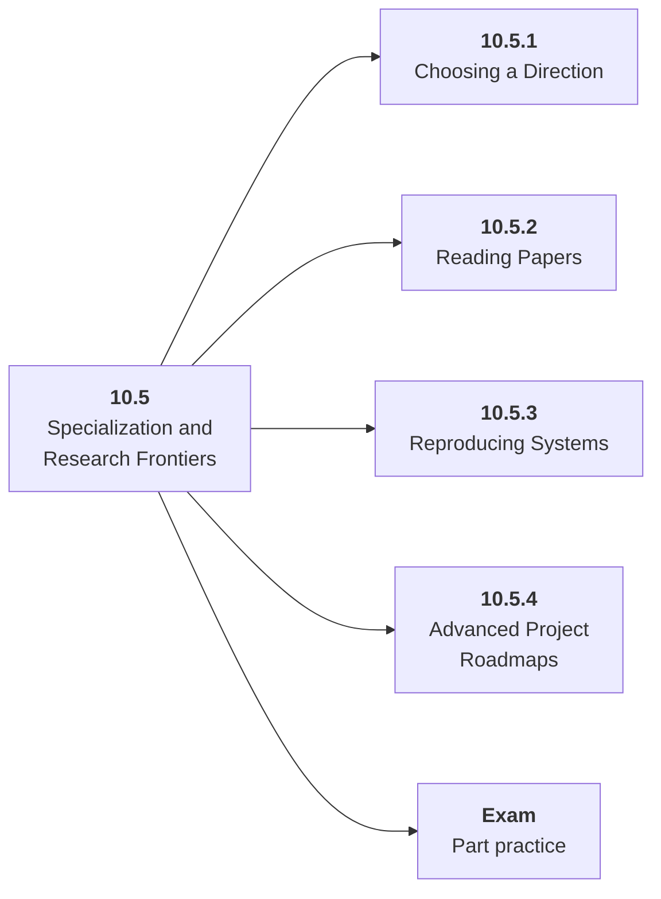

# 10.5 Specialization and Research Frontiers

## Role at Stage 10: Mastery

Choose a deeper direction after the core architecture is complete. This part is one capability inside the stage. It should leave behind an artifact, measurements, and a short explanation of failure modes.

## Explanation

This part has 4 sub-parts because the topic needs that many learning units to feel natural. Some stages have more parts and some have fewer; the structure follows the topic, not a fixed template.

## Part Diagram

## Sub-Parts

| Sub-part folder | What it explains |
|---|---|
| [10.5.1 Choosing a Direction](<10.5.1 Choosing a Direction/index.md>) | Choosing a Direction is the working skill inside Specialization and Research Frontiers that helps you build the stage artifact, A capstone AI system with architecture, implementation, evaluation, deployment, observability, cost, security review, and portfolio narrative, while collecting enough evidence to trust the result. |
| [10.5.2 Reading Papers](<10.5.2 Reading Papers/index.md>) | Reading Papers is the working skill inside Specialization and Research Frontiers that helps you build the stage artifact, A capstone AI system with architecture, implementation, evaluation, deployment, observability, cost, security review, and portfolio narrative, while collecting enough evidence to trust the result. |
| [10.5.3 Reproducing Systems](<10.5.3 Reproducing Systems/index.md>) | Reproducing Systems is the working skill inside Specialization and Research Frontiers that helps you build the stage artifact, A capstone AI system with architecture, implementation, evaluation, deployment, observability, cost, security review, and portfolio narrative, while collecting enough evidence to trust the result. |
| [10.5.4 Advanced Project Roadmaps](<10.5.4 Advanced Project Roadmaps/index.md>) | Advanced Project Roadmaps is the working skill inside Specialization and Research Frontiers that helps you build the stage artifact, A capstone AI system with architecture, implementation, evaluation, deployment, observability, cost, security review, and portfolio narrative, while collecting enough evidence to trust the result. |

## What a Person Who Masters This Part Can Do

- Explain how Specialization and Research Frontiers supports a capstone ai system with architecture, implementation, evaluation, deployment, observability, cost, security review, and portfolio narrative..
- Build and inspect this artifact: Write a specialization plan with an advanced project.
- Measure progress with: Track depth, reproduction quality, benchmark rigor, and explanation quality.
- Debug at least one failure mode before moving to the next part.

## Build and Measure

**Build:** Write a specialization plan with an advanced project.

**Measure:** Track depth, reproduction quality, benchmark rigor, and explanation quality.

## Tests

Take one 30-question exam after studying this part. It opens in a new browser tab so the study page stays available.

  <a href="test/exam.html" target="_blank" rel="noopener">Open Part Exam</a>

## Back to Stage

Return to [Stage 10: Mastery](<../index.md>).
