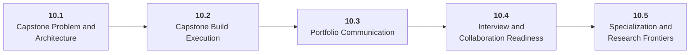

# Stage 10: Mastery

10 Own a complete AI system end to end.

## Goal

Integrate product judgment, LLM understanding, applications, agents, infrastructure, optimization, security, and communication into a capstone portfolio project.

## Roadmap to Master This Stage

1. Read the stage goal and diagram before opening the parts.
2. Move through the parts in order unless you can already pass the exit criteria.
3. Study each sub-part folder: overview, deep dive, and examples/practice.
4. Build the stage artifact in small slices and measure the listed metrics.
5. Use the part exam after each part, or open the global Exam tab to test across the roadmap.

## Stage Structure Diagram

## Parts

| Part | Simple explanation | Build focus |
|---|---|---|
| [10.1 Capstone Problem and Architecture](<10.1 Capstone Problem and Architecture/index.md>) | Choose a narrow but real system and design it before coding. | Write a capstone architecture document. |
| [10.2 Capstone Build Execution](<10.2 Capstone Build Execution/index.md>) | Build the capstone in vertical slices that integrate product, model, data, and deployment early. | Implement milestone slices. |
| [10.3 Portfolio Communication](<10.3 Portfolio Communication/index.md>) | Explain your work through READMEs, diagrams, eval reports, demos, and failure analysis. | Create README, demo script, diagram, and results report. |
| [10.4 Interview and Collaboration Readiness](<10.4 Interview and Collaboration Readiness/index.md>) | Turn project experience into clear debugging stories, design reviews, and collaboration habits. | Prepare a portfolio walkthrough. |
| [10.5 Specialization and Research Frontiers](<10.5 Specialization and Research Frontiers/index.md>) | Choose a deeper direction after the core architecture is complete. | Write a specialization plan with an advanced project. |

## Sub-Part Map

| Part | Sub-part | Why it matters |
|---|---|---|
| 10.1 | [10.1.1 Problem Selection](<10.1 Capstone Problem and Architecture/10.1.1 Problem Selection/index.md>) | Problem Selection is the working skill inside Capstone Problem and Architecture that helps you build the stage artifact, A capstone AI system with architecture, implementation, evaluation, deployment, observability, cost, security review, and portfolio narrative, while collecting enough evidence to trust the result. |
| 10.1 | [10.1.2 Requirements and Constraints](<10.1 Capstone Problem and Architecture/10.1.2 Requirements and Constraints/index.md>) | Requirements and Constraints is the working skill inside Capstone Problem and Architecture that helps you build the stage artifact, A capstone AI system with architecture, implementation, evaluation, deployment, observability, cost, security review, and portfolio narrative, while collecting enough evidence to trust the result. |
| 10.1 | [10.1.3 Architecture Decision Records](<10.1 Capstone Problem and Architecture/10.1.3 Architecture Decision Records/index.md>) | Architecture Decision Records is the working skill inside Capstone Problem and Architecture that helps you build the stage artifact, A capstone AI system with architecture, implementation, evaluation, deployment, observability, cost, security review, and portfolio narrative, while collecting enough evidence to trust the result. |
| 10.1 | [10.1.4 Evaluation and Risk Plan](<10.1 Capstone Problem and Architecture/10.1.4 Evaluation and Risk Plan/index.md>) | Evaluation and Risk Plan is the working skill inside Capstone Problem and Architecture that helps you build the stage artifact, A capstone AI system with architecture, implementation, evaluation, deployment, observability, cost, security review, and portfolio narrative, while collecting enough evidence to trust the result. |
| 10.2 | [10.2.1 Vertical Slice Planning](<10.2 Capstone Build Execution/10.2.1 Vertical Slice Planning/index.md>) | Vertical Slice Planning is the working skill inside Capstone Build Execution that helps you build the stage artifact, A capstone AI system with architecture, implementation, evaluation, deployment, observability, cost, security review, and portfolio narrative, while collecting enough evidence to trust the result. |
| 10.2 | [10.2.2 Integration Testing](<10.2 Capstone Build Execution/10.2.2 Integration Testing/index.md>) | Integration Testing is the working skill inside Capstone Build Execution that helps you build the stage artifact, A capstone AI system with architecture, implementation, evaluation, deployment, observability, cost, security review, and portfolio narrative, while collecting enough evidence to trust the result. |
| 10.2 | [10.2.3 Deployment and Observability](<10.2 Capstone Build Execution/10.2.3 Deployment and Observability/index.md>) | Deployment and Observability is the working skill inside Capstone Build Execution that helps you build the stage artifact, A capstone AI system with architecture, implementation, evaluation, deployment, observability, cost, security review, and portfolio narrative, while collecting enough evidence to trust the result. |
| 10.2 | [10.2.4 Failure Analysis](<10.2 Capstone Build Execution/10.2.4 Failure Analysis/index.md>) | Failure Analysis is the working skill inside Capstone Build Execution that helps you build the stage artifact, A capstone AI system with architecture, implementation, evaluation, deployment, observability, cost, security review, and portfolio narrative, while collecting enough evidence to trust the result. |
| 10.3 | [10.3.1 Technical Writing](<10.3 Portfolio Communication/10.3.1 Technical Writing/index.md>) | Technical Writing is the working skill inside Portfolio Communication that helps you build the stage artifact, A capstone AI system with architecture, implementation, evaluation, deployment, observability, cost, security review, and portfolio narrative, while collecting enough evidence to trust the result. |
| 10.3 | [10.3.2 Architecture Diagrams](<10.3 Portfolio Communication/10.3.2 Architecture Diagrams/index.md>) | Architecture Diagrams is the working skill inside Portfolio Communication that helps you build the stage artifact, A capstone AI system with architecture, implementation, evaluation, deployment, observability, cost, security review, and portfolio narrative, while collecting enough evidence to trust the result. |
| 10.3 | [10.3.3 Demo and Result Narrative](<10.3 Portfolio Communication/10.3.3 Demo and Result Narrative/index.md>) | Demo and Result Narrative is the working skill inside Portfolio Communication that helps you build the stage artifact, A capstone AI system with architecture, implementation, evaluation, deployment, observability, cost, security review, and portfolio narrative, while collecting enough evidence to trust the result. |
| 10.4 | [10.4.1 Debugging Stories](<10.4 Interview and Collaboration Readiness/10.4.1 Debugging Stories/index.md>) | Debugging Stories is the working skill inside Interview and Collaboration Readiness that helps you build the stage artifact, A capstone AI system with architecture, implementation, evaluation, deployment, observability, cost, security review, and portfolio narrative, while collecting enough evidence to trust the result. |
| 10.4 | [10.4.2 Design Review Practice](<10.4 Interview and Collaboration Readiness/10.4.2 Design Review Practice/index.md>) | Design Review Practice is the working skill inside Interview and Collaboration Readiness that helps you build the stage artifact, A capstone AI system with architecture, implementation, evaluation, deployment, observability, cost, security review, and portfolio narrative, while collecting enough evidence to trust the result. |
| 10.4 | [10.4.3 Code Walkthroughs](<10.4 Interview and Collaboration Readiness/10.4.3 Code Walkthroughs/index.md>) | Code Walkthroughs is the working skill inside Interview and Collaboration Readiness that helps you build the stage artifact, A capstone AI system with architecture, implementation, evaluation, deployment, observability, cost, security review, and portfolio narrative, while collecting enough evidence to trust the result. |
| 10.5 | [10.5.1 Choosing a Direction](<10.5 Specialization and Research Frontiers/10.5.1 Choosing a Direction/index.md>) | Choosing a Direction is the working skill inside Specialization and Research Frontiers that helps you build the stage artifact, A capstone AI system with architecture, implementation, evaluation, deployment, observability, cost, security review, and portfolio narrative, while collecting enough evidence to trust the result. |
| 10.5 | [10.5.2 Reading Papers](<10.5 Specialization and Research Frontiers/10.5.2 Reading Papers/index.md>) | Reading Papers is the working skill inside Specialization and Research Frontiers that helps you build the stage artifact, A capstone AI system with architecture, implementation, evaluation, deployment, observability, cost, security review, and portfolio narrative, while collecting enough evidence to trust the result. |
| 10.5 | [10.5.3 Reproducing Systems](<10.5 Specialization and Research Frontiers/10.5.3 Reproducing Systems/index.md>) | Reproducing Systems is the working skill inside Specialization and Research Frontiers that helps you build the stage artifact, A capstone AI system with architecture, implementation, evaluation, deployment, observability, cost, security review, and portfolio narrative, while collecting enough evidence to trust the result. |
| 10.5 | [10.5.4 Advanced Project Roadmaps](<10.5 Specialization and Research Frontiers/10.5.4 Advanced Project Roadmaps/index.md>) | Advanced Project Roadmaps is the working skill inside Specialization and Research Frontiers that helps you build the stage artifact, A capstone AI system with architecture, implementation, evaluation, deployment, observability, cost, security review, and portfolio narrative, while collecting enough evidence to trust the result. |

## Stage Artifact

A capstone AI system with architecture, implementation, evaluation, deployment, observability, cost, security review, and portfolio narrative.

## What to Measure

- milestones complete
- eval pass rate
- latency and cost targets
- security review
- documentation quality
- demo reliability

## Exit Criteria

- design before coding
- build, evaluate, deploy, secure, and monitor
- debug across the stack
- communicate work through docs, demos, and interviews

## Navigation

Previous: [Stage 9: AI Security, Blockchain, and ZKML](<../9. Security, Blockchain, ZKML/index.md>)
