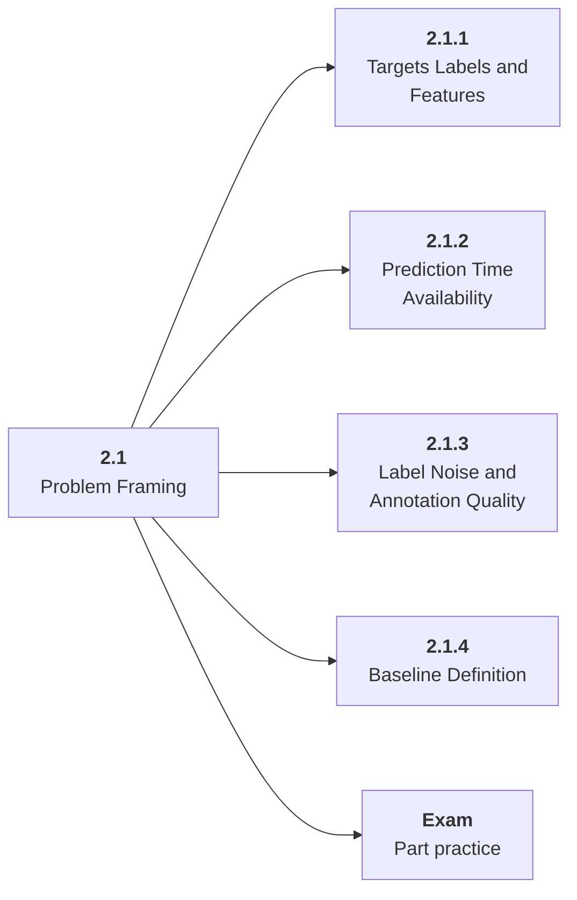

# 2.1 Problem Framing

## Role at Stage 2: Machine Learning

Turn product goals into learnable tasks with clear targets, labels, features, and constraints. This part is one capability inside the stage. It should leave behind an artifact, measurements, and a short explanation of failure modes.

## Explanation

This part has 4 sub-parts because the topic needs that many learning units to feel natural. Some stages have more parts and some have fewer; the structure follows the topic, not a fixed template.

## Part Diagram

## Sub-Parts

| Sub-part folder | What it explains |
|---|---|
| [2.1.1 Targets Labels and Features](<2.1.1 Targets Labels and Features/index.md>) | Targets Labels and Features is the working skill inside Problem Framing that helps you build the stage artifact, An ML baseline report comparing simple and stronger models with metrics, error slices, and a model card, while collecting enough evidence to trust the result. |
| [2.1.2 Prediction Time Availability](<2.1.2 Prediction Time Availability/index.md>) | Prediction Time Availability is the working skill inside Problem Framing that helps you build the stage artifact, An ML baseline report comparing simple and stronger models with metrics, error slices, and a model card, while collecting enough evidence to trust the result. |
| [2.1.3 Label Noise and Annotation Quality](<2.1.3 Label Noise and Annotation Quality/index.md>) | Label Noise and Annotation Quality is the working skill inside Problem Framing that helps you build the stage artifact, An ML baseline report comparing simple and stronger models with metrics, error slices, and a model card, while collecting enough evidence to trust the result. |
| [2.1.4 Baseline Definition](<2.1.4 Baseline Definition/index.md>) | Baseline Definition is the working skill inside Problem Framing that helps you build the stage artifact, An ML baseline report comparing simple and stronger models with metrics, error slices, and a model card, while collecting enough evidence to trust the result. |

## What a Person Who Masters This Part Can Do

- Explain how Problem Framing supports an ml baseline report comparing simple and stronger models with metrics, error slices, and a model card..
- Build and inspect this artifact: Create a task framing document.
- Measure progress with: Report target definition, label source, feature availability, and prediction-time constraints.
- Debug at least one failure mode before moving to the next part.

## Build and Measure

**Build:** Create a task framing document.

**Measure:** Report target definition, label source, feature availability, and prediction-time constraints.

## Tests

Take one 30-question exam after studying this part. It opens in a new browser tab so the study page stays available.

  <a href="test/exam.html" target="_blank" rel="noopener">Open Part Exam</a>

## Back to Stage

Return to [Stage 2: Machine Learning](<../index.md>).
