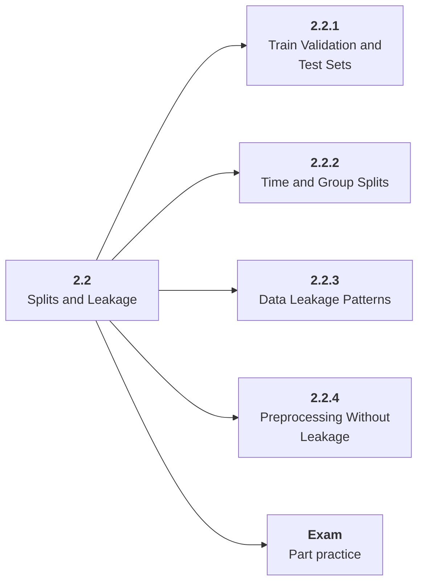

# 2.2 Splits and Leakage

## Role at Stage 2: Machine Learning

Design evaluation splits that represent future use instead of memorized training data. This part is one capability inside the stage. It should leave behind an artifact, measurements, and a short explanation of failure modes.

## Explanation

This part has 4 sub-parts because the topic needs that many learning units to feel natural. Some stages have more parts and some have fewer; the structure follows the topic, not a fixed template.

## Part Diagram

## Sub-Parts

| Sub-part folder | What it explains |
|---|---|
| [2.2.1 Train Validation and Test Sets](<2.2.1 Train Validation and Test Sets/index.md>) | Train Validation and Test Sets is the working skill inside Splits and Leakage that helps you build the stage artifact, An ML baseline report comparing simple and stronger models with metrics, error slices, and a model card, while collecting enough evidence to trust the result. |
| [2.2.2 Time and Group Splits](<2.2.2 Time and Group Splits/index.md>) | Time and Group Splits is the working skill inside Splits and Leakage that helps you build the stage artifact, An ML baseline report comparing simple and stronger models with metrics, error slices, and a model card, while collecting enough evidence to trust the result. |
| [2.2.3 Data Leakage Patterns](<2.2.3 Data Leakage Patterns/index.md>) | Data Leakage Patterns is the working skill inside Splits and Leakage that helps you build the stage artifact, An ML baseline report comparing simple and stronger models with metrics, error slices, and a model card, while collecting enough evidence to trust the result. |
| [2.2.4 Preprocessing Without Leakage](<2.2.4 Preprocessing Without Leakage/index.md>) | Preprocessing Without Leakage is the working skill inside Splits and Leakage that helps you build the stage artifact, An ML baseline report comparing simple and stronger models with metrics, error slices, and a model card, while collecting enough evidence to trust the result. |

## What a Person Who Masters This Part Can Do

- Explain how Splits and Leakage supports an ml baseline report comparing simple and stronger models with metrics, error slices, and a model card..
- Build and inspect this artifact: Create and justify two split strategies.
- Measure progress with: Track split sizes, group boundaries, time boundaries, duplicates, and leakage risks.
- Debug at least one failure mode before moving to the next part.

## Build and Measure

**Build:** Create and justify two split strategies.

**Measure:** Track split sizes, group boundaries, time boundaries, duplicates, and leakage risks.

## Tests

Take one 30-question exam after studying this part. It opens in a new browser tab so the study page stays available.

  <a href="test/exam.html" target="_blank" rel="noopener">Open Part Exam</a>

## Back to Stage

Return to [Stage 2: Machine Learning](<../index.md>).
