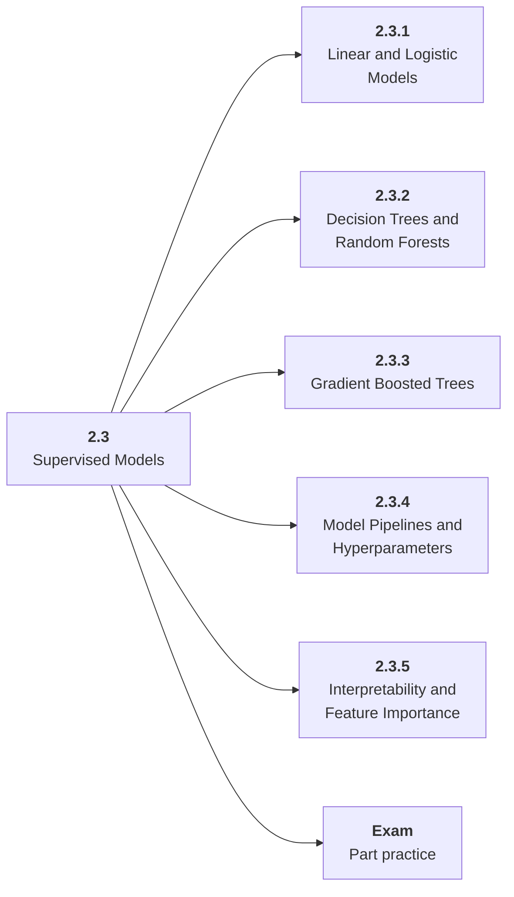

# 2.3 Supervised Models

## Role at Stage 2: Machine Learning

Use simple and strong supervised models before neural complexity. This part is one capability inside the stage. It should leave behind an artifact, measurements, and a short explanation of failure modes.

## Explanation

This part has 5 sub-parts because the topic needs that many learning units to feel natural. Some stages have more parts and some have fewer; the structure follows the topic, not a fixed template.

## Part Diagram

## Sub-Parts

| Sub-part folder | What it explains |
|---|---|
| [2.3.1 Linear and Logistic Models](<2.3.1 Linear and Logistic Models/index.md>) | Linear and Logistic Models is the working skill inside Supervised Models that helps you build the stage artifact, An ML baseline report comparing simple and stronger models with metrics, error slices, and a model card, while collecting enough evidence to trust the result. |
| [2.3.2 Decision Trees and Random Forests](<2.3.2 Decision Trees and Random Forests/index.md>) | Decision Trees and Random Forests is the working skill inside Supervised Models that helps you build the stage artifact, An ML baseline report comparing simple and stronger models with metrics, error slices, and a model card, while collecting enough evidence to trust the result. |
| [2.3.3 Gradient Boosted Trees](<2.3.3 Gradient Boosted Trees/index.md>) | Gradient Boosted Trees is the working skill inside Supervised Models that helps you build the stage artifact, An ML baseline report comparing simple and stronger models with metrics, error slices, and a model card, while collecting enough evidence to trust the result. |
| [2.3.4 Model Pipelines and Hyperparameters](<2.3.4 Model Pipelines and Hyperparameters/index.md>) | Model Pipelines and Hyperparameters is the working skill inside Supervised Models that helps you build the stage artifact, An ML baseline report comparing simple and stronger models with metrics, error slices, and a model card, while collecting enough evidence to trust the result. |
| [2.3.5 Interpretability and Feature Importance](<2.3.5 Interpretability and Feature Importance/index.md>) | Interpretability and Feature Importance is the working skill inside Supervised Models that helps you build the stage artifact, An ML baseline report comparing simple and stronger models with metrics, error slices, and a model card, while collecting enough evidence to trust the result. |

## What a Person Who Masters This Part Can Do

- Explain how Supervised Models supports an ml baseline report comparing simple and stronger models with metrics, error slices, and a model card..
- Build and inspect this artifact: Train linear, tree, and ensemble models for the same task.
- Measure progress with: Compare lift, calibration, feature importance, speed, and interpretability.
- Debug at least one failure mode before moving to the next part.

## Build and Measure

**Build:** Train linear, tree, and ensemble models for the same task.

**Measure:** Compare lift, calibration, feature importance, speed, and interpretability.

## Tests

Take one 30-question exam after studying this part. It opens in a new browser tab so the study page stays available.

  <a href="test/exam.html" target="_blank" rel="noopener">Open Part Exam</a>

## Back to Stage

Return to [Stage 2: Machine Learning](<../index.md>).
