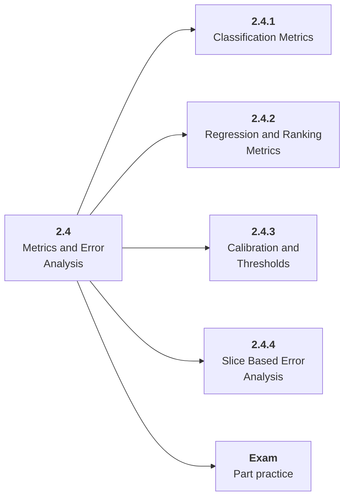

# 2.4 Metrics and Error Analysis

## Role at Stage 2: Machine Learning

Understand model behavior through metrics, thresholds, slices, and concrete failures. This part is one capability inside the stage. It should leave behind an artifact, measurements, and a short explanation of failure modes.

## Explanation

This part has 4 sub-parts because the topic needs that many learning units to feel natural. Some stages have more parts and some have fewer; the structure follows the topic, not a fixed template.

## Part Diagram

## Sub-Parts

| Sub-part folder | What it explains |
|---|---|
| [2.4.1 Classification Metrics](<2.4.1 Classification Metrics/index.md>) | Classification Metrics is the working skill inside Metrics and Error Analysis that helps you build the stage artifact, An ML baseline report comparing simple and stronger models with metrics, error slices, and a model card, while collecting enough evidence to trust the result. |
| [2.4.2 Regression and Ranking Metrics](<2.4.2 Regression and Ranking Metrics/index.md>) | Regression and Ranking Metrics is the working skill inside Metrics and Error Analysis that helps you build the stage artifact, An ML baseline report comparing simple and stronger models with metrics, error slices, and a model card, while collecting enough evidence to trust the result. |
| [2.4.3 Calibration and Thresholds](<2.4.3 Calibration and Thresholds/index.md>) | Calibration and Thresholds is the working skill inside Metrics and Error Analysis that helps you build the stage artifact, An ML baseline report comparing simple and stronger models with metrics, error slices, and a model card, while collecting enough evidence to trust the result. |
| [2.4.4 Slice Based Error Analysis](<2.4.4 Slice Based Error Analysis/index.md>) | Slice Based Error Analysis is the working skill inside Metrics and Error Analysis that helps you build the stage artifact, An ML baseline report comparing simple and stronger models with metrics, error slices, and a model card, while collecting enough evidence to trust the result. |

## What a Person Who Masters This Part Can Do

- Explain how Metrics and Error Analysis supports an ml baseline report comparing simple and stronger models with metrics, error slices, and a model card..
- Build and inspect this artifact: Create an evaluation report with examples.
- Measure progress with: Track confusion matrix, precision/recall tradeoffs, calibration, and slice performance.
- Debug at least one failure mode before moving to the next part.

## Build and Measure

**Build:** Create an evaluation report with examples.

**Measure:** Track confusion matrix, precision/recall tradeoffs, calibration, and slice performance.

## Tests

Take one 30-question exam after studying this part. It opens in a new browser tab so the study page stays available.

  <a href="test/exam.html" target="_blank" rel="noopener">Open Part Exam</a>

## Back to Stage

Return to [Stage 2: Machine Learning](<../index.md>).
