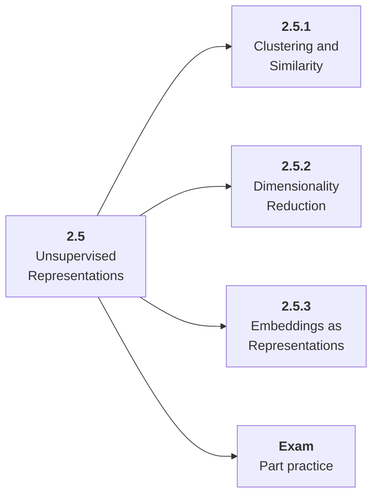

# 2.5 Unsupervised Representations

## Role at Stage 2: Machine Learning

Prepare for embeddings, clustering, retrieval, and topic discovery. This part is one capability inside the stage. It should leave behind an artifact, measurements, and a short explanation of failure modes.

## Explanation

This part has 3 sub-parts because the topic needs that many learning units to feel natural. Some stages have more parts and some have fewer; the structure follows the topic, not a fixed template.

## Part Diagram

## Sub-Parts

| Sub-part folder | What it explains |
|---|---|
| [2.5.1 Clustering and Similarity](<2.5.1 Clustering and Similarity/index.md>) | Clustering and Similarity is the working skill inside Unsupervised Representations that helps you build the stage artifact, An ML baseline report comparing simple and stronger models with metrics, error slices, and a model card, while collecting enough evidence to trust the result. |
| [2.5.2 Dimensionality Reduction](<2.5.2 Dimensionality Reduction/index.md>) | Dimensionality Reduction is the working skill inside Unsupervised Representations that helps you build the stage artifact, An ML baseline report comparing simple and stronger models with metrics, error slices, and a model card, while collecting enough evidence to trust the result. |
| [2.5.3 Embeddings as Representations](<2.5.3 Embeddings as Representations/index.md>) | Embeddings as Representations is the working skill inside Unsupervised Representations that helps you build the stage artifact, An ML baseline report comparing simple and stronger models with metrics, error slices, and a model card, while collecting enough evidence to trust the result. |

## What a Person Who Masters This Part Can Do

- Explain how Unsupervised Representations supports an ml baseline report comparing simple and stronger models with metrics, error slices, and a model card..
- Build and inspect this artifact: Cluster and visualize a dataset.
- Measure progress with: Report nearest examples, cluster stability, projection limits, and usefulness.
- Debug at least one failure mode before moving to the next part.

## Build and Measure

**Build:** Cluster and visualize a dataset.

**Measure:** Report nearest examples, cluster stability, projection limits, and usefulness.

## Tests

Take one 30-question exam after studying this part. It opens in a new browser tab so the study page stays available.

  <a href="test/exam.html" target="_blank" rel="noopener">Open Part Exam</a>

## Back to Stage

Return to [Stage 2: Machine Learning](<../index.md>).
