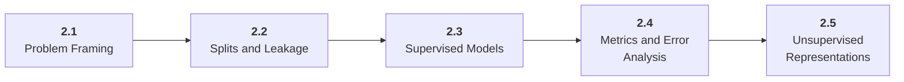

# Stage 2: Machine Learning

2 Learn how models learn from data and how evaluation can lie.

## Goal

Develop the ML habits that remain essential for deep learning, LLM applications, and agent systems: baselines, splits, metrics, leakage checks, and error analysis.

## Roadmap to Master This Stage

1. Read the stage goal and diagram before opening the parts.
2. Move through the parts in order unless you can already pass the exit criteria.
3. Study each sub-part folder: overview, deep dive, and examples/practice.
4. Build the stage artifact in small slices and measure the listed metrics.
5. Use the part exam after each part, or open the global Exam tab to test across the roadmap.

## Stage Structure Diagram

## Parts

| Part | Simple explanation | Build focus |
|---|---|---|
| [2.1 Problem Framing](<2.1 Problem Framing/index.md>) | Turn product goals into learnable tasks with clear targets, labels, features, and constraints. | Create a task framing document. |
| [2.2 Splits and Leakage](<2.2 Splits and Leakage/index.md>) | Design evaluation splits that represent future use instead of memorized training data. | Create and justify two split strategies. |
| [2.3 Supervised Models](<2.3 Supervised Models/index.md>) | Use simple and strong supervised models before neural complexity. | Train linear, tree, and ensemble models for the same task. |
| [2.4 Metrics and Error Analysis](<2.4 Metrics and Error Analysis/index.md>) | Understand model behavior through metrics, thresholds, slices, and concrete failures. | Create an evaluation report with examples. |
| [2.5 Unsupervised Representations](<2.5 Unsupervised Representations/index.md>) | Prepare for embeddings, clustering, retrieval, and topic discovery. | Cluster and visualize a dataset. |

## Sub-Part Map

| Part | Sub-part | Why it matters |
|---|---|---|
| 2.1 | [2.1.1 Targets Labels and Features](<2.1 Problem Framing/2.1.1 Targets Labels and Features/index.md>) | Targets Labels and Features is the working skill inside Problem Framing that helps you build the stage artifact, An ML baseline report comparing simple and stronger models with metrics, error slices, and a model card, while collecting enough evidence to trust the result. |
| 2.1 | [2.1.2 Prediction Time Availability](<2.1 Problem Framing/2.1.2 Prediction Time Availability/index.md>) | Prediction Time Availability is the working skill inside Problem Framing that helps you build the stage artifact, An ML baseline report comparing simple and stronger models with metrics, error slices, and a model card, while collecting enough evidence to trust the result. |
| 2.1 | [2.1.3 Label Noise and Annotation Quality](<2.1 Problem Framing/2.1.3 Label Noise and Annotation Quality/index.md>) | Label Noise and Annotation Quality is the working skill inside Problem Framing that helps you build the stage artifact, An ML baseline report comparing simple and stronger models with metrics, error slices, and a model card, while collecting enough evidence to trust the result. |
| 2.1 | [2.1.4 Baseline Definition](<2.1 Problem Framing/2.1.4 Baseline Definition/index.md>) | Baseline Definition is the working skill inside Problem Framing that helps you build the stage artifact, An ML baseline report comparing simple and stronger models with metrics, error slices, and a model card, while collecting enough evidence to trust the result. |
| 2.2 | [2.2.1 Train Validation and Test Sets](<2.2 Splits and Leakage/2.2.1 Train Validation and Test Sets/index.md>) | Train Validation and Test Sets is the working skill inside Splits and Leakage that helps you build the stage artifact, An ML baseline report comparing simple and stronger models with metrics, error slices, and a model card, while collecting enough evidence to trust the result. |
| 2.2 | [2.2.2 Time and Group Splits](<2.2 Splits and Leakage/2.2.2 Time and Group Splits/index.md>) | Time and Group Splits is the working skill inside Splits and Leakage that helps you build the stage artifact, An ML baseline report comparing simple and stronger models with metrics, error slices, and a model card, while collecting enough evidence to trust the result. |
| 2.2 | [2.2.3 Data Leakage Patterns](<2.2 Splits and Leakage/2.2.3 Data Leakage Patterns/index.md>) | Data Leakage Patterns is the working skill inside Splits and Leakage that helps you build the stage artifact, An ML baseline report comparing simple and stronger models with metrics, error slices, and a model card, while collecting enough evidence to trust the result. |
| 2.2 | [2.2.4 Preprocessing Without Leakage](<2.2 Splits and Leakage/2.2.4 Preprocessing Without Leakage/index.md>) | Preprocessing Without Leakage is the working skill inside Splits and Leakage that helps you build the stage artifact, An ML baseline report comparing simple and stronger models with metrics, error slices, and a model card, while collecting enough evidence to trust the result. |
| 2.3 | [2.3.1 Linear and Logistic Models](<2.3 Supervised Models/2.3.1 Linear and Logistic Models/index.md>) | Linear and Logistic Models is the working skill inside Supervised Models that helps you build the stage artifact, An ML baseline report comparing simple and stronger models with metrics, error slices, and a model card, while collecting enough evidence to trust the result. |
| 2.3 | [2.3.2 Decision Trees and Random Forests](<2.3 Supervised Models/2.3.2 Decision Trees and Random Forests/index.md>) | Decision Trees and Random Forests is the working skill inside Supervised Models that helps you build the stage artifact, An ML baseline report comparing simple and stronger models with metrics, error slices, and a model card, while collecting enough evidence to trust the result. |
| 2.3 | [2.3.3 Gradient Boosted Trees](<2.3 Supervised Models/2.3.3 Gradient Boosted Trees/index.md>) | Gradient Boosted Trees is the working skill inside Supervised Models that helps you build the stage artifact, An ML baseline report comparing simple and stronger models with metrics, error slices, and a model card, while collecting enough evidence to trust the result. |
| 2.3 | [2.3.4 Model Pipelines and Hyperparameters](<2.3 Supervised Models/2.3.4 Model Pipelines and Hyperparameters/index.md>) | Model Pipelines and Hyperparameters is the working skill inside Supervised Models that helps you build the stage artifact, An ML baseline report comparing simple and stronger models with metrics, error slices, and a model card, while collecting enough evidence to trust the result. |
| 2.3 | [2.3.5 Interpretability and Feature Importance](<2.3 Supervised Models/2.3.5 Interpretability and Feature Importance/index.md>) | Interpretability and Feature Importance is the working skill inside Supervised Models that helps you build the stage artifact, An ML baseline report comparing simple and stronger models with metrics, error slices, and a model card, while collecting enough evidence to trust the result. |
| 2.4 | [2.4.1 Classification Metrics](<2.4 Metrics and Error Analysis/2.4.1 Classification Metrics/index.md>) | Classification Metrics is the working skill inside Metrics and Error Analysis that helps you build the stage artifact, An ML baseline report comparing simple and stronger models with metrics, error slices, and a model card, while collecting enough evidence to trust the result. |
| 2.4 | [2.4.2 Regression and Ranking Metrics](<2.4 Metrics and Error Analysis/2.4.2 Regression and Ranking Metrics/index.md>) | Regression and Ranking Metrics is the working skill inside Metrics and Error Analysis that helps you build the stage artifact, An ML baseline report comparing simple and stronger models with metrics, error slices, and a model card, while collecting enough evidence to trust the result. |
| 2.4 | [2.4.3 Calibration and Thresholds](<2.4 Metrics and Error Analysis/2.4.3 Calibration and Thresholds/index.md>) | Calibration and Thresholds is the working skill inside Metrics and Error Analysis that helps you build the stage artifact, An ML baseline report comparing simple and stronger models with metrics, error slices, and a model card, while collecting enough evidence to trust the result. |
| 2.4 | [2.4.4 Slice Based Error Analysis](<2.4 Metrics and Error Analysis/2.4.4 Slice Based Error Analysis/index.md>) | Slice Based Error Analysis is the working skill inside Metrics and Error Analysis that helps you build the stage artifact, An ML baseline report comparing simple and stronger models with metrics, error slices, and a model card, while collecting enough evidence to trust the result. |
| 2.5 | [2.5.1 Clustering and Similarity](<2.5 Unsupervised Representations/2.5.1 Clustering and Similarity/index.md>) | Clustering and Similarity is the working skill inside Unsupervised Representations that helps you build the stage artifact, An ML baseline report comparing simple and stronger models with metrics, error slices, and a model card, while collecting enough evidence to trust the result. |
| 2.5 | [2.5.2 Dimensionality Reduction](<2.5 Unsupervised Representations/2.5.2 Dimensionality Reduction/index.md>) | Dimensionality Reduction is the working skill inside Unsupervised Representations that helps you build the stage artifact, An ML baseline report comparing simple and stronger models with metrics, error slices, and a model card, while collecting enough evidence to trust the result. |
| 2.5 | [2.5.3 Embeddings as Representations](<2.5 Unsupervised Representations/2.5.3 Embeddings as Representations/index.md>) | Embeddings as Representations is the working skill inside Unsupervised Representations that helps you build the stage artifact, An ML baseline report comparing simple and stronger models with metrics, error slices, and a model card, while collecting enough evidence to trust the result. |

## Stage Artifact

An ML baseline report comparing simple and stronger models with metrics, error slices, and a model card.

## What to Measure

- baseline metric
- improved model metric
- train-validation gap
- three error slices
- leakage checklist

## Exit Criteria

- frame supervised and unsupervised tasks
- choose and interpret metrics
- detect leakage and evaluation flaws
- write a concise model card and failure analysis

## Navigation

Previous: [Stage 1: Foundations](<../1. Foundations/index.md>) | Next: [Stage 3: Deep Learning](<../3. Deep Learning/index.md>)
