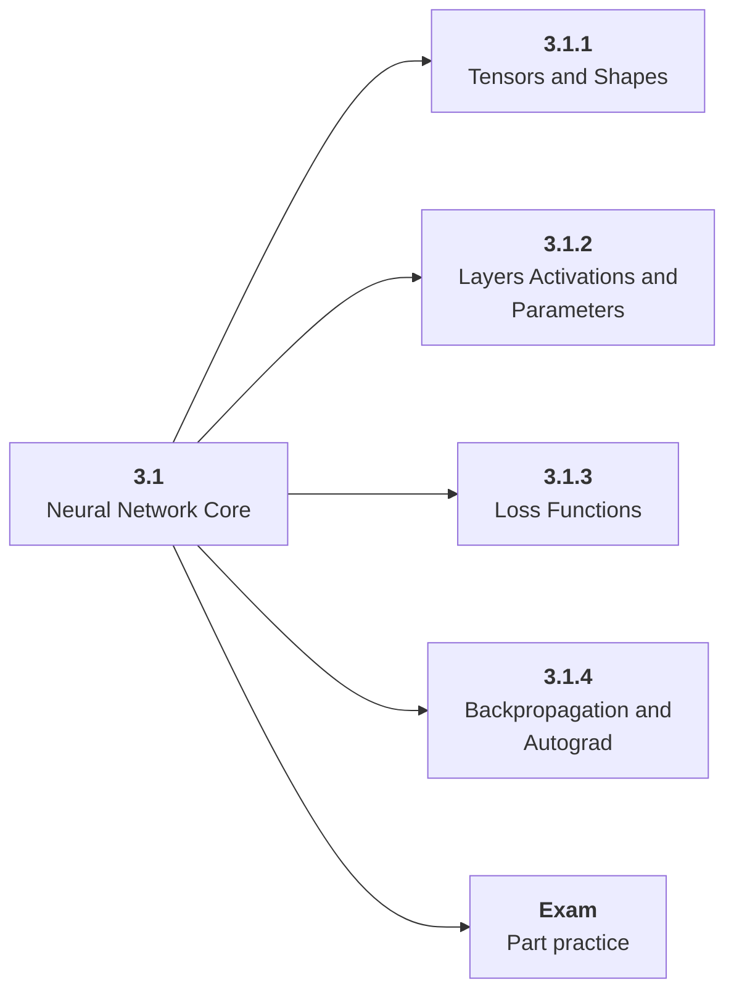

# 3.1 Neural Network Core

## Role at Stage 3: Deep Learning

Connect tensors, layers, losses, gradients, and optimizers to learning behavior. This part is one capability inside the stage. It should leave behind an artifact, measurements, and a short explanation of failure modes.

## Explanation

This part has 4 sub-parts because the topic needs that many learning units to feel natural. Some stages have more parts and some have fewer; the structure follows the topic, not a fixed template.

## Part Diagram

## Sub-Parts

| Sub-part folder | What it explains |
|---|---|
| [3.1.1 Tensors and Shapes](<3.1.1 Tensors and Shapes/index.md>) | Tensors and Shapes is the working skill inside Neural Network Core that helps you build the stage artifact, A PyTorch training project with loops, validation curves, checkpoints, ablations, and debugging notes, while collecting enough evidence to trust the result. |
| [3.1.2 Layers Activations and Parameters](<3.1.2 Layers Activations and Parameters/index.md>) | Layers Activations and Parameters is the working skill inside Neural Network Core that helps you build the stage artifact, A PyTorch training project with loops, validation curves, checkpoints, ablations, and debugging notes, while collecting enough evidence to trust the result. |
| [3.1.3 Loss Functions](<3.1.3 Loss Functions/index.md>) | Loss Functions is the working skill inside Neural Network Core that helps you build the stage artifact, A PyTorch training project with loops, validation curves, checkpoints, ablations, and debugging notes, while collecting enough evidence to trust the result. |
| [3.1.4 Backpropagation and Autograd](<3.1.4 Backpropagation and Autograd/index.md>) | Backpropagation and Autograd is the working skill inside Neural Network Core that helps you build the stage artifact, A PyTorch training project with loops, validation curves, checkpoints, ablations, and debugging notes, while collecting enough evidence to trust the result. |

## What a Person Who Masters This Part Can Do

- Explain how Neural Network Core supports a pytorch training project with loops, validation curves, checkpoints, ablations, and debugging notes..
- Build and inspect this artifact: Train a tiny neural network and inspect its learning curve.
- Measure progress with: Plot loss, accuracy, gradients, and one failed run.
- Debug at least one failure mode before moving to the next part.

## Build and Measure

**Build:** Train a tiny neural network and inspect its learning curve.

**Measure:** Plot loss, accuracy, gradients, and one failed run.

## Tests

Take one 30-question exam after studying this part. It opens in a new browser tab so the study page stays available.

  <a href="test/exam.html" target="_blank" rel="noopener">Open Part Exam</a>

## Back to Stage

Return to [Stage 3: Deep Learning](<../index.md>).
