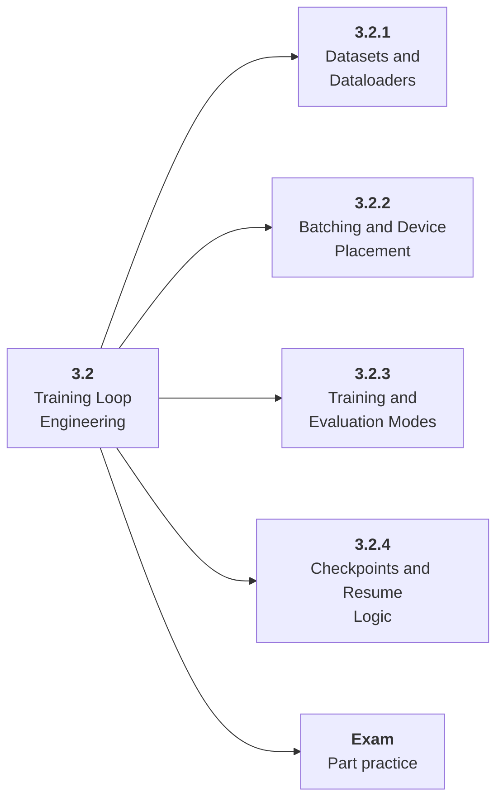

# 3.2 Training Loop Engineering

## Role at Stage 3: Deep Learning

Build training code that handles data, devices, checkpoints, validation, and experiment records. This part is one capability inside the stage. It should leave behind an artifact, measurements, and a short explanation of failure modes.

## Explanation

This part has 4 sub-parts because the topic needs that many learning units to feel natural. Some stages have more parts and some have fewer; the structure follows the topic, not a fixed template.

## Part Diagram

## Sub-Parts

| Sub-part folder | What it explains |
|---|---|
| [3.2.1 Datasets and Dataloaders](<3.2.1 Datasets and Dataloaders/index.md>) | Datasets and Dataloaders is the working skill inside Training Loop Engineering that helps you build the stage artifact, A PyTorch training project with loops, validation curves, checkpoints, ablations, and debugging notes, while collecting enough evidence to trust the result. |
| [3.2.2 Batching and Device Placement](<3.2.2 Batching and Device Placement/index.md>) | Batching and Device Placement is the working skill inside Training Loop Engineering that helps you build the stage artifact, A PyTorch training project with loops, validation curves, checkpoints, ablations, and debugging notes, while collecting enough evidence to trust the result. |
| [3.2.3 Training and Evaluation Modes](<3.2.3 Training and Evaluation Modes/index.md>) | Training and Evaluation Modes is the working skill inside Training Loop Engineering that helps you build the stage artifact, A PyTorch training project with loops, validation curves, checkpoints, ablations, and debugging notes, while collecting enough evidence to trust the result. |
| [3.2.4 Checkpoints and Resume Logic](<3.2.4 Checkpoints and Resume Logic/index.md>) | Checkpoints and Resume Logic is the working skill inside Training Loop Engineering that helps you build the stage artifact, A PyTorch training project with loops, validation curves, checkpoints, ablations, and debugging notes, while collecting enough evidence to trust the result. |

## What a Person Who Masters This Part Can Do

- Explain how Training Loop Engineering supports a pytorch training project with loops, validation curves, checkpoints, ablations, and debugging notes..
- Build and inspect this artifact: Create a reusable PyTorch training script.
- Measure progress with: Track epoch time, curves, checkpoints, and reproducibility.
- Debug at least one failure mode before moving to the next part.

## Build and Measure

**Build:** Create a reusable PyTorch training script.

**Measure:** Track epoch time, curves, checkpoints, and reproducibility.

## Tests

Take one 30-question exam after studying this part. It opens in a new browser tab so the study page stays available.

  <a href="test/exam.html" target="_blank" rel="noopener">Open Part Exam</a>

## Back to Stage

Return to [Stage 3: Deep Learning](<../index.md>).
