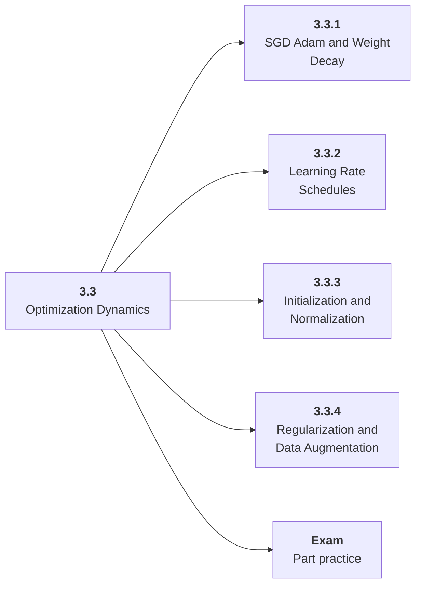

# 3.3 Optimization Dynamics

## Role at Stage 3: Deep Learning

Tune training behavior with optimizers, schedules, initialization, regularization, and ablations. This part is one capability inside the stage. It should leave behind an artifact, measurements, and a short explanation of failure modes.

## Explanation

This part has 4 sub-parts because the topic needs that many learning units to feel natural. Some stages have more parts and some have fewer; the structure follows the topic, not a fixed template.

## Part Diagram

## Sub-Parts

| Sub-part folder | What it explains |
|---|---|
| [3.3.1 SGD Adam and Weight Decay](<3.3.1 SGD Adam and Weight Decay/index.md>) | SGD Adam and Weight Decay is the working skill inside Optimization Dynamics that helps you build the stage artifact, A PyTorch training project with loops, validation curves, checkpoints, ablations, and debugging notes, while collecting enough evidence to trust the result. |
| [3.3.2 Learning Rate Schedules](<3.3.2 Learning Rate Schedules/index.md>) | Learning Rate Schedules is the working skill inside Optimization Dynamics that helps you build the stage artifact, A PyTorch training project with loops, validation curves, checkpoints, ablations, and debugging notes, while collecting enough evidence to trust the result. |
| [3.3.3 Initialization and Normalization](<3.3.3 Initialization and Normalization/index.md>) | Initialization and Normalization is the working skill inside Optimization Dynamics that helps you build the stage artifact, A PyTorch training project with loops, validation curves, checkpoints, ablations, and debugging notes, while collecting enough evidence to trust the result. |
| [3.3.4 Regularization and Data Augmentation](<3.3.4 Regularization and Data Augmentation/index.md>) | Regularization and Data Augmentation is the working skill inside Optimization Dynamics that helps you build the stage artifact, A PyTorch training project with loops, validation curves, checkpoints, ablations, and debugging notes, while collecting enough evidence to trust the result. |

## What a Person Who Masters This Part Can Do

- Explain how Optimization Dynamics supports a pytorch training project with loops, validation curves, checkpoints, ablations, and debugging notes..
- Build and inspect this artifact: Run learning-rate and regularization ablations.
- Measure progress with: Compare convergence, overfitting, stability, and final metric.
- Debug at least one failure mode before moving to the next part.

## Build and Measure

**Build:** Run learning-rate and regularization ablations.

**Measure:** Compare convergence, overfitting, stability, and final metric.

## Tests

Take one 30-question exam after studying this part. It opens in a new browser tab so the study page stays available.

  <a href="test/exam.html" target="_blank" rel="noopener">Open Part Exam</a>

## Back to Stage

Return to [Stage 3: Deep Learning](<../index.md>).
