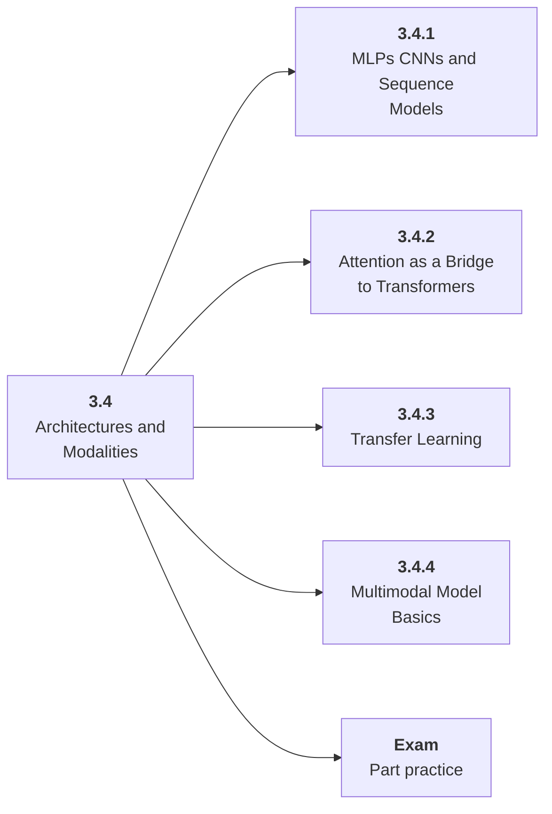

# 3.4 Architectures and Modalities

## Role at Stage 3: Deep Learning

Read and adapt model structures for tabular, vision, text, sequence, and multimodal tasks. This part is one capability inside the stage. It should leave behind an artifact, measurements, and a short explanation of failure modes.

## Explanation

This part has 4 sub-parts because the topic needs that many learning units to feel natural. Some stages have more parts and some have fewer; the structure follows the topic, not a fixed template.

## Part Diagram

## Sub-Parts

| Sub-part folder | What it explains |
|---|---|
| [3.4.1 MLPs CNNs and Sequence Models](<3.4.1 MLPs CNNs and Sequence Models/index.md>) | MLPs CNNs and Sequence Models is the working skill inside Architectures and Modalities that helps you build the stage artifact, A PyTorch training project with loops, validation curves, checkpoints, ablations, and debugging notes, while collecting enough evidence to trust the result. |
| [3.4.2 Attention as a Bridge to Transformers](<3.4.2 Attention as a Bridge to Transformers/index.md>) | Attention as a Bridge to Transformers is the working skill inside Architectures and Modalities that helps you build the stage artifact, A PyTorch training project with loops, validation curves, checkpoints, ablations, and debugging notes, while collecting enough evidence to trust the result. |
| [3.4.3 Transfer Learning](<3.4.3 Transfer Learning/index.md>) | Transfer Learning is the working skill inside Architectures and Modalities that helps you build the stage artifact, A PyTorch training project with loops, validation curves, checkpoints, ablations, and debugging notes, while collecting enough evidence to trust the result. |
| [3.4.4 Multimodal Model Basics](<3.4.4 Multimodal Model Basics/index.md>) | Multimodal Model Basics is the working skill inside Architectures and Modalities that helps you build the stage artifact, A PyTorch training project with loops, validation curves, checkpoints, ablations, and debugging notes, while collecting enough evidence to trust the result. |

## What a Person Who Masters This Part Can Do

- Explain how Architectures and Modalities supports a pytorch training project with loops, validation curves, checkpoints, ablations, and debugging notes..
- Build and inspect this artifact: Train or adapt a small model architecture.
- Measure progress with: Compare quality and speed across variants.
- Debug at least one failure mode before moving to the next part.

## Build and Measure

**Build:** Train or adapt a small model architecture.

**Measure:** Compare quality and speed across variants.

## Tests

Take one 30-question exam after studying this part. It opens in a new browser tab so the study page stays available.

  <a href="test/exam.html" target="_blank" rel="noopener">Open Part Exam</a>

## Back to Stage

Return to [Stage 3: Deep Learning](<../index.md>).
