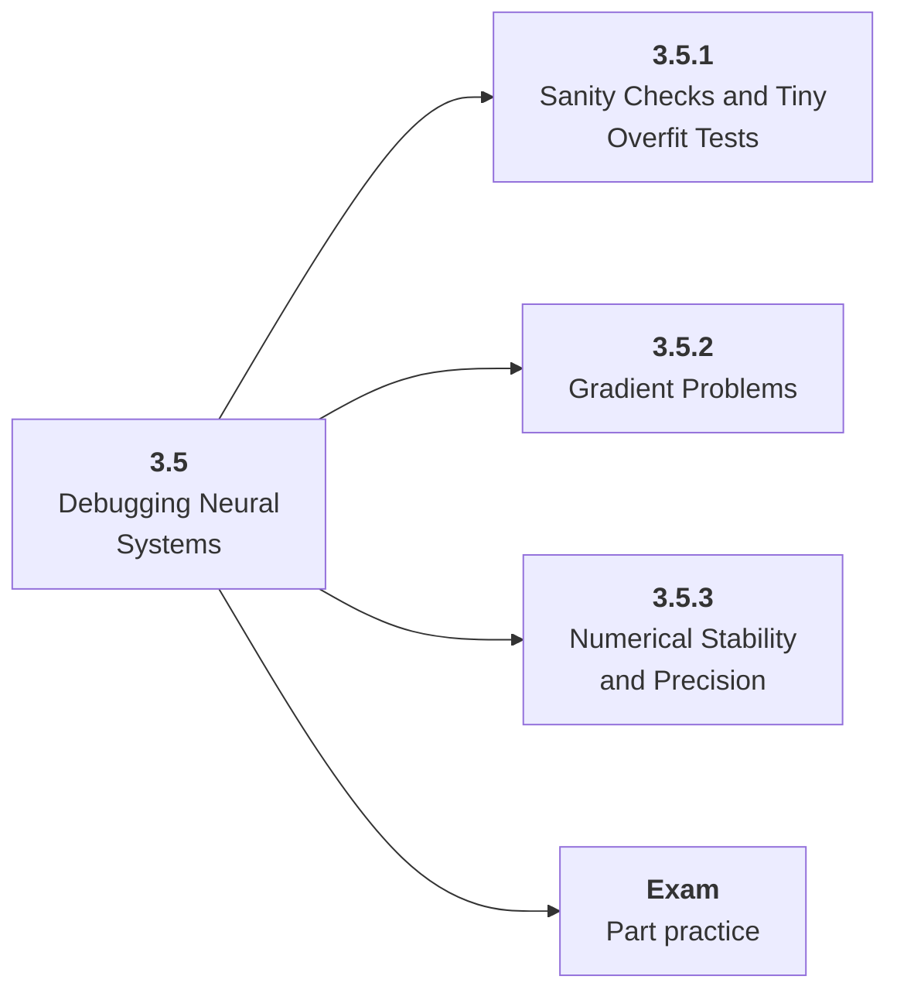

# 3.5 Debugging Neural Systems

## Role at Stage 3: Deep Learning

Diagnose the ordinary reasons neural networks fail before blaming the architecture. This part is one capability inside the stage. It should leave behind an artifact, measurements, and a short explanation of failure modes.

## Explanation

This part has 3 sub-parts because the topic needs that many learning units to feel natural. Some stages have more parts and some have fewer; the structure follows the topic, not a fixed template.

## Part Diagram

## Sub-Parts

| Sub-part folder | What it explains |
|---|---|
| [3.5.1 Sanity Checks and Tiny Overfit Tests](<3.5.1 Sanity Checks and Tiny Overfit Tests/index.md>) | Sanity Checks and Tiny Overfit Tests is the working skill inside Debugging Neural Systems that helps you build the stage artifact, A PyTorch training project with loops, validation curves, checkpoints, ablations, and debugging notes, while collecting enough evidence to trust the result. |
| [3.5.2 Gradient Problems](<3.5.2 Gradient Problems/index.md>) | Gradient Problems is the working skill inside Debugging Neural Systems that helps you build the stage artifact, A PyTorch training project with loops, validation curves, checkpoints, ablations, and debugging notes, while collecting enough evidence to trust the result. |
| [3.5.3 Numerical Stability and Precision](<3.5.3 Numerical Stability and Precision/index.md>) | Numerical Stability and Precision is the working skill inside Debugging Neural Systems that helps you build the stage artifact, A PyTorch training project with loops, validation curves, checkpoints, ablations, and debugging notes, while collecting enough evidence to trust the result. |

## What a Person Who Masters This Part Can Do

- Explain how Debugging Neural Systems supports a pytorch training project with loops, validation curves, checkpoints, ablations, and debugging notes..
- Build and inspect this artifact: Apply a training debugging checklist.
- Measure progress with: Record before-after curves, runtime, memory, and the fix.
- Debug at least one failure mode before moving to the next part.

## Build and Measure

**Build:** Apply a training debugging checklist.

**Measure:** Record before-after curves, runtime, memory, and the fix.

## Tests

Take one 30-question exam after studying this part. It opens in a new browser tab so the study page stays available.

  <a href="test/exam.html" target="_blank" rel="noopener">Open Part Exam</a>

## Back to Stage

Return to [Stage 3: Deep Learning](<../index.md>).
