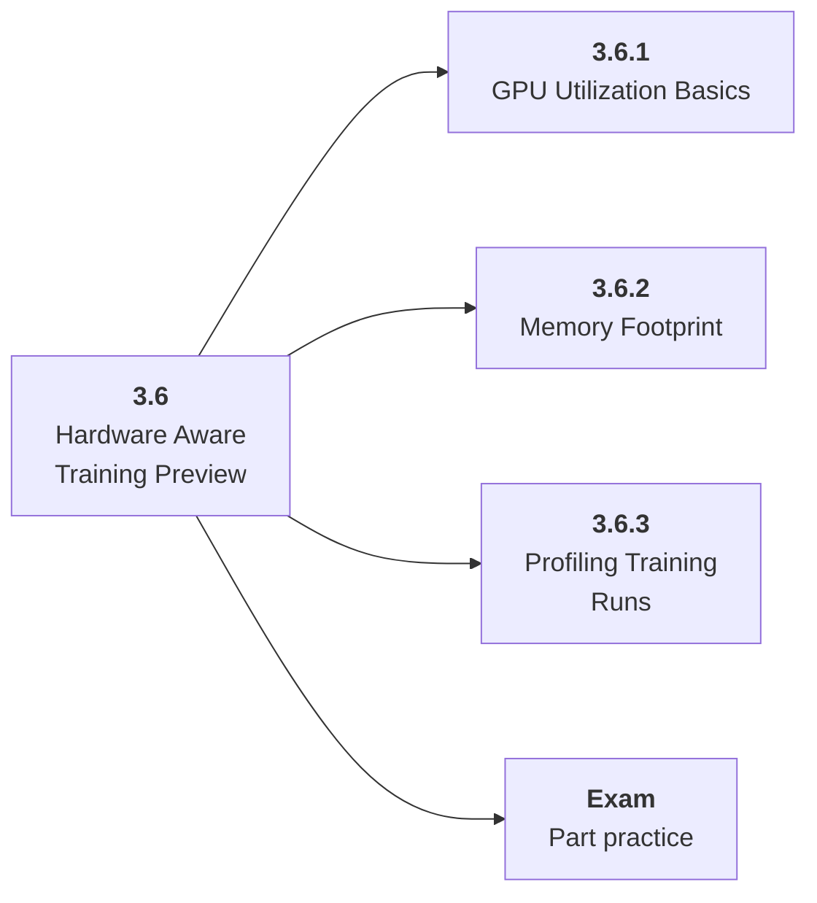

# 3.6 Hardware Aware Training Preview

## Role at Stage 3: Deep Learning

Understand the first layer of GPU utilization, memory pressure, and data bottlenecks. This part is one capability inside the stage. It should leave behind an artifact, measurements, and a short explanation of failure modes.

## Explanation

This part has 3 sub-parts because the topic needs that many learning units to feel natural. Some stages have more parts and some have fewer; the structure follows the topic, not a fixed template.

## Part Diagram

## Sub-Parts

| Sub-part folder | What it explains |
|---|---|
| [3.6.1 GPU Utilization Basics](<3.6.1 GPU Utilization Basics/index.md>) | GPU Utilization Basics is the working skill inside Hardware Aware Training Preview that helps you build the stage artifact, A PyTorch training project with loops, validation curves, checkpoints, ablations, and debugging notes, while collecting enough evidence to trust the result. |
| [3.6.2 Memory Footprint](<3.6.2 Memory Footprint/index.md>) | Memory Footprint is the working skill inside Hardware Aware Training Preview that helps you build the stage artifact, A PyTorch training project with loops, validation curves, checkpoints, ablations, and debugging notes, while collecting enough evidence to trust the result. |
| [3.6.3 Profiling Training Runs](<3.6.3 Profiling Training Runs/index.md>) | Profiling Training Runs is the working skill inside Hardware Aware Training Preview that helps you build the stage artifact, A PyTorch training project with loops, validation curves, checkpoints, ablations, and debugging notes, while collecting enough evidence to trust the result. |

## What a Person Who Masters This Part Can Do

- Explain how Hardware Aware Training Preview supports a pytorch training project with loops, validation curves, checkpoints, ablations, and debugging notes..
- Build and inspect this artifact: Profile a small training run.
- Measure progress with: Track CPU/GPU utilization, dataloader time, batch size, and memory.
- Debug at least one failure mode before moving to the next part.

## Build and Measure

**Build:** Profile a small training run.

**Measure:** Track CPU/GPU utilization, dataloader time, batch size, and memory.

## Tests

Take one 30-question exam after studying this part. It opens in a new browser tab so the study page stays available.

  <a href="test/exam.html" target="_blank" rel="noopener">Open Part Exam</a>

## Back to Stage

Return to [Stage 3: Deep Learning](<../index.md>).
