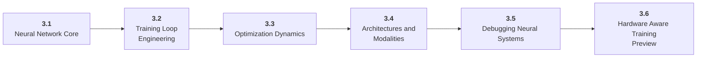

# Stage 3: Deep Learning

3 Train, debug, and reason about neural networks.

## Goal

Understand neural networks deeply enough to work with transformers, fine-tuning, inference optimization, and modern model code.

## Roadmap to Master This Stage

1. Read the stage goal and diagram before opening the parts.
2. Move through the parts in order unless you can already pass the exit criteria.
3. Study each sub-part folder: overview, deep dive, and examples/practice.
4. Build the stage artifact in small slices and measure the listed metrics.
5. Use the part exam after each part, or open the global Exam tab to test across the roadmap.

## Stage Structure Diagram

## Parts

| Part | Simple explanation | Build focus |
|---|---|---|
| [3.1 Neural Network Core](<3.1 Neural Network Core/index.md>) | Connect tensors, layers, losses, gradients, and optimizers to learning behavior. | Train a tiny neural network and inspect its learning curve. |
| [3.2 Training Loop Engineering](<3.2 Training Loop Engineering/index.md>) | Build training code that handles data, devices, checkpoints, validation, and experiment records. | Create a reusable PyTorch training script. |
| [3.3 Optimization Dynamics](<3.3 Optimization Dynamics/index.md>) | Tune training behavior with optimizers, schedules, initialization, regularization, and ablations. | Run learning-rate and regularization ablations. |
| [3.4 Architectures and Modalities](<3.4 Architectures and Modalities/index.md>) | Read and adapt model structures for tabular, vision, text, sequence, and multimodal tasks. | Train or adapt a small model architecture. |
| [3.5 Debugging Neural Systems](<3.5 Debugging Neural Systems/index.md>) | Diagnose the ordinary reasons neural networks fail before blaming the architecture. | Apply a training debugging checklist. |
| [3.6 Hardware Aware Training Preview](<3.6 Hardware Aware Training Preview/index.md>) | Understand the first layer of GPU utilization, memory pressure, and data bottlenecks. | Profile a small training run. |

## Sub-Part Map

| Part | Sub-part | Why it matters |
|---|---|---|
| 3.1 | [3.1.1 Tensors and Shapes](<3.1 Neural Network Core/3.1.1 Tensors and Shapes/index.md>) | Tensors and Shapes is the working skill inside Neural Network Core that helps you build the stage artifact, A PyTorch training project with loops, validation curves, checkpoints, ablations, and debugging notes, while collecting enough evidence to trust the result. |
| 3.1 | [3.1.2 Layers Activations and Parameters](<3.1 Neural Network Core/3.1.2 Layers Activations and Parameters/index.md>) | Layers Activations and Parameters is the working skill inside Neural Network Core that helps you build the stage artifact, A PyTorch training project with loops, validation curves, checkpoints, ablations, and debugging notes, while collecting enough evidence to trust the result. |
| 3.1 | [3.1.3 Loss Functions](<3.1 Neural Network Core/3.1.3 Loss Functions/index.md>) | Loss Functions is the working skill inside Neural Network Core that helps you build the stage artifact, A PyTorch training project with loops, validation curves, checkpoints, ablations, and debugging notes, while collecting enough evidence to trust the result. |
| 3.1 | [3.1.4 Backpropagation and Autograd](<3.1 Neural Network Core/3.1.4 Backpropagation and Autograd/index.md>) | Backpropagation and Autograd is the working skill inside Neural Network Core that helps you build the stage artifact, A PyTorch training project with loops, validation curves, checkpoints, ablations, and debugging notes, while collecting enough evidence to trust the result. |
| 3.2 | [3.2.1 Datasets and Dataloaders](<3.2 Training Loop Engineering/3.2.1 Datasets and Dataloaders/index.md>) | Datasets and Dataloaders is the working skill inside Training Loop Engineering that helps you build the stage artifact, A PyTorch training project with loops, validation curves, checkpoints, ablations, and debugging notes, while collecting enough evidence to trust the result. |
| 3.2 | [3.2.2 Batching and Device Placement](<3.2 Training Loop Engineering/3.2.2 Batching and Device Placement/index.md>) | Batching and Device Placement is the working skill inside Training Loop Engineering that helps you build the stage artifact, A PyTorch training project with loops, validation curves, checkpoints, ablations, and debugging notes, while collecting enough evidence to trust the result. |
| 3.2 | [3.2.3 Training and Evaluation Modes](<3.2 Training Loop Engineering/3.2.3 Training and Evaluation Modes/index.md>) | Training and Evaluation Modes is the working skill inside Training Loop Engineering that helps you build the stage artifact, A PyTorch training project with loops, validation curves, checkpoints, ablations, and debugging notes, while collecting enough evidence to trust the result. |
| 3.2 | [3.2.4 Checkpoints and Resume Logic](<3.2 Training Loop Engineering/3.2.4 Checkpoints and Resume Logic/index.md>) | Checkpoints and Resume Logic is the working skill inside Training Loop Engineering that helps you build the stage artifact, A PyTorch training project with loops, validation curves, checkpoints, ablations, and debugging notes, while collecting enough evidence to trust the result. |
| 3.3 | [3.3.1 SGD Adam and Weight Decay](<3.3 Optimization Dynamics/3.3.1 SGD Adam and Weight Decay/index.md>) | SGD Adam and Weight Decay is the working skill inside Optimization Dynamics that helps you build the stage artifact, A PyTorch training project with loops, validation curves, checkpoints, ablations, and debugging notes, while collecting enough evidence to trust the result. |
| 3.3 | [3.3.2 Learning Rate Schedules](<3.3 Optimization Dynamics/3.3.2 Learning Rate Schedules/index.md>) | Learning Rate Schedules is the working skill inside Optimization Dynamics that helps you build the stage artifact, A PyTorch training project with loops, validation curves, checkpoints, ablations, and debugging notes, while collecting enough evidence to trust the result. |
| 3.3 | [3.3.3 Initialization and Normalization](<3.3 Optimization Dynamics/3.3.3 Initialization and Normalization/index.md>) | Initialization and Normalization is the working skill inside Optimization Dynamics that helps you build the stage artifact, A PyTorch training project with loops, validation curves, checkpoints, ablations, and debugging notes, while collecting enough evidence to trust the result. |
| 3.3 | [3.3.4 Regularization and Data Augmentation](<3.3 Optimization Dynamics/3.3.4 Regularization and Data Augmentation/index.md>) | Regularization and Data Augmentation is the working skill inside Optimization Dynamics that helps you build the stage artifact, A PyTorch training project with loops, validation curves, checkpoints, ablations, and debugging notes, while collecting enough evidence to trust the result. |
| 3.4 | [3.4.1 MLPs CNNs and Sequence Models](<3.4 Architectures and Modalities/3.4.1 MLPs CNNs and Sequence Models/index.md>) | MLPs CNNs and Sequence Models is the working skill inside Architectures and Modalities that helps you build the stage artifact, A PyTorch training project with loops, validation curves, checkpoints, ablations, and debugging notes, while collecting enough evidence to trust the result. |
| 3.4 | [3.4.2 Attention as a Bridge to Transformers](<3.4 Architectures and Modalities/3.4.2 Attention as a Bridge to Transformers/index.md>) | Attention as a Bridge to Transformers is the working skill inside Architectures and Modalities that helps you build the stage artifact, A PyTorch training project with loops, validation curves, checkpoints, ablations, and debugging notes, while collecting enough evidence to trust the result. |
| 3.4 | [3.4.3 Transfer Learning](<3.4 Architectures and Modalities/3.4.3 Transfer Learning/index.md>) | Transfer Learning is the working skill inside Architectures and Modalities that helps you build the stage artifact, A PyTorch training project with loops, validation curves, checkpoints, ablations, and debugging notes, while collecting enough evidence to trust the result. |
| 3.4 | [3.4.4 Multimodal Model Basics](<3.4 Architectures and Modalities/3.4.4 Multimodal Model Basics/index.md>) | Multimodal Model Basics is the working skill inside Architectures and Modalities that helps you build the stage artifact, A PyTorch training project with loops, validation curves, checkpoints, ablations, and debugging notes, while collecting enough evidence to trust the result. |
| 3.5 | [3.5.1 Sanity Checks and Tiny Overfit Tests](<3.5 Debugging Neural Systems/3.5.1 Sanity Checks and Tiny Overfit Tests/index.md>) | Sanity Checks and Tiny Overfit Tests is the working skill inside Debugging Neural Systems that helps you build the stage artifact, A PyTorch training project with loops, validation curves, checkpoints, ablations, and debugging notes, while collecting enough evidence to trust the result. |
| 3.5 | [3.5.2 Gradient Problems](<3.5 Debugging Neural Systems/3.5.2 Gradient Problems/index.md>) | Gradient Problems is the working skill inside Debugging Neural Systems that helps you build the stage artifact, A PyTorch training project with loops, validation curves, checkpoints, ablations, and debugging notes, while collecting enough evidence to trust the result. |
| 3.5 | [3.5.3 Numerical Stability and Precision](<3.5 Debugging Neural Systems/3.5.3 Numerical Stability and Precision/index.md>) | Numerical Stability and Precision is the working skill inside Debugging Neural Systems that helps you build the stage artifact, A PyTorch training project with loops, validation curves, checkpoints, ablations, and debugging notes, while collecting enough evidence to trust the result. |
| 3.6 | [3.6.1 GPU Utilization Basics](<3.6 Hardware Aware Training Preview/3.6.1 GPU Utilization Basics/index.md>) | GPU Utilization Basics is the working skill inside Hardware Aware Training Preview that helps you build the stage artifact, A PyTorch training project with loops, validation curves, checkpoints, ablations, and debugging notes, while collecting enough evidence to trust the result. |
| 3.6 | [3.6.2 Memory Footprint](<3.6 Hardware Aware Training Preview/3.6.2 Memory Footprint/index.md>) | Memory Footprint is the working skill inside Hardware Aware Training Preview that helps you build the stage artifact, A PyTorch training project with loops, validation curves, checkpoints, ablations, and debugging notes, while collecting enough evidence to trust the result. |
| 3.6 | [3.6.3 Profiling Training Runs](<3.6 Hardware Aware Training Preview/3.6.3 Profiling Training Runs/index.md>) | Profiling Training Runs is the working skill inside Hardware Aware Training Preview that helps you build the stage artifact, A PyTorch training project with loops, validation curves, checkpoints, ablations, and debugging notes, while collecting enough evidence to trust the result. |

## Stage Artifact

A PyTorch training project with loops, validation curves, checkpoints, ablations, and debugging notes.

## What to Measure

- training and validation curves
- final validation metric
- training time
- memory use
- ablation result

## Exit Criteria

- implement a training loop
- explain autograd and optimizers
- debug a model that does not learn
- read and modify architecture code

## Navigation

Previous: [Stage 2: Machine Learning](<../2. Machine Learning/index.md>) | Next: [Stage 4: Large Language Models](<../4. LLMs/index.md>)
