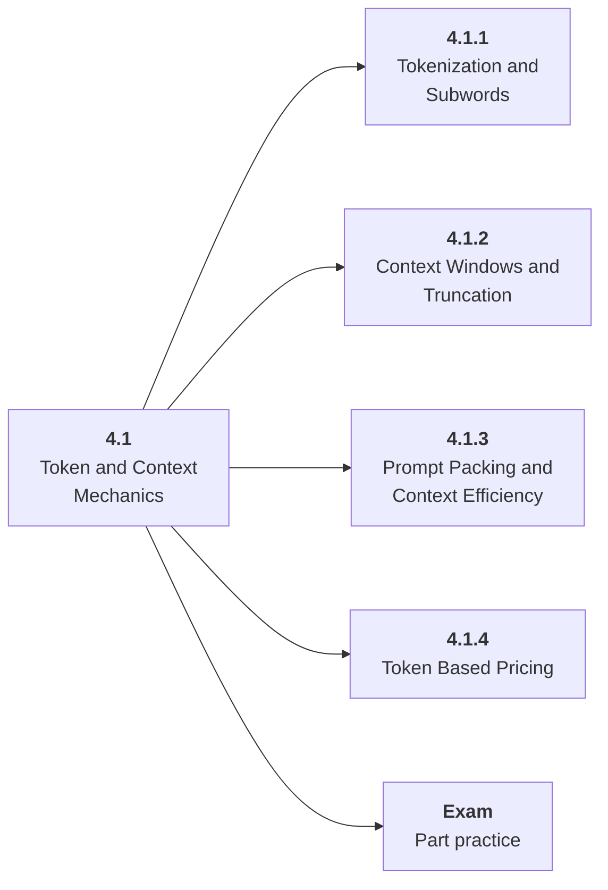

# 4.1 Token and Context Mechanics

## Role at Stage 4: Large Language Models

Understand how language becomes tokens and why context is a scarce engineering resource. This part is one capability inside the stage. It should leave behind an artifact, measurements, and a short explanation of failure modes.

## Explanation

This part has 4 sub-parts because the topic needs that many learning units to feel natural. Some stages have more parts and some have fewer; the structure follows the topic, not a fixed template.

## Part Diagram

## Sub-Parts

| Sub-part folder | What it explains |
|---|---|
| [4.1.1 Tokenization and Subwords](<4.1.1 Tokenization and Subwords/index.md>) | Tokenization and Subwords is the working skill inside Token and Context Mechanics that helps you build the stage artifact, An LLM fundamentals notebook comparing models, tokenization, structured outputs, embeddings, costs, and failure cases, while collecting enough evidence to trust the result. |
| [4.1.2 Context Windows and Truncation](<4.1.2 Context Windows and Truncation/index.md>) | Context Windows and Truncation is the working skill inside Token and Context Mechanics that helps you build the stage artifact, An LLM fundamentals notebook comparing models, tokenization, structured outputs, embeddings, costs, and failure cases, while collecting enough evidence to trust the result. |
| [4.1.3 Prompt Packing and Context Efficiency](<4.1.3 Prompt Packing and Context Efficiency/index.md>) | Prompt Packing and Context Efficiency is the working skill inside Token and Context Mechanics that helps you build the stage artifact, An LLM fundamentals notebook comparing models, tokenization, structured outputs, embeddings, costs, and failure cases, while collecting enough evidence to trust the result. |
| [4.1.4 Token Based Pricing](<4.1.4 Token Based Pricing/index.md>) | Token Based Pricing is the working skill inside Token and Context Mechanics that helps you build the stage artifact, An LLM fundamentals notebook comparing models, tokenization, structured outputs, embeddings, costs, and failure cases, while collecting enough evidence to trust the result. |

## What a Person Who Masters This Part Can Do

- Explain how Token and Context Mechanics supports an llm fundamentals notebook comparing models, tokenization, structured outputs, embeddings, costs, and failure cases..
- Build and inspect this artifact: Create tokenization and context-budget demos.
- Measure progress with: Report token counts, truncation risks, cost, and latency.
- Debug at least one failure mode before moving to the next part.

## Build and Measure

**Build:** Create tokenization and context-budget demos.

**Measure:** Report token counts, truncation risks, cost, and latency.

## Tests

Take one 30-question exam after studying this part. It opens in a new browser tab so the study page stays available.

  <a href="test/exam.html" target="_blank" rel="noopener">Open Part Exam</a>

## Back to Stage

Return to [Stage 4: Large Language Models](<../index.md>).
