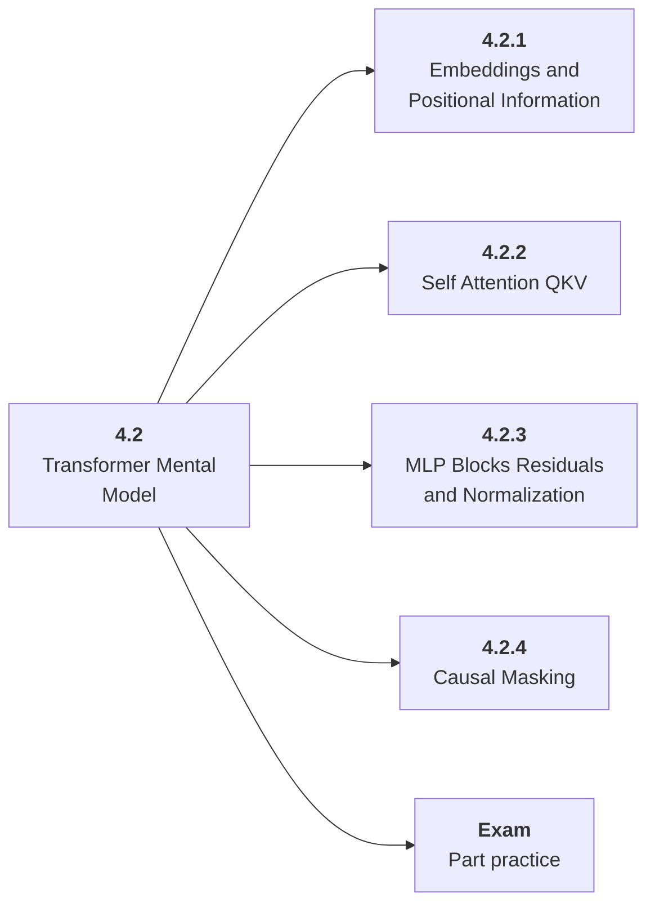

# 4.2 Transformer Mental Model

## Role at Stage 4: Large Language Models

Learn the architecture concepts that explain modern LLM behavior. This part is one capability inside the stage. It should leave behind an artifact, measurements, and a short explanation of failure modes.

## Explanation

This part has 4 sub-parts because the topic needs that many learning units to feel natural. Some stages have more parts and some have fewer; the structure follows the topic, not a fixed template.

## Part Diagram

## Sub-Parts

| Sub-part folder | What it explains |
|---|---|
| [4.2.1 Embeddings and Positional Information](<4.2.1 Embeddings and Positional Information/index.md>) | Embeddings and Positional Information is the working skill inside Transformer Mental Model that helps you build the stage artifact, An LLM fundamentals notebook comparing models, tokenization, structured outputs, embeddings, costs, and failure cases, while collecting enough evidence to trust the result. |
| [4.2.2 Self Attention QKV](<4.2.2 Self Attention QKV/index.md>) | Self Attention QKV is the working skill inside Transformer Mental Model that helps you build the stage artifact, An LLM fundamentals notebook comparing models, tokenization, structured outputs, embeddings, costs, and failure cases, while collecting enough evidence to trust the result. |
| [4.2.3 MLP Blocks Residuals and Normalization](<4.2.3 MLP Blocks Residuals and Normalization/index.md>) | MLP Blocks Residuals and Normalization is the working skill inside Transformer Mental Model that helps you build the stage artifact, An LLM fundamentals notebook comparing models, tokenization, structured outputs, embeddings, costs, and failure cases, while collecting enough evidence to trust the result. |
| [4.2.4 Causal Masking](<4.2.4 Causal Masking/index.md>) | Causal Masking is the working skill inside Transformer Mental Model that helps you build the stage artifact, An LLM fundamentals notebook comparing models, tokenization, structured outputs, embeddings, costs, and failure cases, while collecting enough evidence to trust the result. |

## What a Person Who Masters This Part Can Do

- Explain how Transformer Mental Model supports an llm fundamentals notebook comparing models, tokenization, structured outputs, embeddings, costs, and failure cases..
- Build and inspect this artifact: Annotate a transformer block and trace a simplified forward pass.
- Measure progress with: Check tensor shapes, attention flow, and causal masking.
- Debug at least one failure mode before moving to the next part.

## Build and Measure

**Build:** Annotate a transformer block and trace a simplified forward pass.

**Measure:** Check tensor shapes, attention flow, and causal masking.

## Tests

Take one 30-question exam after studying this part. It opens in a new browser tab so the study page stays available.

  <a href="test/exam.html" target="_blank" rel="noopener">Open Part Exam</a>

## Back to Stage

Return to [Stage 4: Large Language Models](<../index.md>).
