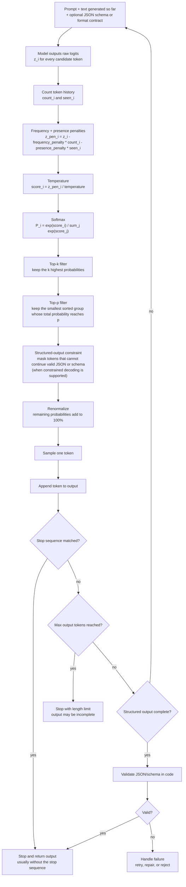

# 4.3 Generation Controls

## Role at Stage 4: Large Language Models

Control probabilistic text generation and make outputs fit software contracts. This part is one capability inside the stage. It should leave behind an artifact, measurements, and a short explanation of failure modes.

## Explanation

This part has 5 sub-parts because the topic needs that many learning units to feel natural. Some stages have more parts and some have fewer; the structure follows the topic, not a fixed template.

## Generation Control Flow

This diagram shows a beginner-friendly order for applying common generation controls during one next-token step. Stop sequences, max tokens, and structured-output checks sit around the sampling loop because they decide whether to continue, stop, validate, retry, or reject the result.

Exact order can vary by provider or inference library. Some systems apply top-k before top-p, some expose only a few controls, and some add controls such as repetition penalty or min-p. Structured-output implementations also differ: some constrain token choices during decoding, while others validate or repair after the text is complete.

Beginner model:

1. The model creates raw logits.
2. Frequency and presence penalties adjust logits for tokens already used.
3. Temperature reshapes the logits.
4. Softmax turns logits into probabilities.
5. Top-k and top-p remove candidate tokens.
6. Structured-output constraints can mask tokens that would break valid JSON or the schema.
7. The remaining probabilities are rescaled.
8. The model samples one token.
9. Stop sequences, max tokens, and structured-output completion checks decide whether to stop or continue.
10. Completed structured outputs should still be validated by code.

## Sub-Parts

| Sub-part folder | What it explains |
|---|---|
| [4.3.1 Logits and Softmax](<4.3.1 Logits and Softmax/index.md>) | Logits and Softmax is the working skill inside Generation Controls that helps you build the stage artifact, An LLM fundamentals notebook comparing models, tokenization, structured outputs, embeddings, costs, and failure cases, while collecting enough evidence to trust the result. |
| [4.3.2 Temperature Top-p and Top-k](<4.3.2 Temperature Top-p and Top-k/index.md>) | Temperature Top-p and Top-k is the working skill inside Generation Controls that helps you build the stage artifact, An LLM fundamentals notebook comparing models, tokenization, structured outputs, embeddings, costs, and failure cases, while collecting enough evidence to trust the result. |
| [4.3.3 Stop Sequences and Max Tokens](<4.3.3 Stop Sequences and Max Tokens/index.md>) | Stop Sequences and Max Tokens is the working skill inside Generation Controls that helps you build the stage artifact, An LLM fundamentals notebook comparing models, tokenization, structured outputs, embeddings, costs, and failure cases, while collecting enough evidence to trust the result. |
| [4.3.4 Structured Outputs and JSON Schemas](<4.3.4 Structured Outputs and JSON Schemas/index.md>) | Structured Outputs and JSON Schemas is the working skill inside Generation Controls that helps you build the stage artifact, An LLM fundamentals notebook comparing models, tokenization, structured outputs, embeddings, costs, and failure cases, while collecting enough evidence to trust the result. |
| [4.3.5 Frequency and Presence Penalties](<4.3.5 Frequency and Presence Penalties/index.md>) | Frequency and Presence Penalties is the working skill inside Generation Controls that helps you build the stage artifact, An LLM fundamentals notebook comparing models, tokenization, structured outputs, embeddings, costs, and failure cases, while collecting enough evidence to trust the result. |

## What a Person Who Masters This Part Can Do

- Explain how Generation Controls supports an llm fundamentals notebook comparing models, tokenization, structured outputs, embeddings, costs, and failure cases..
- Build and inspect this artifact: Compare repeated generations across decoding settings.
- Measure progress with: Track variation, validity, latency, and quality.
- Debug at least one failure mode before moving to the next part.

## Build and Measure

**Build:** Compare repeated generations across decoding settings.

**Measure:** Track variation, validity, latency, and quality.

## Tests

Take one 30-question exam after studying this part. It opens in a new browser tab so the study page stays available.

  <a href="test/exam.html" target="_blank" rel="noopener">Open Part Exam</a>

## Back to Stage

Return to [Stage 4: Large Language Models](<../index.md>).
