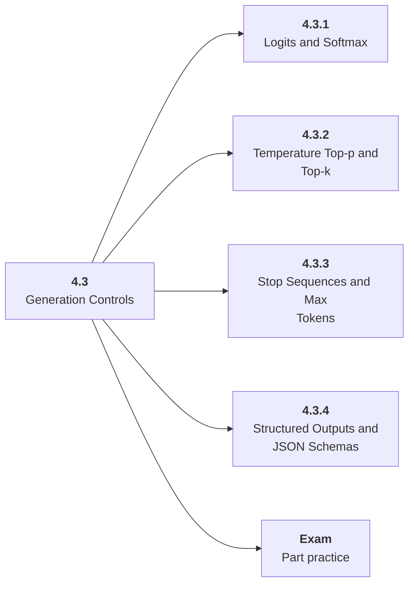

# 4.3 Generation Controls

## Role at Stage 4: Large Language Models

Control probabilistic text generation and make outputs fit software contracts. This part is one capability inside the stage. It should leave behind an artifact, measurements, and a short explanation of failure modes.

## Explanation

This part has 4 sub-parts because the topic needs that many learning units to feel natural. Some stages have more parts and some have fewer; the structure follows the topic, not a fixed template.

## Part Diagram

## Sub-Parts

| Sub-part folder | What it explains |
|---|---|
| [4.3.1 Logits and Softmax](<4.3.1 Logits and Softmax/index.md>) | Logits and Softmax is the working skill inside Generation Controls that helps you build the stage artifact, An LLM fundamentals notebook comparing models, tokenization, structured outputs, embeddings, costs, and failure cases, while collecting enough evidence to trust the result. |
| [4.3.2 Temperature Top-p and Top-k](<4.3.2 Temperature Top-p and Top-k/index.md>) | Temperature Top-p and Top-k is the working skill inside Generation Controls that helps you build the stage artifact, An LLM fundamentals notebook comparing models, tokenization, structured outputs, embeddings, costs, and failure cases, while collecting enough evidence to trust the result. |
| [4.3.3 Stop Sequences and Max Tokens](<4.3.3 Stop Sequences and Max Tokens/index.md>) | Stop Sequences and Max Tokens is the working skill inside Generation Controls that helps you build the stage artifact, An LLM fundamentals notebook comparing models, tokenization, structured outputs, embeddings, costs, and failure cases, while collecting enough evidence to trust the result. |
| [4.3.4 Structured Outputs and JSON Schemas](<4.3.4 Structured Outputs and JSON Schemas/index.md>) | Structured Outputs and JSON Schemas is the working skill inside Generation Controls that helps you build the stage artifact, An LLM fundamentals notebook comparing models, tokenization, structured outputs, embeddings, costs, and failure cases, while collecting enough evidence to trust the result. |

## What a Person Who Masters This Part Can Do

- Explain how Generation Controls supports an llm fundamentals notebook comparing models, tokenization, structured outputs, embeddings, costs, and failure cases..
- Build and inspect this artifact: Compare repeated generations across decoding settings.
- Measure progress with: Track variation, validity, latency, and quality.
- Debug at least one failure mode before moving to the next part.

## Build and Measure

**Build:** Compare repeated generations across decoding settings.

**Measure:** Track variation, validity, latency, and quality.

## Tests

Take one 30-question exam after studying this part. It opens in a new browser tab so the study page stays available.

  <a href="test/exam.html" target="_blank" rel="noopener">Open Part Exam</a>

## Back to Stage

Return to [Stage 4: Large Language Models](<../index.md>).
