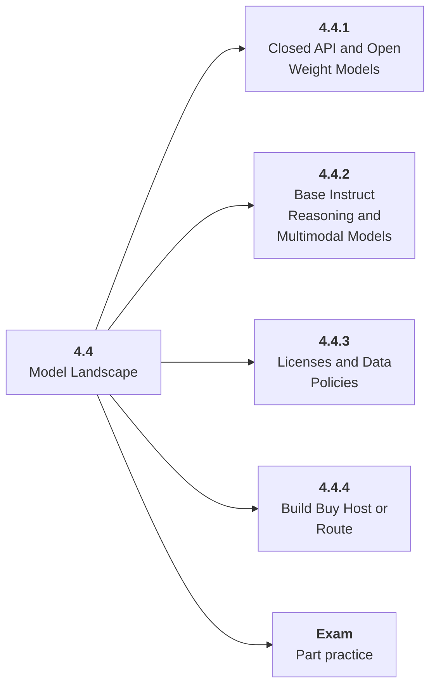

# 4.4 Model Landscape

## Role at Stage 4: Large Language Models

Choose among model families, sizes, licenses, providers, and hosting patterns. This part is one capability inside the stage. It should leave behind an artifact, measurements, and a short explanation of failure modes.

## Explanation

This part has 4 sub-parts because the topic needs that many learning units to feel natural. Some stages have more parts and some have fewer; the structure follows the topic, not a fixed template.

## Part Diagram

## Sub-Parts

| Sub-part folder | What it explains |
|---|---|
| [4.4.1 Closed API and Open Weight Models](<4.4.1 Closed API and Open Weight Models/index.md>) | Closed API and Open Weight Models is the working skill inside Model Landscape that helps you build the stage artifact, An LLM fundamentals notebook comparing models, tokenization, structured outputs, embeddings, costs, and failure cases, while collecting enough evidence to trust the result. |
| [4.4.2 Base Instruct Reasoning and Multimodal Models](<4.4.2 Base Instruct Reasoning and Multimodal Models/index.md>) | Base Instruct Reasoning and Multimodal Models is the working skill inside Model Landscape that helps you build the stage artifact, An LLM fundamentals notebook comparing models, tokenization, structured outputs, embeddings, costs, and failure cases, while collecting enough evidence to trust the result. |
| [4.4.3 Licenses and Data Policies](<4.4.3 Licenses and Data Policies/index.md>) | Licenses and Data Policies is the working skill inside Model Landscape that helps you build the stage artifact, An LLM fundamentals notebook comparing models, tokenization, structured outputs, embeddings, costs, and failure cases, while collecting enough evidence to trust the result. |
| [4.4.4 Build Buy Host or Route](<4.4.4 Build Buy Host or Route/index.md>) | Build Buy Host or Route is the working skill inside Model Landscape that helps you build the stage artifact, An LLM fundamentals notebook comparing models, tokenization, structured outputs, embeddings, costs, and failure cases, while collecting enough evidence to trust the result. |

## What a Person Who Masters This Part Can Do

- Explain how Model Landscape supports an llm fundamentals notebook comparing models, tokenization, structured outputs, embeddings, costs, and failure cases..
- Build and inspect this artifact: Create a private model leaderboard for one task.
- Measure progress with: Report quality, latency, cost per success, privacy, license, and operations.
- Debug at least one failure mode before moving to the next part.

## Build and Measure

**Build:** Create a private model leaderboard for one task.

**Measure:** Report quality, latency, cost per success, privacy, license, and operations.

## Tests

Take one 30-question exam after studying this part. It opens in a new browser tab so the study page stays available.

  <a href="test/exam.html" target="_blank" rel="noopener">Open Part Exam</a>

## Back to Stage

Return to [Stage 4: Large Language Models](<../index.md>).
