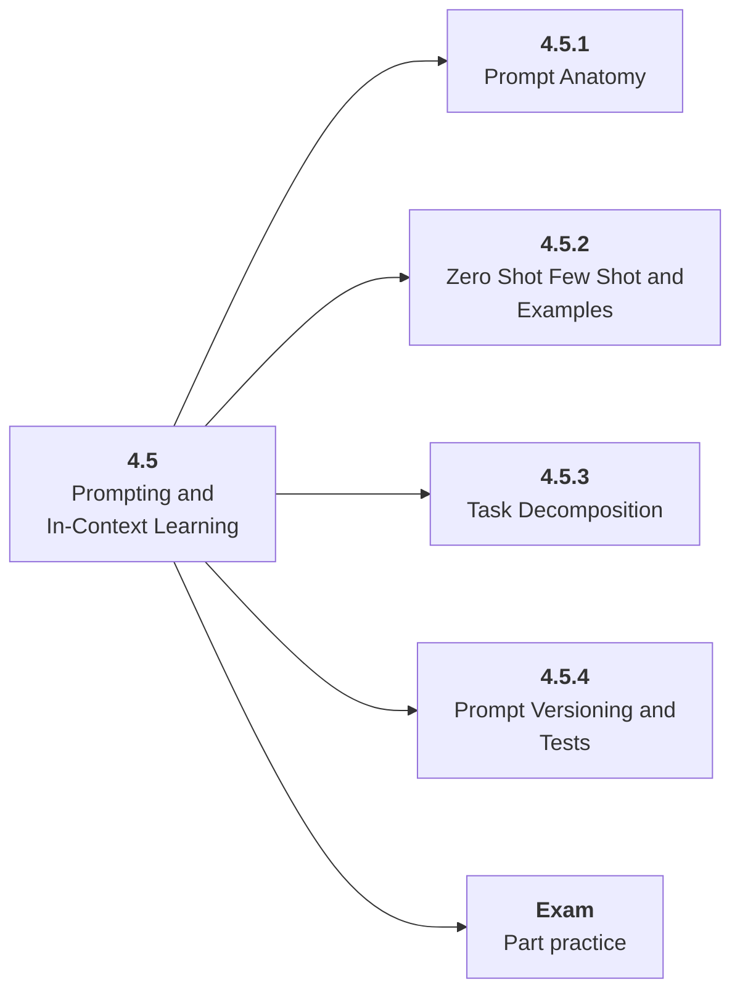

# 4.5 Prompting and In-Context Learning

## Role at Stage 4: Large Language Models

Use instructions, examples, constraints, and decomposition before heavier adaptation. This part is one capability inside the stage. It should leave behind an artifact, measurements, and a short explanation of failure modes.

## Explanation

This part has 4 sub-parts because the topic needs that many learning units to feel natural. Some stages have more parts and some have fewer; the structure follows the topic, not a fixed template.

## Part Diagram

## Sub-Parts

| Sub-part folder | What it explains |
|---|---|
| [4.5.1 Prompt Anatomy](<4.5.1 Prompt Anatomy/index.md>) | Prompt Anatomy is the working skill inside Prompting and In-Context Learning that helps you build the stage artifact, An LLM fundamentals notebook comparing models, tokenization, structured outputs, embeddings, costs, and failure cases, while collecting enough evidence to trust the result. |
| [4.5.2 Zero Shot Few Shot and Examples](<4.5.2 Zero Shot Few Shot and Examples/index.md>) | Zero Shot Few Shot and Examples is the working skill inside Prompting and In-Context Learning that helps you build the stage artifact, An LLM fundamentals notebook comparing models, tokenization, structured outputs, embeddings, costs, and failure cases, while collecting enough evidence to trust the result. |
| [4.5.3 Task Decomposition](<4.5.3 Task Decomposition/index.md>) | Task Decomposition is the working skill inside Prompting and In-Context Learning that helps you build the stage artifact, An LLM fundamentals notebook comparing models, tokenization, structured outputs, embeddings, costs, and failure cases, while collecting enough evidence to trust the result. |
| [4.5.4 Prompt Versioning and Tests](<4.5.4 Prompt Versioning and Tests/index.md>) | Prompt Versioning and Tests is the working skill inside Prompting and In-Context Learning that helps you build the stage artifact, An LLM fundamentals notebook comparing models, tokenization, structured outputs, embeddings, costs, and failure cases, while collecting enough evidence to trust the result. |

## What a Person Who Masters This Part Can Do

- Explain how Prompting and In-Context Learning supports an llm fundamentals notebook comparing models, tokenization, structured outputs, embeddings, costs, and failure cases..
- Build and inspect this artifact: Build a prompt testing lab.
- Measure progress with: Track prompt version, pass rate, output validity, and regression cases.
- Debug at least one failure mode before moving to the next part.

## Build and Measure

**Build:** Build a prompt testing lab.

**Measure:** Track prompt version, pass rate, output validity, and regression cases.

## Tests

Take one 30-question exam after studying this part. It opens in a new browser tab so the study page stays available.

  <a href="test/exam.html" target="_blank" rel="noopener">Open Part Exam</a>

## Back to Stage

Return to [Stage 4: Large Language Models](<../index.md>).
