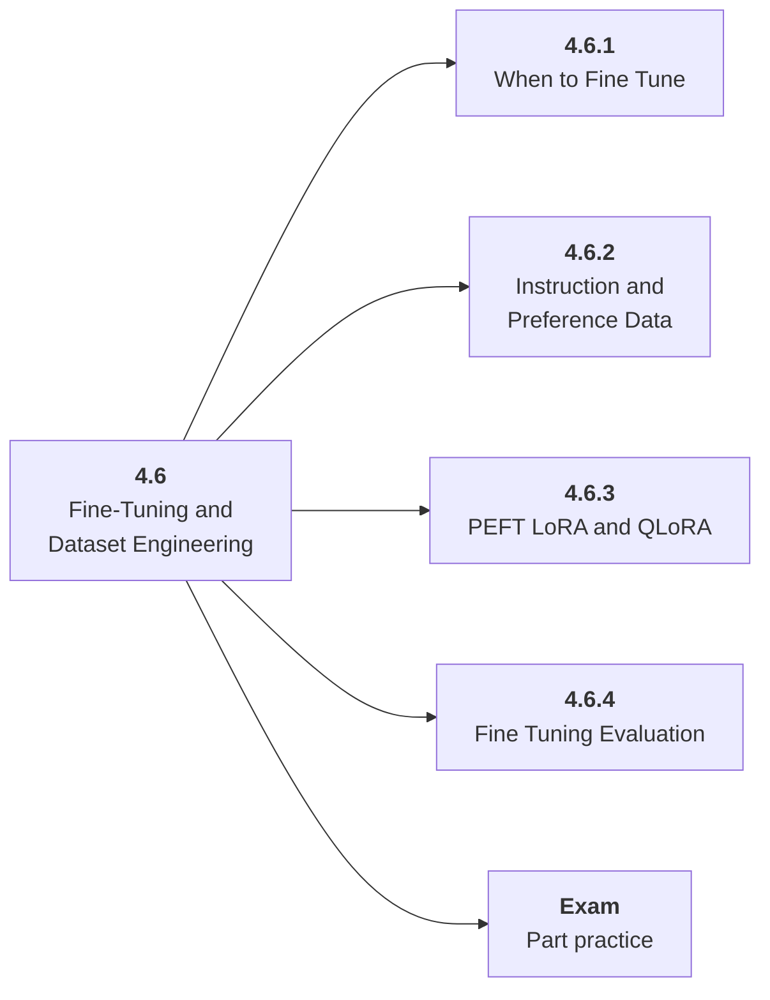

# 4.6 Fine-Tuning and Dataset Engineering

## Role at Stage 4: Large Language Models

Know when model weights should change and how data quality drives the result. This part is one capability inside the stage. It should leave behind an artifact, measurements, and a short explanation of failure modes.

## Explanation

This part has 4 sub-parts because the topic needs that many learning units to feel natural. Some stages have more parts and some have fewer; the structure follows the topic, not a fixed template.

## Part Diagram

## Sub-Parts

| Sub-part folder | What it explains |
|---|---|
| [4.6.1 When to Fine Tune](<4.6.1 When to Fine Tune/index.md>) | When to Fine Tune is the working skill inside Fine-Tuning and Dataset Engineering that helps you build the stage artifact, An LLM fundamentals notebook comparing models, tokenization, structured outputs, embeddings, costs, and failure cases, while collecting enough evidence to trust the result. |
| [4.6.2 Instruction and Preference Data](<4.6.2 Instruction and Preference Data/index.md>) | Instruction and Preference Data is the working skill inside Fine-Tuning and Dataset Engineering that helps you build the stage artifact, An LLM fundamentals notebook comparing models, tokenization, structured outputs, embeddings, costs, and failure cases, while collecting enough evidence to trust the result. |
| [4.6.3 PEFT LoRA and QLoRA](<4.6.3 PEFT LoRA and QLoRA/index.md>) | PEFT LoRA and QLoRA is the working skill inside Fine-Tuning and Dataset Engineering that helps you build the stage artifact, An LLM fundamentals notebook comparing models, tokenization, structured outputs, embeddings, costs, and failure cases, while collecting enough evidence to trust the result. |
| [4.6.4 Fine Tuning Evaluation](<4.6.4 Fine Tuning Evaluation/index.md>) | Fine Tuning Evaluation is the working skill inside Fine-Tuning and Dataset Engineering that helps you build the stage artifact, An LLM fundamentals notebook comparing models, tokenization, structured outputs, embeddings, costs, and failure cases, while collecting enough evidence to trust the result. |

## What a Person Who Masters This Part Can Do

- Explain how Fine-Tuning and Dataset Engineering supports an llm fundamentals notebook comparing models, tokenization, structured outputs, embeddings, costs, and failure cases..
- Build and inspect this artifact: Prepare an instruction dataset and PEFT plan.
- Measure progress with: Track data quality, coverage, held-out quality, memory, cost, and regressions.
- Debug at least one failure mode before moving to the next part.

## Build and Measure

**Build:** Prepare an instruction dataset and PEFT plan.

**Measure:** Track data quality, coverage, held-out quality, memory, cost, and regressions.

## Tests

Take one 30-question exam after studying this part. It opens in a new browser tab so the study page stays available.

  <a href="test/exam.html" target="_blank" rel="noopener">Open Part Exam</a>

## Back to Stage

Return to [Stage 4: Large Language Models](<../index.md>).
