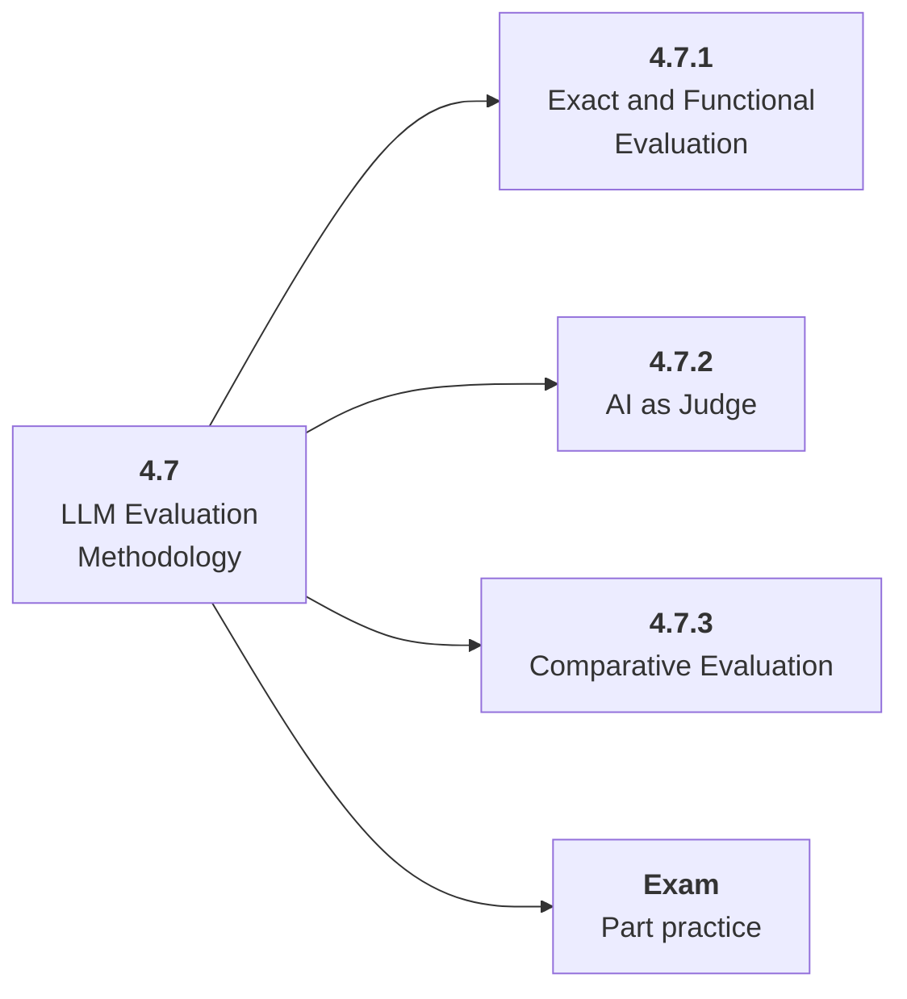

# 4.7 LLM Evaluation Methodology

## Role at Stage 4: Large Language Models

Evaluate open-ended model behavior with exact checks, rubrics, judges, and comparative tests. This part is one capability inside the stage. It should leave behind an artifact, measurements, and a short explanation of failure modes.

## Explanation

This part has 3 sub-parts because the topic needs that many learning units to feel natural. Some stages have more parts and some have fewer; the structure follows the topic, not a fixed template.

## Part Diagram

## Sub-Parts

| Sub-part folder | What it explains |
|---|---|
| [4.7.1 Exact and Functional Evaluation](<4.7.1 Exact and Functional Evaluation/index.md>) | Exact and Functional Evaluation is the working skill inside LLM Evaluation Methodology that helps you build the stage artifact, An LLM fundamentals notebook comparing models, tokenization, structured outputs, embeddings, costs, and failure cases, while collecting enough evidence to trust the result. |
| [4.7.2 AI as Judge](<4.7.2 AI as Judge/index.md>) | AI as Judge is the working skill inside LLM Evaluation Methodology that helps you build the stage artifact, An LLM fundamentals notebook comparing models, tokenization, structured outputs, embeddings, costs, and failure cases, while collecting enough evidence to trust the result. |
| [4.7.3 Comparative Evaluation](<4.7.3 Comparative Evaluation/index.md>) | Comparative Evaluation is the working skill inside LLM Evaluation Methodology that helps you build the stage artifact, An LLM fundamentals notebook comparing models, tokenization, structured outputs, embeddings, costs, and failure cases, while collecting enough evidence to trust the result. |

## What a Person Who Masters This Part Can Do

- Explain how LLM Evaluation Methodology supports an llm fundamentals notebook comparing models, tokenization, structured outputs, embeddings, costs, and failure cases..
- Build and inspect this artifact: Create a 30-case eval set.
- Measure progress with: Track exact pass rate, rubric scores, judge agreement, and failure categories.
- Debug at least one failure mode before moving to the next part.

## Build and Measure

**Build:** Create a 30-case eval set.

**Measure:** Track exact pass rate, rubric scores, judge agreement, and failure categories.

## Tests

Take one 30-question exam after studying this part. It opens in a new browser tab so the study page stays available.

  <a href="test/exam.html" target="_blank" rel="noopener">Open Part Exam</a>

## Back to Stage

Return to [Stage 4: Large Language Models](<../index.md>).
