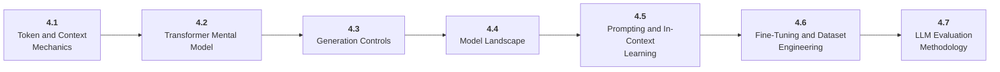

# Stage 4: Large Language Models

4 Understand tokens, transformers, generation, adaptation, and evaluation.

## Goal

Build a practical mental model of LLM behavior so you can choose models, control outputs, evaluate quality, and decide between prompting, RAG, tools, and fine-tuning.

## Roadmap to Master This Stage

1. Read the stage goal and diagram before opening the parts.
2. Move through the parts in order unless you can already pass the exit criteria.
3. Study each sub-part folder: overview, deep dive, and examples/practice.
4. Build the stage artifact in small slices and measure the listed metrics.
5. Use the part exam after each part, or open the global Exam tab to test across the roadmap.

## Stage Structure Diagram

## Parts

| Part | Simple explanation | Build focus |
|---|---|---|
| [4.1 Token and Context Mechanics](<4.1 Token and Context Mechanics/index.md>) | Understand how language becomes tokens and why context is a scarce engineering resource. | Create tokenization and context-budget demos. |
| [4.2 Transformer Mental Model](<4.2 Transformer Mental Model/index.md>) | Learn the architecture concepts that explain modern LLM behavior. | Annotate a transformer block and trace a simplified forward pass. |
| [4.3 Generation Controls](<4.3 Generation Controls/index.md>) | Control probabilistic text generation and make outputs fit software contracts. | Compare repeated generations across decoding settings. |
| [4.4 Model Landscape](<4.4 Model Landscape/index.md>) | Choose among model families, sizes, licenses, providers, and hosting patterns. | Create a private model leaderboard for one task. |
| [4.5 Prompting and In-Context Learning](<4.5 Prompting and In-Context Learning/index.md>) | Use instructions, examples, constraints, and decomposition before heavier adaptation. | Build a prompt testing lab. |
| [4.6 Fine-Tuning and Dataset Engineering](<4.6 Fine-Tuning and Dataset Engineering/index.md>) | Know when model weights should change and how data quality drives the result. | Prepare an instruction dataset and PEFT plan. |
| [4.7 LLM Evaluation Methodology](<4.7 LLM Evaluation Methodology/index.md>) | Evaluate open-ended model behavior with exact checks, rubrics, judges, and comparative tests. | Create a 30-case eval set. |

## Sub-Part Map

| Part | Sub-part | Why it matters |
|---|---|---|
| 4.1 | [4.1.1 Tokenization and Subwords](<4.1 Token and Context Mechanics/4.1.1 Tokenization and Subwords/index.md>) | Tokenization and Subwords is the working skill inside Token and Context Mechanics that helps you build the stage artifact, An LLM fundamentals notebook comparing models, tokenization, structured outputs, embeddings, costs, and failure cases, while collecting enough evidence to trust the result. |
| 4.1 | [4.1.2 Context Windows and Truncation](<4.1 Token and Context Mechanics/4.1.2 Context Windows and Truncation/index.md>) | Context Windows and Truncation is the working skill inside Token and Context Mechanics that helps you build the stage artifact, An LLM fundamentals notebook comparing models, tokenization, structured outputs, embeddings, costs, and failure cases, while collecting enough evidence to trust the result. |
| 4.1 | [4.1.3 Prompt Packing and Context Efficiency](<4.1 Token and Context Mechanics/4.1.3 Prompt Packing and Context Efficiency/index.md>) | Prompt Packing and Context Efficiency is the working skill inside Token and Context Mechanics that helps you build the stage artifact, An LLM fundamentals notebook comparing models, tokenization, structured outputs, embeddings, costs, and failure cases, while collecting enough evidence to trust the result. |
| 4.1 | [4.1.4 Token Based Pricing](<4.1 Token and Context Mechanics/4.1.4 Token Based Pricing/index.md>) | Token Based Pricing is the working skill inside Token and Context Mechanics that helps you build the stage artifact, An LLM fundamentals notebook comparing models, tokenization, structured outputs, embeddings, costs, and failure cases, while collecting enough evidence to trust the result. |
| 4.2 | [4.2.1 Embeddings and Positional Information](<4.2 Transformer Mental Model/4.2.1 Embeddings and Positional Information/index.md>) | Embeddings and Positional Information is the working skill inside Transformer Mental Model that helps you build the stage artifact, An LLM fundamentals notebook comparing models, tokenization, structured outputs, embeddings, costs, and failure cases, while collecting enough evidence to trust the result. |
| 4.2 | [4.2.2 Self Attention QKV](<4.2 Transformer Mental Model/4.2.2 Self Attention QKV/index.md>) | Self Attention QKV is the working skill inside Transformer Mental Model that helps you build the stage artifact, An LLM fundamentals notebook comparing models, tokenization, structured outputs, embeddings, costs, and failure cases, while collecting enough evidence to trust the result. |
| 4.2 | [4.2.3 MLP Blocks Residuals and Normalization](<4.2 Transformer Mental Model/4.2.3 MLP Blocks Residuals and Normalization/index.md>) | MLP Blocks Residuals and Normalization is the working skill inside Transformer Mental Model that helps you build the stage artifact, An LLM fundamentals notebook comparing models, tokenization, structured outputs, embeddings, costs, and failure cases, while collecting enough evidence to trust the result. |
| 4.2 | [4.2.4 Causal Masking](<4.2 Transformer Mental Model/4.2.4 Causal Masking/index.md>) | Causal Masking is the working skill inside Transformer Mental Model that helps you build the stage artifact, An LLM fundamentals notebook comparing models, tokenization, structured outputs, embeddings, costs, and failure cases, while collecting enough evidence to trust the result. |
| 4.3 | [4.3.1 Logits and Softmax](<4.3 Generation Controls/4.3.1 Logits and Softmax/index.md>) | Logits and Softmax is the working skill inside Generation Controls that helps you build the stage artifact, An LLM fundamentals notebook comparing models, tokenization, structured outputs, embeddings, costs, and failure cases, while collecting enough evidence to trust the result. |
| 4.3 | [4.3.2 Temperature Top-p and Top-k](<4.3 Generation Controls/4.3.2 Temperature Top-p and Top-k/index.md>) | Temperature Top-p and Top-k is the working skill inside Generation Controls that helps you build the stage artifact, An LLM fundamentals notebook comparing models, tokenization, structured outputs, embeddings, costs, and failure cases, while collecting enough evidence to trust the result. |
| 4.3 | [4.3.3 Stop Sequences and Max Tokens](<4.3 Generation Controls/4.3.3 Stop Sequences and Max Tokens/index.md>) | Stop Sequences and Max Tokens is the working skill inside Generation Controls that helps you build the stage artifact, An LLM fundamentals notebook comparing models, tokenization, structured outputs, embeddings, costs, and failure cases, while collecting enough evidence to trust the result. |
| 4.3 | [4.3.4 Structured Outputs and JSON Schemas](<4.3 Generation Controls/4.3.4 Structured Outputs and JSON Schemas/index.md>) | Structured Outputs and JSON Schemas is the working skill inside Generation Controls that helps you build the stage artifact, An LLM fundamentals notebook comparing models, tokenization, structured outputs, embeddings, costs, and failure cases, while collecting enough evidence to trust the result. |
| 4.4 | [4.4.1 Closed API and Open Weight Models](<4.4 Model Landscape/4.4.1 Closed API and Open Weight Models/index.md>) | Closed API and Open Weight Models is the working skill inside Model Landscape that helps you build the stage artifact, An LLM fundamentals notebook comparing models, tokenization, structured outputs, embeddings, costs, and failure cases, while collecting enough evidence to trust the result. |
| 4.4 | [4.4.2 Base Instruct Reasoning and Multimodal Models](<4.4 Model Landscape/4.4.2 Base Instruct Reasoning and Multimodal Models/index.md>) | Base Instruct Reasoning and Multimodal Models is the working skill inside Model Landscape that helps you build the stage artifact, An LLM fundamentals notebook comparing models, tokenization, structured outputs, embeddings, costs, and failure cases, while collecting enough evidence to trust the result. |
| 4.4 | [4.4.3 Licenses and Data Policies](<4.4 Model Landscape/4.4.3 Licenses and Data Policies/index.md>) | Licenses and Data Policies is the working skill inside Model Landscape that helps you build the stage artifact, An LLM fundamentals notebook comparing models, tokenization, structured outputs, embeddings, costs, and failure cases, while collecting enough evidence to trust the result. |
| 4.4 | [4.4.4 Build Buy Host or Route](<4.4 Model Landscape/4.4.4 Build Buy Host or Route/index.md>) | Build Buy Host or Route is the working skill inside Model Landscape that helps you build the stage artifact, An LLM fundamentals notebook comparing models, tokenization, structured outputs, embeddings, costs, and failure cases, while collecting enough evidence to trust the result. |
| 4.5 | [4.5.1 Prompt Anatomy](<4.5 Prompting and In-Context Learning/4.5.1 Prompt Anatomy/index.md>) | Prompt Anatomy is the working skill inside Prompting and In-Context Learning that helps you build the stage artifact, An LLM fundamentals notebook comparing models, tokenization, structured outputs, embeddings, costs, and failure cases, while collecting enough evidence to trust the result. |
| 4.5 | [4.5.2 Zero Shot Few Shot and Examples](<4.5 Prompting and In-Context Learning/4.5.2 Zero Shot Few Shot and Examples/index.md>) | Zero Shot Few Shot and Examples is the working skill inside Prompting and In-Context Learning that helps you build the stage artifact, An LLM fundamentals notebook comparing models, tokenization, structured outputs, embeddings, costs, and failure cases, while collecting enough evidence to trust the result. |
| 4.5 | [4.5.3 Task Decomposition](<4.5 Prompting and In-Context Learning/4.5.3 Task Decomposition/index.md>) | Task Decomposition is the working skill inside Prompting and In-Context Learning that helps you build the stage artifact, An LLM fundamentals notebook comparing models, tokenization, structured outputs, embeddings, costs, and failure cases, while collecting enough evidence to trust the result. |
| 4.5 | [4.5.4 Prompt Versioning and Tests](<4.5 Prompting and In-Context Learning/4.5.4 Prompt Versioning and Tests/index.md>) | Prompt Versioning and Tests is the working skill inside Prompting and In-Context Learning that helps you build the stage artifact, An LLM fundamentals notebook comparing models, tokenization, structured outputs, embeddings, costs, and failure cases, while collecting enough evidence to trust the result. |
| 4.6 | [4.6.1 When to Fine Tune](<4.6 Fine-Tuning and Dataset Engineering/4.6.1 When to Fine Tune/index.md>) | When to Fine Tune is the working skill inside Fine-Tuning and Dataset Engineering that helps you build the stage artifact, An LLM fundamentals notebook comparing models, tokenization, structured outputs, embeddings, costs, and failure cases, while collecting enough evidence to trust the result. |
| 4.6 | [4.6.2 Instruction and Preference Data](<4.6 Fine-Tuning and Dataset Engineering/4.6.2 Instruction and Preference Data/index.md>) | Instruction and Preference Data is the working skill inside Fine-Tuning and Dataset Engineering that helps you build the stage artifact, An LLM fundamentals notebook comparing models, tokenization, structured outputs, embeddings, costs, and failure cases, while collecting enough evidence to trust the result. |
| 4.6 | [4.6.3 PEFT LoRA and QLoRA](<4.6 Fine-Tuning and Dataset Engineering/4.6.3 PEFT LoRA and QLoRA/index.md>) | PEFT LoRA and QLoRA is the working skill inside Fine-Tuning and Dataset Engineering that helps you build the stage artifact, An LLM fundamentals notebook comparing models, tokenization, structured outputs, embeddings, costs, and failure cases, while collecting enough evidence to trust the result. |
| 4.6 | [4.6.4 Fine Tuning Evaluation](<4.6 Fine-Tuning and Dataset Engineering/4.6.4 Fine Tuning Evaluation/index.md>) | Fine Tuning Evaluation is the working skill inside Fine-Tuning and Dataset Engineering that helps you build the stage artifact, An LLM fundamentals notebook comparing models, tokenization, structured outputs, embeddings, costs, and failure cases, while collecting enough evidence to trust the result. |
| 4.7 | [4.7.1 Exact and Functional Evaluation](<4.7 LLM Evaluation Methodology/4.7.1 Exact and Functional Evaluation/index.md>) | Exact and Functional Evaluation is the working skill inside LLM Evaluation Methodology that helps you build the stage artifact, An LLM fundamentals notebook comparing models, tokenization, structured outputs, embeddings, costs, and failure cases, while collecting enough evidence to trust the result. |
| 4.7 | [4.7.2 AI as Judge](<4.7 LLM Evaluation Methodology/4.7.2 AI as Judge/index.md>) | AI as Judge is the working skill inside LLM Evaluation Methodology that helps you build the stage artifact, An LLM fundamentals notebook comparing models, tokenization, structured outputs, embeddings, costs, and failure cases, while collecting enough evidence to trust the result. |
| 4.7 | [4.7.3 Comparative Evaluation](<4.7 LLM Evaluation Methodology/4.7.3 Comparative Evaluation/index.md>) | Comparative Evaluation is the working skill inside LLM Evaluation Methodology that helps you build the stage artifact, An LLM fundamentals notebook comparing models, tokenization, structured outputs, embeddings, costs, and failure cases, while collecting enough evidence to trust the result. |

## Stage Artifact

An LLM fundamentals notebook comparing models, tokenization, structured outputs, embeddings, costs, and failure cases.

## What to Measure

- token counts
- latency
- cost estimate
- structured output validity
- small task accuracy

## Exit Criteria

- explain tokenization, embeddings, attention, context, and sampling
- choose models by constraints
- use structured outputs
- know when fine-tuning is premature

## Navigation

Previous: [Stage 3: Deep Learning](<../3. Deep Learning/index.md>) | Next: [Stage 5: AI Applications](<../5. AI Applications/index.md>)
