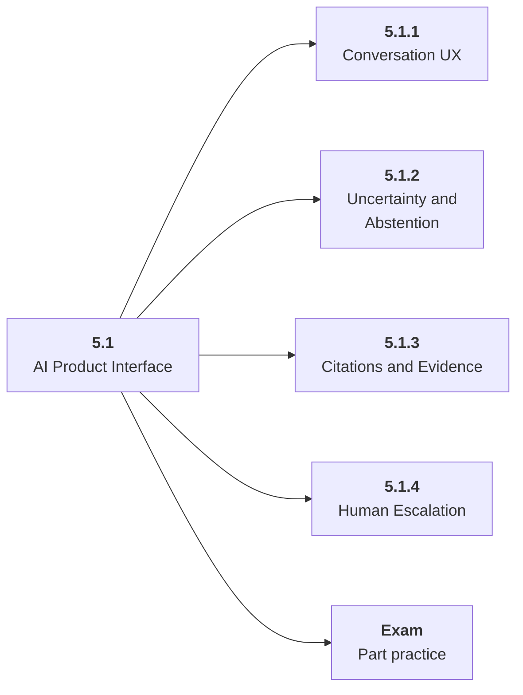

# 5.1 AI Product Interface

## Role at Stage 5: AI Applications

Design user flows that expose uncertainty, citations, correction, and escalation clearly. This part is one capability inside the stage. It should leave behind an artifact, measurements, and a short explanation of failure modes.

## Explanation

This part has 4 sub-parts because the topic needs that many learning units to feel natural. Some stages have more parts and some have fewer; the structure follows the topic, not a fixed template.

## Part Diagram

## Sub-Parts

| Sub-part folder | What it explains |
|---|---|
| [5.1.1 Conversation UX](<5.1.1 Conversation UX/index.md>) | Conversation UX is the working skill inside AI Product Interface that helps you build the stage artifact, An evaluated RAG or AI workflow application with documents, prompts, tests, logs, latency, cost, and failure analysis, while collecting enough evidence to trust the result. |
| [5.1.2 Uncertainty and Abstention](<5.1.2 Uncertainty and Abstention/index.md>) | Uncertainty and Abstention is the working skill inside AI Product Interface that helps you build the stage artifact, An evaluated RAG or AI workflow application with documents, prompts, tests, logs, latency, cost, and failure analysis, while collecting enough evidence to trust the result. |
| [5.1.3 Citations and Evidence](<5.1.3 Citations and Evidence/index.md>) | Citations and Evidence is the working skill inside AI Product Interface that helps you build the stage artifact, An evaluated RAG or AI workflow application with documents, prompts, tests, logs, latency, cost, and failure analysis, while collecting enough evidence to trust the result. |
| [5.1.4 Human Escalation](<5.1.4 Human Escalation/index.md>) | Human Escalation is the working skill inside AI Product Interface that helps you build the stage artifact, An evaluated RAG or AI workflow application with documents, prompts, tests, logs, latency, cost, and failure analysis, while collecting enough evidence to trust the result. |

## What a Person Who Masters This Part Can Do

- Explain how AI Product Interface supports an evaluated rag or ai workflow application with documents, prompts, tests, logs, latency, cost, and failure analysis..
- Build and inspect this artifact: Design a conversation flow and response policy.
- Measure progress with: Track user-visible failures, clarification rate, and correction capture.
- Debug at least one failure mode before moving to the next part.

## Build and Measure

**Build:** Design a conversation flow and response policy.

**Measure:** Track user-visible failures, clarification rate, and correction capture.

## Tests

Take one 30-question exam after studying this part. It opens in a new browser tab so the study page stays available.

  <a href="test/exam.html" target="_blank" rel="noopener">Open Part Exam</a>

## Back to Stage

Return to [Stage 5: AI Applications](<../index.md>).
