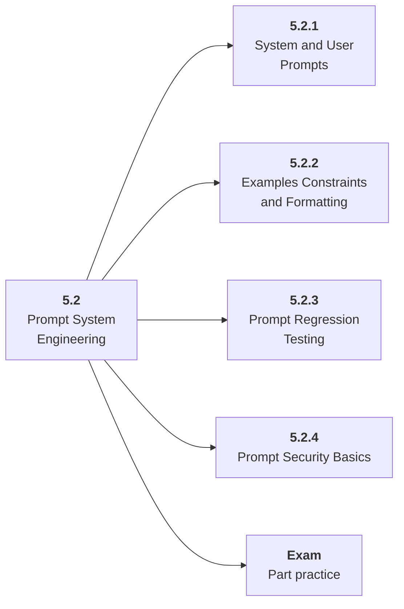

# 5.2 Prompt System Engineering

## Role at Stage 5: AI Applications

Treat prompts as versioned product assets with tests and release discipline. This part is one capability inside the stage. It should leave behind an artifact, measurements, and a short explanation of failure modes.

## Explanation

This part has 4 sub-parts because the topic needs that many learning units to feel natural. Some stages have more parts and some have fewer; the structure follows the topic, not a fixed template.

## Part Diagram

## Sub-Parts

| Sub-part folder | What it explains |
|---|---|
| [5.2.1 System and User Prompts](<5.2.1 System and User Prompts/index.md>) | System and User Prompts is the working skill inside Prompt System Engineering that helps you build the stage artifact, An evaluated RAG or AI workflow application with documents, prompts, tests, logs, latency, cost, and failure analysis, while collecting enough evidence to trust the result. |
| [5.2.2 Examples Constraints and Formatting](<5.2.2 Examples Constraints and Formatting/index.md>) | Examples Constraints and Formatting is the working skill inside Prompt System Engineering that helps you build the stage artifact, An evaluated RAG or AI workflow application with documents, prompts, tests, logs, latency, cost, and failure analysis, while collecting enough evidence to trust the result. |
| [5.2.3 Prompt Regression Testing](<5.2.3 Prompt Regression Testing/index.md>) | Prompt Regression Testing is the working skill inside Prompt System Engineering that helps you build the stage artifact, An evaluated RAG or AI workflow application with documents, prompts, tests, logs, latency, cost, and failure analysis, while collecting enough evidence to trust the result. |
| [5.2.4 Prompt Security Basics](<5.2.4 Prompt Security Basics/index.md>) | Prompt Security Basics is the working skill inside Prompt System Engineering that helps you build the stage artifact, An evaluated RAG or AI workflow application with documents, prompts, tests, logs, latency, cost, and failure analysis, while collecting enough evidence to trust the result. |

## What a Person Who Masters This Part Can Do

- Explain how Prompt System Engineering supports an evaluated rag or ai workflow application with documents, prompts, tests, logs, latency, cost, and failure analysis..
- Build and inspect this artifact: Create a prompt registry and test suite.
- Measure progress with: Track prompt version, test pass rate, output validity, and rollback path.
- Debug at least one failure mode before moving to the next part.

## Build and Measure

**Build:** Create a prompt registry and test suite.

**Measure:** Track prompt version, test pass rate, output validity, and rollback path.

## Tests

Take one 30-question exam after studying this part. It opens in a new browser tab so the study page stays available.

  <a href="test/exam.html" target="_blank" rel="noopener">Open Part Exam</a>

## Back to Stage

Return to [Stage 5: AI Applications](<../index.md>).
