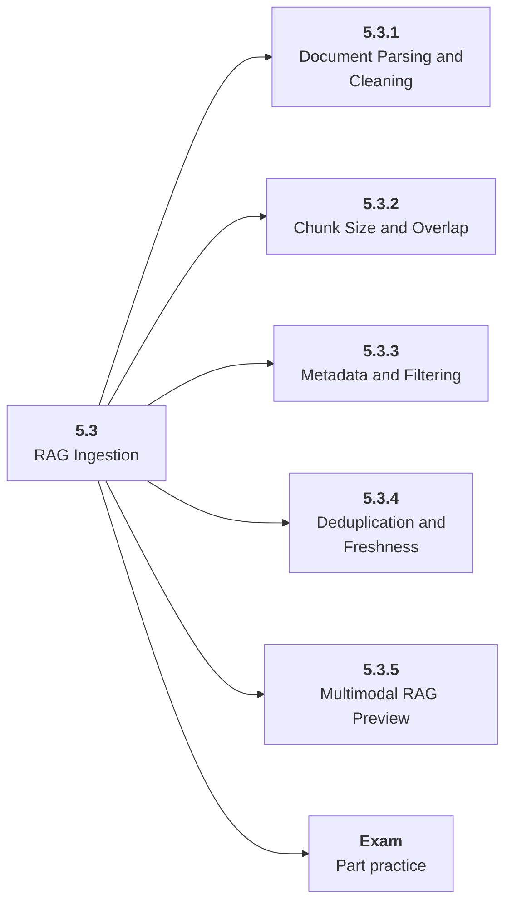

# 5.3 RAG Ingestion

## Role at Stage 5: AI Applications

Turn documents into clean, retrievable, inspectable knowledge assets. This part is one capability inside the stage. It should leave behind an artifact, measurements, and a short explanation of failure modes.

## Explanation

This part has 5 sub-parts because the topic needs that many learning units to feel natural. Some stages have more parts and some have fewer; the structure follows the topic, not a fixed template.

## Part Diagram

## Sub-Parts

| Sub-part folder | What it explains |
|---|---|
| [5.3.1 Document Parsing and Cleaning](<5.3.1 Document Parsing and Cleaning/index.md>) | Document Parsing and Cleaning is the working skill inside RAG Ingestion that helps you build the stage artifact, An evaluated RAG or AI workflow application with documents, prompts, tests, logs, latency, cost, and failure analysis, while collecting enough evidence to trust the result. |
| [5.3.2 Chunk Size and Overlap](<5.3.2 Chunk Size and Overlap/index.md>) | Chunk Size and Overlap is the working skill inside RAG Ingestion that helps you build the stage artifact, An evaluated RAG or AI workflow application with documents, prompts, tests, logs, latency, cost, and failure analysis, while collecting enough evidence to trust the result. |
| [5.3.3 Metadata and Filtering](<5.3.3 Metadata and Filtering/index.md>) | Metadata and Filtering is the working skill inside RAG Ingestion that helps you build the stage artifact, An evaluated RAG or AI workflow application with documents, prompts, tests, logs, latency, cost, and failure analysis, while collecting enough evidence to trust the result. |
| [5.3.4 Deduplication and Freshness](<5.3.4 Deduplication and Freshness/index.md>) | Deduplication and Freshness is the working skill inside RAG Ingestion that helps you build the stage artifact, An evaluated RAG or AI workflow application with documents, prompts, tests, logs, latency, cost, and failure analysis, while collecting enough evidence to trust the result. |
| [5.3.5 Multimodal RAG Preview](<5.3.5 Multimodal RAG Preview/index.md>) | Multimodal RAG Preview is the working skill inside RAG Ingestion that helps you build the stage artifact, An evaluated RAG or AI workflow application with documents, prompts, tests, logs, latency, cost, and failure analysis, while collecting enough evidence to trust the result. |

## What a Person Who Masters This Part Can Do

- Explain how RAG Ingestion supports an evaluated rag or ai workflow application with documents, prompts, tests, logs, latency, cost, and failure analysis..
- Build and inspect this artifact: Build a document ingestion pipeline.
- Measure progress with: Track parsed documents, rejected content, chunks, metadata, and freshness.
- Debug at least one failure mode before moving to the next part.

## Build and Measure

**Build:** Build a document ingestion pipeline.

**Measure:** Track parsed documents, rejected content, chunks, metadata, and freshness.

## Tests

Take one 30-question exam after studying this part. It opens in a new browser tab so the study page stays available.

  <a href="test/exam.html" target="_blank" rel="noopener">Open Part Exam</a>

## Back to Stage

Return to [Stage 5: AI Applications](<../index.md>).
