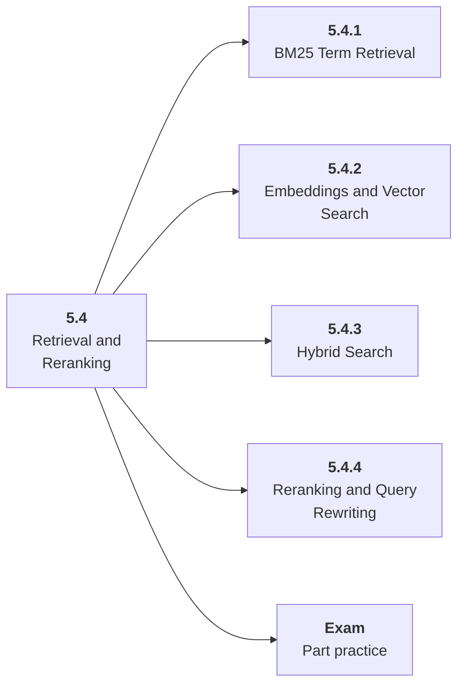

# 5.4 Retrieval and Reranking

## Role at Stage 5: AI Applications

Retrieve the right evidence before asking the model to answer. This part is one capability inside the stage. It should leave behind an artifact, measurements, and a short explanation of failure modes.

## Explanation

This part has 4 sub-parts because the topic needs that many learning units to feel natural. Some stages have more parts and some have fewer; the structure follows the topic, not a fixed template.

## Part Diagram

## Sub-Parts

| Sub-part folder | What it explains |
|---|---|
| [5.4.1 BM25 Term Retrieval](<5.4.1 BM25 Term Retrieval/index.md>) | BM25 Term Retrieval is the working skill inside Retrieval and Reranking that helps you build the stage artifact, An evaluated RAG or AI workflow application with documents, prompts, tests, logs, latency, cost, and failure analysis, while collecting enough evidence to trust the result. |
| [5.4.2 Embeddings and Vector Search](<5.4.2 Embeddings and Vector Search/index.md>) | Embeddings and Vector Search is the working skill inside Retrieval and Reranking that helps you build the stage artifact, An evaluated RAG or AI workflow application with documents, prompts, tests, logs, latency, cost, and failure analysis, while collecting enough evidence to trust the result. |
| [5.4.3 Hybrid Search](<5.4.3 Hybrid Search/index.md>) | Hybrid Search is the working skill inside Retrieval and Reranking that helps you build the stage artifact, An evaluated RAG or AI workflow application with documents, prompts, tests, logs, latency, cost, and failure analysis, while collecting enough evidence to trust the result. |
| [5.4.4 Reranking and Query Rewriting](<5.4.4 Reranking and Query Rewriting/index.md>) | Reranking and Query Rewriting is the working skill inside Retrieval and Reranking that helps you build the stage artifact, An evaluated RAG or AI workflow application with documents, prompts, tests, logs, latency, cost, and failure analysis, while collecting enough evidence to trust the result. |

## What a Person Who Masters This Part Can Do

- Explain how Retrieval and Reranking supports an evaluated rag or ai workflow application with documents, prompts, tests, logs, latency, cost, and failure analysis..
- Build and inspect this artifact: Compare BM25, vector, and hybrid retrieval.
- Measure progress with: Track hit rate, recall, precision, latency, and reranker cost.
- Debug at least one failure mode before moving to the next part.

## Build and Measure

**Build:** Compare BM25, vector, and hybrid retrieval.

**Measure:** Track hit rate, recall, precision, latency, and reranker cost.

## Tests

Take one 30-question exam after studying this part. It opens in a new browser tab so the study page stays available.

  <a href="test/exam.html" target="_blank" rel="noopener">Open Part Exam</a>

## Back to Stage

Return to [Stage 5: AI Applications](<../index.md>).
