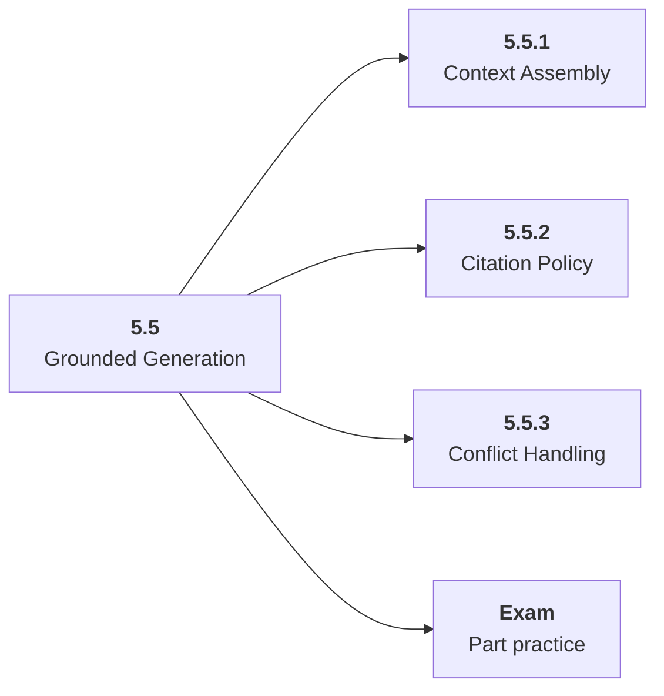

# 5.5 Grounded Generation

## Role at Stage 5: AI Applications

Assemble context so answers are faithful, cite evidence, and admit when evidence is missing. This part is one capability inside the stage. It should leave behind an artifact, measurements, and a short explanation of failure modes.

## Explanation

This part has 3 sub-parts because the topic needs that many learning units to feel natural. Some stages have more parts and some have fewer; the structure follows the topic, not a fixed template.

## Part Diagram

## Sub-Parts

| Sub-part folder | What it explains |
|---|---|
| [5.5.1 Context Assembly](<5.5.1 Context Assembly/index.md>) | Context Assembly is the working skill inside Grounded Generation that helps you build the stage artifact, An evaluated RAG or AI workflow application with documents, prompts, tests, logs, latency, cost, and failure analysis, while collecting enough evidence to trust the result. |
| [5.5.2 Citation Policy](<5.5.2 Citation Policy/index.md>) | Citation Policy is the working skill inside Grounded Generation that helps you build the stage artifact, An evaluated RAG or AI workflow application with documents, prompts, tests, logs, latency, cost, and failure analysis, while collecting enough evidence to trust the result. |
| [5.5.3 Conflict Handling](<5.5.3 Conflict Handling/index.md>) | Conflict Handling is the working skill inside Grounded Generation that helps you build the stage artifact, An evaluated RAG or AI workflow application with documents, prompts, tests, logs, latency, cost, and failure analysis, while collecting enough evidence to trust the result. |

## What a Person Who Masters This Part Can Do

- Explain how Grounded Generation supports an evaluated rag or ai workflow application with documents, prompts, tests, logs, latency, cost, and failure analysis..
- Build and inspect this artifact: Build a cited answer generator.
- Measure progress with: Track faithfulness, unsupported claims, unknown-answer behavior, and token use.
- Debug at least one failure mode before moving to the next part.

## Build and Measure

**Build:** Build a cited answer generator.

**Measure:** Track faithfulness, unsupported claims, unknown-answer behavior, and token use.

## Tests

Take one 30-question exam after studying this part. It opens in a new browser tab so the study page stays available.

  <a href="test/exam.html" target="_blank" rel="noopener">Open Part Exam</a>

## Back to Stage

Return to [Stage 5: AI Applications](<../index.md>).
