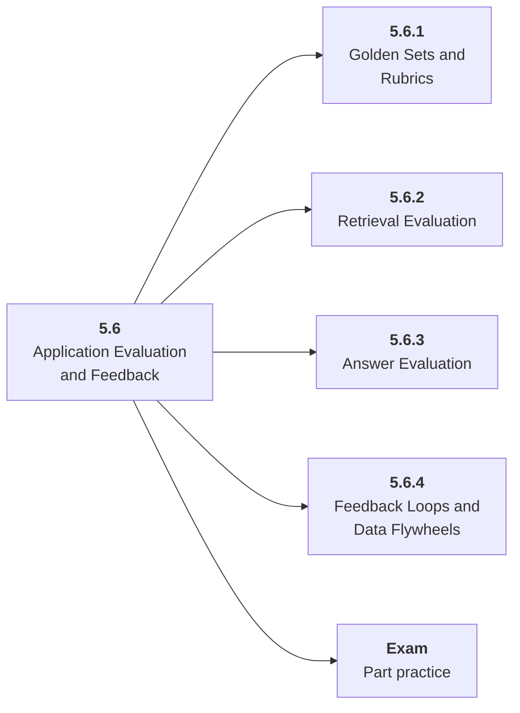

# 5.6 Application Evaluation and Feedback

## Role at Stage 5: AI Applications

Measure the whole application through golden sets, rubrics, judges, human review, and user feedback. This part is one capability inside the stage. It should leave behind an artifact, measurements, and a short explanation of failure modes.

## Explanation

This part has 4 sub-parts because the topic needs that many learning units to feel natural. Some stages have more parts and some have fewer; the structure follows the topic, not a fixed template.

## Part Diagram

## Sub-Parts

| Sub-part folder | What it explains |
|---|---|
| [5.6.1 Golden Sets and Rubrics](<5.6.1 Golden Sets and Rubrics/index.md>) | Golden Sets and Rubrics is the working skill inside Application Evaluation and Feedback that helps you build the stage artifact, An evaluated RAG or AI workflow application with documents, prompts, tests, logs, latency, cost, and failure analysis, while collecting enough evidence to trust the result. |
| [5.6.2 Retrieval Evaluation](<5.6.2 Retrieval Evaluation/index.md>) | Retrieval Evaluation is the working skill inside Application Evaluation and Feedback that helps you build the stage artifact, An evaluated RAG or AI workflow application with documents, prompts, tests, logs, latency, cost, and failure analysis, while collecting enough evidence to trust the result. |
| [5.6.3 Answer Evaluation](<5.6.3 Answer Evaluation/index.md>) | Answer Evaluation is the working skill inside Application Evaluation and Feedback that helps you build the stage artifact, An evaluated RAG or AI workflow application with documents, prompts, tests, logs, latency, cost, and failure analysis, while collecting enough evidence to trust the result. |
| [5.6.4 Feedback Loops and Data Flywheels](<5.6.4 Feedback Loops and Data Flywheels/index.md>) | Feedback Loops and Data Flywheels is the working skill inside Application Evaluation and Feedback that helps you build the stage artifact, An evaluated RAG or AI workflow application with documents, prompts, tests, logs, latency, cost, and failure analysis, while collecting enough evidence to trust the result. |

## What a Person Who Masters This Part Can Do

- Explain how Application Evaluation and Feedback supports an evaluated rag or ai workflow application with documents, prompts, tests, logs, latency, cost, and failure analysis..
- Build and inspect this artifact: Create a 50-question eval suite and feedback flow.
- Measure progress with: Track pass rate, judge agreement, human review notes, and feedback categories.
- Debug at least one failure mode before moving to the next part.

## Build and Measure

**Build:** Create a 50-question eval suite and feedback flow.

**Measure:** Track pass rate, judge agreement, human review notes, and feedback categories.

## Tests

Take one 30-question exam after studying this part. It opens in a new browser tab so the study page stays available.

  <a href="test/exam.html" target="_blank" rel="noopener">Open Part Exam</a>

## Back to Stage

Return to [Stage 5: AI Applications](<../index.md>).
