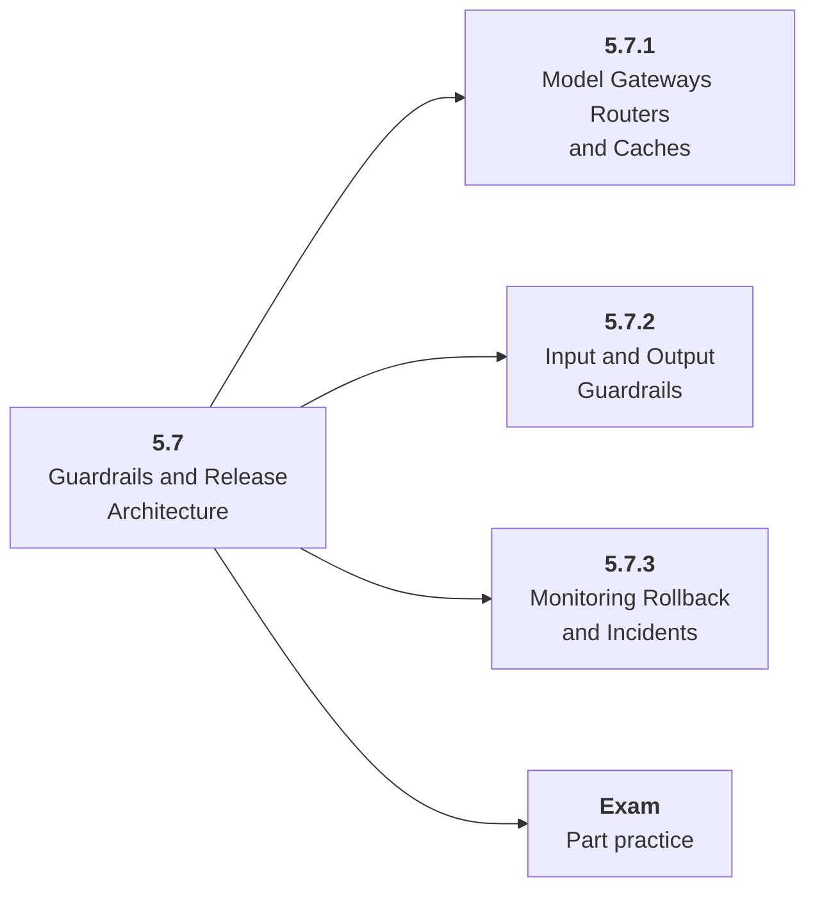

# 5.7 Guardrails and Release Architecture

## Role at Stage 5: AI Applications

Wrap model calls with gateways, routers, validators, caches, monitoring, and incident response. This part is one capability inside the stage. It should leave behind an artifact, measurements, and a short explanation of failure modes.

## Explanation

This part has 3 sub-parts because the topic needs that many learning units to feel natural. Some stages have more parts and some have fewer; the structure follows the topic, not a fixed template.

## Part Diagram

## Sub-Parts

| Sub-part folder | What it explains |
|---|---|
| [5.7.1 Model Gateways Routers and Caches](<5.7.1 Model Gateways Routers and Caches/index.md>) | Model Gateways Routers and Caches is the working skill inside Guardrails and Release Architecture that helps you build the stage artifact, An evaluated RAG or AI workflow application with documents, prompts, tests, logs, latency, cost, and failure analysis, while collecting enough evidence to trust the result. |
| [5.7.2 Input and Output Guardrails](<5.7.2 Input and Output Guardrails/index.md>) | Input and Output Guardrails is the working skill inside Guardrails and Release Architecture that helps you build the stage artifact, An evaluated RAG or AI workflow application with documents, prompts, tests, logs, latency, cost, and failure analysis, while collecting enough evidence to trust the result. |
| [5.7.3 Monitoring Rollback and Incidents](<5.7.3 Monitoring Rollback and Incidents/index.md>) | Monitoring Rollback and Incidents is the working skill inside Guardrails and Release Architecture that helps you build the stage artifact, An evaluated RAG or AI workflow application with documents, prompts, tests, logs, latency, cost, and failure analysis, while collecting enough evidence to trust the result. |

## What a Person Who Masters This Part Can Do

- Explain how Guardrails and Release Architecture supports an evaluated rag or ai workflow application with documents, prompts, tests, logs, latency, cost, and failure analysis..
- Build and inspect this artifact: Deploy a small AI app with release checks.
- Measure progress with: Track p95 latency, cache hit rate, error rate, blocked unsafe requests, and cost.
- Debug at least one failure mode before moving to the next part.

## Build and Measure

**Build:** Deploy a small AI app with release checks.

**Measure:** Track p95 latency, cache hit rate, error rate, blocked unsafe requests, and cost.

## Tests

Take one 30-question exam after studying this part. It opens in a new browser tab so the study page stays available.

  <a href="test/exam.html" target="_blank" rel="noopener">Open Part Exam</a>

## Back to Stage

Return to [Stage 5: AI Applications](<../index.md>).
