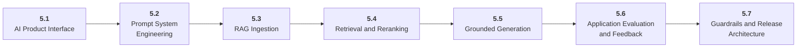

# Stage 5: AI Applications

5 Build reliable AI products around models.

## Goal

Learn prompt systems, RAG, context engineering, user experience, guardrails, evaluation, feedback loops, and application architecture.

## Roadmap to Master This Stage

1. Read the stage goal and diagram before opening the parts.
2. Move through the parts in order unless you can already pass the exit criteria.
3. Study each sub-part folder: overview, deep dive, and examples/practice.
4. Build the stage artifact in small slices and measure the listed metrics.
5. Use the part exam after each part, or open the global Exam tab to test across the roadmap.

## Stage Structure Diagram

## Parts

| Part | Simple explanation | Build focus |
|---|---|---|
| [5.1 AI Product Interface](<5.1 AI Product Interface/index.md>) | Design user flows that expose uncertainty, citations, correction, and escalation clearly. | Design a conversation flow and response policy. |
| [5.2 Prompt System Engineering](<5.2 Prompt System Engineering/index.md>) | Treat prompts as versioned product assets with tests and release discipline. | Create a prompt registry and test suite. |
| [5.3 RAG Ingestion](<5.3 RAG Ingestion/index.md>) | Turn documents into clean, retrievable, inspectable knowledge assets. | Build a document ingestion pipeline. |
| [5.4 Retrieval and Reranking](<5.4 Retrieval and Reranking/index.md>) | Retrieve the right evidence before asking the model to answer. | Compare BM25, vector, and hybrid retrieval. |
| [5.5 Grounded Generation](<5.5 Grounded Generation/index.md>) | Assemble context so answers are faithful, cite evidence, and admit when evidence is missing. | Build a cited answer generator. |
| [5.6 Application Evaluation and Feedback](<5.6 Application Evaluation and Feedback/index.md>) | Measure the whole application through golden sets, rubrics, judges, human review, and user feedback. | Create a 50-question eval suite and feedback flow. |
| [5.7 Guardrails and Release Architecture](<5.7 Guardrails and Release Architecture/index.md>) | Wrap model calls with gateways, routers, validators, caches, monitoring, and incident response. | Deploy a small AI app with release checks. |

## Sub-Part Map

| Part | Sub-part | Why it matters |
|---|---|---|
| 5.1 | [5.1.1 Conversation UX](<5.1 AI Product Interface/5.1.1 Conversation UX/index.md>) | Conversation UX is the working skill inside AI Product Interface that helps you build the stage artifact, An evaluated RAG or AI workflow application with documents, prompts, tests, logs, latency, cost, and failure analysis, while collecting enough evidence to trust the result. |
| 5.1 | [5.1.2 Uncertainty and Abstention](<5.1 AI Product Interface/5.1.2 Uncertainty and Abstention/index.md>) | Uncertainty and Abstention is the working skill inside AI Product Interface that helps you build the stage artifact, An evaluated RAG or AI workflow application with documents, prompts, tests, logs, latency, cost, and failure analysis, while collecting enough evidence to trust the result. |
| 5.1 | [5.1.3 Citations and Evidence](<5.1 AI Product Interface/5.1.3 Citations and Evidence/index.md>) | Citations and Evidence is the working skill inside AI Product Interface that helps you build the stage artifact, An evaluated RAG or AI workflow application with documents, prompts, tests, logs, latency, cost, and failure analysis, while collecting enough evidence to trust the result. |
| 5.1 | [5.1.4 Human Escalation](<5.1 AI Product Interface/5.1.4 Human Escalation/index.md>) | Human Escalation is the working skill inside AI Product Interface that helps you build the stage artifact, An evaluated RAG or AI workflow application with documents, prompts, tests, logs, latency, cost, and failure analysis, while collecting enough evidence to trust the result. |
| 5.2 | [5.2.1 System and User Prompts](<5.2 Prompt System Engineering/5.2.1 System and User Prompts/index.md>) | System and User Prompts is the working skill inside Prompt System Engineering that helps you build the stage artifact, An evaluated RAG or AI workflow application with documents, prompts, tests, logs, latency, cost, and failure analysis, while collecting enough evidence to trust the result. |
| 5.2 | [5.2.2 Examples Constraints and Formatting](<5.2 Prompt System Engineering/5.2.2 Examples Constraints and Formatting/index.md>) | Examples Constraints and Formatting is the working skill inside Prompt System Engineering that helps you build the stage artifact, An evaluated RAG or AI workflow application with documents, prompts, tests, logs, latency, cost, and failure analysis, while collecting enough evidence to trust the result. |
| 5.2 | [5.2.3 Prompt Regression Testing](<5.2 Prompt System Engineering/5.2.3 Prompt Regression Testing/index.md>) | Prompt Regression Testing is the working skill inside Prompt System Engineering that helps you build the stage artifact, An evaluated RAG or AI workflow application with documents, prompts, tests, logs, latency, cost, and failure analysis, while collecting enough evidence to trust the result. |
| 5.2 | [5.2.4 Prompt Security Basics](<5.2 Prompt System Engineering/5.2.4 Prompt Security Basics/index.md>) | Prompt Security Basics is the working skill inside Prompt System Engineering that helps you build the stage artifact, An evaluated RAG or AI workflow application with documents, prompts, tests, logs, latency, cost, and failure analysis, while collecting enough evidence to trust the result. |
| 5.3 | [5.3.1 Document Parsing and Cleaning](<5.3 RAG Ingestion/5.3.1 Document Parsing and Cleaning/index.md>) | Document Parsing and Cleaning is the working skill inside RAG Ingestion that helps you build the stage artifact, An evaluated RAG or AI workflow application with documents, prompts, tests, logs, latency, cost, and failure analysis, while collecting enough evidence to trust the result. |
| 5.3 | [5.3.2 Chunk Size and Overlap](<5.3 RAG Ingestion/5.3.2 Chunk Size and Overlap/index.md>) | Chunk Size and Overlap is the working skill inside RAG Ingestion that helps you build the stage artifact, An evaluated RAG or AI workflow application with documents, prompts, tests, logs, latency, cost, and failure analysis, while collecting enough evidence to trust the result. |
| 5.3 | [5.3.3 Metadata and Filtering](<5.3 RAG Ingestion/5.3.3 Metadata and Filtering/index.md>) | Metadata and Filtering is the working skill inside RAG Ingestion that helps you build the stage artifact, An evaluated RAG or AI workflow application with documents, prompts, tests, logs, latency, cost, and failure analysis, while collecting enough evidence to trust the result. |
| 5.3 | [5.3.4 Deduplication and Freshness](<5.3 RAG Ingestion/5.3.4 Deduplication and Freshness/index.md>) | Deduplication and Freshness is the working skill inside RAG Ingestion that helps you build the stage artifact, An evaluated RAG or AI workflow application with documents, prompts, tests, logs, latency, cost, and failure analysis, while collecting enough evidence to trust the result. |
| 5.3 | [5.3.5 Multimodal RAG Preview](<5.3 RAG Ingestion/5.3.5 Multimodal RAG Preview/index.md>) | Multimodal RAG Preview is the working skill inside RAG Ingestion that helps you build the stage artifact, An evaluated RAG or AI workflow application with documents, prompts, tests, logs, latency, cost, and failure analysis, while collecting enough evidence to trust the result. |
| 5.4 | [5.4.1 BM25 Term Retrieval](<5.4 Retrieval and Reranking/5.4.1 BM25 Term Retrieval/index.md>) | BM25 Term Retrieval is the working skill inside Retrieval and Reranking that helps you build the stage artifact, An evaluated RAG or AI workflow application with documents, prompts, tests, logs, latency, cost, and failure analysis, while collecting enough evidence to trust the result. |
| 5.4 | [5.4.2 Embeddings and Vector Search](<5.4 Retrieval and Reranking/5.4.2 Embeddings and Vector Search/index.md>) | Embeddings and Vector Search is the working skill inside Retrieval and Reranking that helps you build the stage artifact, An evaluated RAG or AI workflow application with documents, prompts, tests, logs, latency, cost, and failure analysis, while collecting enough evidence to trust the result. |
| 5.4 | [5.4.3 Hybrid Search](<5.4 Retrieval and Reranking/5.4.3 Hybrid Search/index.md>) | Hybrid Search is the working skill inside Retrieval and Reranking that helps you build the stage artifact, An evaluated RAG or AI workflow application with documents, prompts, tests, logs, latency, cost, and failure analysis, while collecting enough evidence to trust the result. |
| 5.4 | [5.4.4 Reranking and Query Rewriting](<5.4 Retrieval and Reranking/5.4.4 Reranking and Query Rewriting/index.md>) | Reranking and Query Rewriting is the working skill inside Retrieval and Reranking that helps you build the stage artifact, An evaluated RAG or AI workflow application with documents, prompts, tests, logs, latency, cost, and failure analysis, while collecting enough evidence to trust the result. |
| 5.5 | [5.5.1 Context Assembly](<5.5 Grounded Generation/5.5.1 Context Assembly/index.md>) | Context Assembly is the working skill inside Grounded Generation that helps you build the stage artifact, An evaluated RAG or AI workflow application with documents, prompts, tests, logs, latency, cost, and failure analysis, while collecting enough evidence to trust the result. |
| 5.5 | [5.5.2 Citation Policy](<5.5 Grounded Generation/5.5.2 Citation Policy/index.md>) | Citation Policy is the working skill inside Grounded Generation that helps you build the stage artifact, An evaluated RAG or AI workflow application with documents, prompts, tests, logs, latency, cost, and failure analysis, while collecting enough evidence to trust the result. |
| 5.5 | [5.5.3 Conflict Handling](<5.5 Grounded Generation/5.5.3 Conflict Handling/index.md>) | Conflict Handling is the working skill inside Grounded Generation that helps you build the stage artifact, An evaluated RAG or AI workflow application with documents, prompts, tests, logs, latency, cost, and failure analysis, while collecting enough evidence to trust the result. |
| 5.6 | [5.6.1 Golden Sets and Rubrics](<5.6 Application Evaluation and Feedback/5.6.1 Golden Sets and Rubrics/index.md>) | Golden Sets and Rubrics is the working skill inside Application Evaluation and Feedback that helps you build the stage artifact, An evaluated RAG or AI workflow application with documents, prompts, tests, logs, latency, cost, and failure analysis, while collecting enough evidence to trust the result. |
| 5.6 | [5.6.2 Retrieval Evaluation](<5.6 Application Evaluation and Feedback/5.6.2 Retrieval Evaluation/index.md>) | Retrieval Evaluation is the working skill inside Application Evaluation and Feedback that helps you build the stage artifact, An evaluated RAG or AI workflow application with documents, prompts, tests, logs, latency, cost, and failure analysis, while collecting enough evidence to trust the result. |
| 5.6 | [5.6.3 Answer Evaluation](<5.6 Application Evaluation and Feedback/5.6.3 Answer Evaluation/index.md>) | Answer Evaluation is the working skill inside Application Evaluation and Feedback that helps you build the stage artifact, An evaluated RAG or AI workflow application with documents, prompts, tests, logs, latency, cost, and failure analysis, while collecting enough evidence to trust the result. |
| 5.6 | [5.6.4 Feedback Loops and Data Flywheels](<5.6 Application Evaluation and Feedback/5.6.4 Feedback Loops and Data Flywheels/index.md>) | Feedback Loops and Data Flywheels is the working skill inside Application Evaluation and Feedback that helps you build the stage artifact, An evaluated RAG or AI workflow application with documents, prompts, tests, logs, latency, cost, and failure analysis, while collecting enough evidence to trust the result. |
| 5.7 | [5.7.1 Model Gateways Routers and Caches](<5.7 Guardrails and Release Architecture/5.7.1 Model Gateways Routers and Caches/index.md>) | Model Gateways Routers and Caches is the working skill inside Guardrails and Release Architecture that helps you build the stage artifact, An evaluated RAG or AI workflow application with documents, prompts, tests, logs, latency, cost, and failure analysis, while collecting enough evidence to trust the result. |
| 5.7 | [5.7.2 Input and Output Guardrails](<5.7 Guardrails and Release Architecture/5.7.2 Input and Output Guardrails/index.md>) | Input and Output Guardrails is the working skill inside Guardrails and Release Architecture that helps you build the stage artifact, An evaluated RAG or AI workflow application with documents, prompts, tests, logs, latency, cost, and failure analysis, while collecting enough evidence to trust the result. |
| 5.7 | [5.7.3 Monitoring Rollback and Incidents](<5.7 Guardrails and Release Architecture/5.7.3 Monitoring Rollback and Incidents/index.md>) | Monitoring Rollback and Incidents is the working skill inside Guardrails and Release Architecture that helps you build the stage artifact, An evaluated RAG or AI workflow application with documents, prompts, tests, logs, latency, cost, and failure analysis, while collecting enough evidence to trust the result. |

## Stage Artifact

An evaluated RAG or AI workflow application with documents, prompts, tests, logs, latency, cost, and failure analysis.

## What to Measure

- retrieval hit rate
- answer correctness
- hallucination rate
- latency
- token cost
- feedback captured

## Exit Criteria

- version prompts and context
- build and evaluate RAG
- separate retrieval and generation failures
- add feedback, guardrails, logs, and release checks

## Navigation

Previous: [Stage 4: Large Language Models](<../4. LLMs/index.md>) | Next: [Stage 6: AI Agents](<../6. AI Agents/index.md>)
